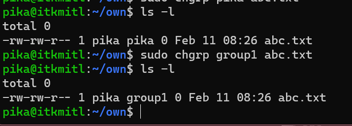
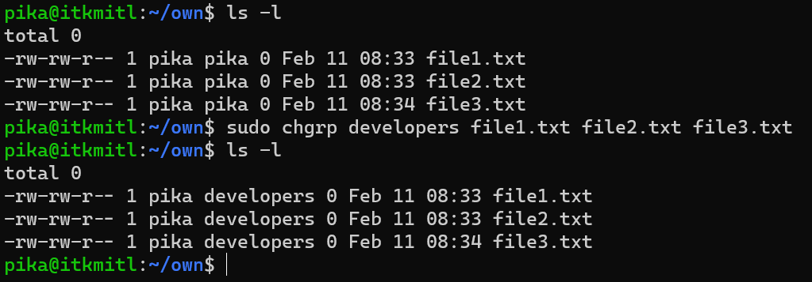
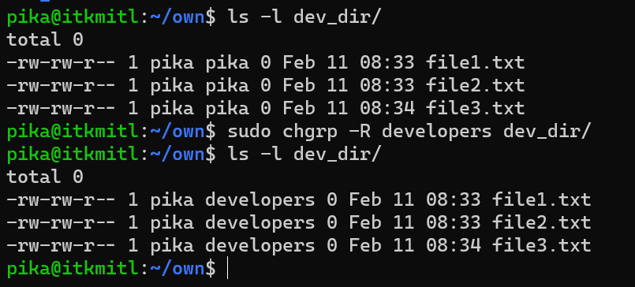
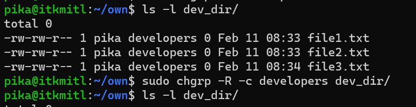
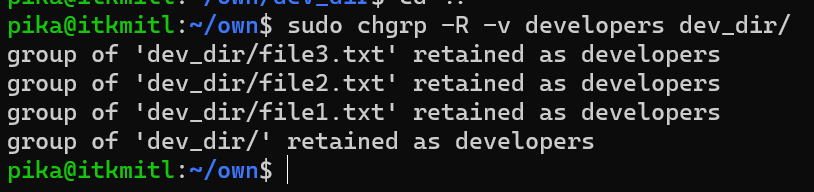

# User Authorization with chgrp

คำสั่ง chgrp ใน Linux นั้น ใช้สำหรับการเปลี่ยน group เจ้าของ (group ownership) ของไฟล์หรือ directory ใดๆ ซึ่งทุกๆไฟล์ ทุกๆ directory ของ Linux นั้นจะมี user เจ้าของและ group เจ้าของ โดยเราสามารถเปลี่ยนเจ้าของได้ด้วยคำสั่ง chown ที่เราได้เรียนกันไปในบทเรียนก่อนหน้า สำหรับการเปลี่ยน group เจ้าของจะใช้คำสั่ง chgrp 
## Syntax of chgrp Command in Linux

``` Bash
chgrp [OPTION]... GROUP FILE...
chgrp [OPTION]... --reference=RFILE FILE...
```

ต้องบอกก่อนว่า อย่างแรกเราต้องมีสิทธิ์ของ root ในการเพิ่ม group (add group) หรือลบ group (delete group) เราสามารถ login ในสิทธิ์ของ root หรือใช้คำสั่ง sudo นำหน้าคำสั่งที่ต้องการสิทธิ์ root ก็ได้ เช่น

``` Bash
sudo addgroup group1
```

<br><br>

## Examples of chgrp Command in Linux

### Changing Group Ownership of a Single File

การเปลี่ยน group เจ้าของสำหรับไฟล์ไฟล์เดียว สามารถใช้คำสั่งดังนี้

``` Bash
sudo chgrp group1 abc.txt
```



จะสังเกตได้ว่าก่อนที่เราจะสั่ง chgrp นั้น group owner ของไฟล์ abc.txt คือ pika แต่หลังจากที่้เราสั่งให้เปลี่ยนเป็นของ group1 แล้ว group owner ของไฟล์นั้นก็กลายเป็น group1

<br><br>

### Changing Group Ownership of Multiple Files

การเปลี่ยน group เจ้าของสำหรับหลายๆ ไฟล์พร้อมกันทำได้ดังนี้

``` Bash
sudo chgrp developers file1.txt file2.txt file3.txt
```



<br><br>

### Changing Group Ownership of a Directory or Folder

ในการเปลี่ยน group เจ้าของของ directory หรือ folder สามารถทำได้ดังนี้

``` Bash
sudo chgrp developers dev_dir
```

<br><br>

### Recursively Change the Group Ownership of a Directory

จะทำการเปลี่ยน group เจ้าของของ directory และเนื้อหาใน directory นั้นทั้งหมด

``` Bash
sudo chgrp -R developers dev_dir
```



จะสังเกตว่าเนื้อหาใน directory นั้นทั้งหมดถูกเปลี่ยน group เจ้าของเป็น developers หมดแล้ว

<br><br>

## Options Available in chgrp Command in Linux

### -c Option

จะทำการแสดงข้อความว่ากำลังทำการเปลี่ยน group เจ้าของของไฟล์อะไร ไปเป็น group อะไร

``` Bash
sudo chgrp -c developers dev_dir 
```


<br><br>

### -f Option

คำสั่งจะถูกบังคับให้ทำงานจนจบ และไม่แสดง error ใดๆ แม้ว่าจะไม่มี group หรือไฟล์ที่ขอให้เปลี่ยนจริงๆ ก็ตาม


<br><br>

### -v Option

จะแสดงข้อความคล้ายกับ -c แต่ต่างกันตรงที่ไม่ว่า chgrp นั้นจะกระทำกับไฟล์ หรือไม่ได้กระทำ ก็ยังจะแสดงข้อความเหมือน log ออกมา

``` Bash
sudo chgrp -v developers dev_dir 
```

**เปรียบเทียบระหว่าง -c และ -v**


**-c**



**-v**

<br>
จะสังเกตว่า -v จะยังแจ้งเตือนแม้จะไม่ได้ดำเนินการใดๆกับไฟล์ต่างจาก -c ที่จะแจ้งเตือนเฉพาะเมื่อมีการดำเนินการเกิดขึ้นกับ
ไฟล์

<br><br>

## References
* [GeeksForGeeks](https://www.geeksforgeeks.org/chgrp-command-in-linux-with-examples/)