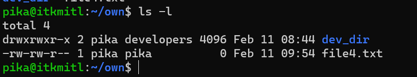
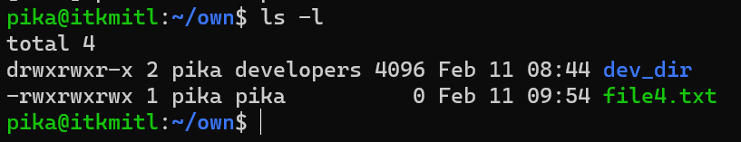
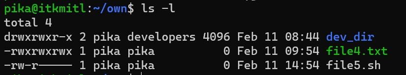
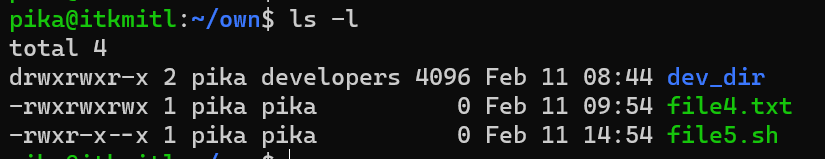
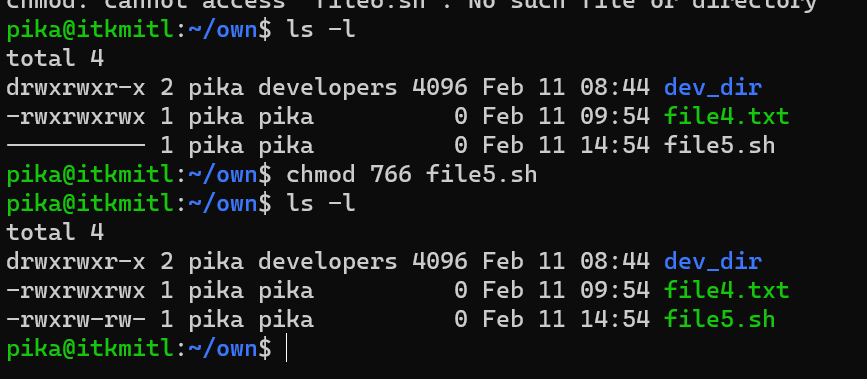

# User Authorization with chmod

## Ownership and Permissions

เพื่อป้องกันไฟล์และ directory จากการเข้าถึงโดยไม่ได้รับอนุญาต เราใช้ permissions (สิทธิ์) ในการควบคุมว่า user สามารถทำอะไรได้บ้างกับไฟล์หรือ directory นั้น ๆ โดย Linux จะมีสิทธิ์อยู่ 3 อย่างคือ
* ***Read*** สิทธิ์นี้คือการอนุญาตให้ผ user สามารถอ่านไฟล์ใน directory ได้ และสามารถทำให้ user อ่าน directory ย่อยที่เก็บอยู่ใน directory ลงไปได้อีก
* ***Write*** สิทธิ์นี้จะอนุญาตให้ user สร้าง แก้ไขดัดแปลง หรือ ลบไฟล์นั้นทิ้งได้
* ***Execute*** สิทธิ์นี้จะอนุญาตให้ไฟล์นั้นถูก run ได้ เช่น ไฟล์ php.sh ถ้าเราไม่ให้สิทธิ์ execute กับมันมันก็จะไม่สามารถ run ได้

<br><br>

## Type of file Permissions in chown Command in Linux

ประเภทของสิทธิ์ในการเข้าถึงไฟล์จะมีอยู่ 3 กลุ่ม
* ***User*** สิทธิ์ของไฟล์นี้จะส่งผลกระทบกับ user ที่เป็นเจ้าของไฟล์ (Owner)
* ***Group*** สิทธิ์ของไฟล์นี้จะส่งผลกับ group ที่เป็นเจ้าของไฟล์ ถ้า user ที่เป็นเจ้าของไฟล์อยู๋ใน group นี้ด้วยจะยึดจากสิทธิ์ของ user ที่เป็นเจ้าของไฟล์ (User permissions) เป็นหลัก
* ***Other*** สิทธิ์ประเภทนี้ของไฟล์จะส่งผลกับ user คนอื่น ๆ ทั้งหมดในระบบ

<br><br>

## Viewing and Understanding File Permissions

วิธีการดูสิทธิ์ของไฟล์หรือ directory เราใช้คำสั่ง:

``` Bash
ls -l
```



สังเกตว่าในแต่ละบรรทัด ตัวอักษรตัวแรกของแต่ละบรรทัดจะบอกประเภทของไฟล์ของบรรทัดนั้นๆ เช่น ถ้าเป็น dash (-) ก็หมายถึงว่าบรรทัดนั้นคือไฟล์ แต่ถ้าเป็นตัวอักษร d จะหมายถึง directory

<br><br>

* ทีนี้ต่อมาคือตัวอักษร 3 ตัวแรก จะแสดงสิทธิ์ของ User ที่เป็นเจ้าของไฟล์ (User permissions)
* 3 ตัวอักษรกลาง จะแสดงสิทธิ์ของสมาชิกของ group ที่เป็นเจ้าของไฟล์นั้นๆ (Group permissions)
* 3 ตัวอักษรสุดท้าย จะแสดงสิทธิ์ของทุกคนที่ไม่ได้อยู่ 2 ส่วนแรกที่กล่าวไป (Other permissions)

<br><br>

จะสังเกตว่าในแต่ละ set ของ permission นั้นจะมี 3 ตัวอักษร ซึ่งแต่ละตัวอักษรก็แสดงถึงการมี หรือ ไม่มีสิทธิ์นั้นๆ หากว่าตัวอักษรนั้นเป็น dash (-) หมายความว่าไม่ได้สิทธิ์นั้น อาจจะยังงง แต่เดี๋ยวเราจะอธิบายให้เห็นภาะและเข้าใจมากขึ้นครับ

<br><br>

**ในแต่ละตัวอักษรจะแสดงถึง:**

* ***r*** คือสิทธิ์ Read
* ***w*** คือสิทธิ์ Write
* ***x*** คือสิทธิ์ Execute

<br>

***ตัวอย่าง***

* --- การแสดงในลักษณะนี้หมายความว่าไม่ได้สิทธิ์ใดๆเลย
* rwx กลับกัน การแสดงในลักษณะนี้หมายถึงได้สิทธิ์ทั้งหมด (full permissions) ทั้งอ่าน เขียน และ execute มีครบทุกตัวอักษร

<br><br>

ในภาพที่แสดงข้างต้นให้ลองสังเกตในแถวของ directory ที่ชื่อ ***dev_dir*** ตรงคำว่า pika หมายถึง user owner ของ directory นี้คือ pika ส่วนหลังคือ group owner หมายถึง group owner ของ directory นี้คือ developers

<br><br>

กลับมาดูสิทธิ์ (permissions) ด้านหน้าสุดของแต่ละบรรทัด
* set แรกคือ 3 ตัวอักษรหลังจากประเภทไฟล์ หมายถึงสิทธิ์ของ user owner ที่สามารถกระทำได้กับ directory นี้ จากรูป user owner มีสิทธิ์ rwx หมายความว่าสามารถทำได้ทุกอย่างทั้งอ่าน เขียน และ execute
* set ที่สอง คือส่วนที่ระบุสิทธิ์ของ group owner หรือ group เจ้าของ หากดูจากรูปแล้ว group owner สามารถทำได้ทุกอย่างเช่นเดียวกัน มี r, w และ x ครบ แสดงว่า group owner หรือ user ทุกคนใน group developers นั้นสามารถกระทำการใดๆ กับ directory นี้ก็ได้ทั้งการ อ่าน เขียน และ execute
* set ที่สุดท้าย คือส่วนที่ระบุสิทธิ์ของบุคคลอื่นนอกเหนือจากที่กล่าวไป หรือ Others โดยจากในรูปเป็น r-x หมายถึง ผู้อื่น สามารถอ่าน กับ execute ไฟล์ใน directory dev_dir ได้แต่เขียน แก้ไขดัดแปลง หรือลบไฟล์ในนั้นไม่ได้

<br><br>

## Understanding The Permission Syntax

ในการใช้คำสั่ง chmod เพื่อเปลี่ยนสิทธิ์ เราต้องระบุในคำสั่งด้วยว่า:

* ใคร (who): เราจะเปลี่ยนสิทธิ์ให้ใคร
* อะไร (what): สิ่งที่เราต้องการเปลี่ยนแปลงคืออะไร? เรากำลังให้สิทธิ์เพิ่ม หรือลบสิทธิ์ออก?
* ใด (which): เรากำลังจะให้หรือแก้สิทธิ์ใด

<br><br>

เราให้สิทธิ์โดยการใช้ตัวย่อ เช่น u+x โดยที่ u หมายถึง user (ใคร) ส่วน + หมายถึงเพิ่มสิทธิ์ (อะไร) และ x หมายถึงสิทธิ์ในการ execute (ใด)

<br><br>

ในส่วนของ "ใคร" (who) ค่าที่เราจะสามารถใช้ได้มีดังนี้

* u หมายถึง user ที่เป็นเจ้าของไฟล์
* g หมายถึง group ที่เป็นเจ้าของไฟล์
* o หมายถึง คนอื่นที่ไม่ได้อยู่ใน u และ g ที่กล่าวไปข้างต้น (Others)
* a หมายถึง ทุกคน ทุกอย่างที่กล่าวไปข้างต้น (all)

<br>

ถ้าไม่มีตัวใดที่กล่าวไปข้างต้นถูกใช้เลย chmod จะทำงานเหมือนกับว่าเราใช้ค่า ***a*** (all)

<br><br>

ส่วนของ "อะไร" (what) เราสามารถใช้ค่าดังนี้

* "-" เครื่องหมายลบ ใช้ในการลบหรือถอนสิทธิ์
* "+" เครื่องหมายบวก ใช้ในการเพิ่มหรือให้สิทธิ์ โดยตัวมันจะเพิ่มเข้าไปใน set ของสิทธิ์ที่มีอยู่แล้ว หากต้องการให้มีเพียงสิทธิ์นั้นๆ เท่านั้นให้ใช้เครื่องหมาย =
* "=" เครื่องหมายเท่ากับ ใช้ในการให้เฉพาะสิทธิ์นั้นเท่านั้น แล้วจะลบสิทธิ์อื่นออกทั้งหมด

<br><br>

ส่วนของ "อันใด" (which) มีค่าให้ใช้ดังนี้
* r คือ สิทธิ์ในการอ่าน
* w คือ สิทธิ์ในการเขียน
* x คือ สิทธิ์ในการ execute

<br><br>

## Setting and Modifying Permissions

ยกตัวอย่างเช่น เรามีไฟล์ที่ทุกคนมีสิทธิ์ทุกอย่างอยู่



แต่เราต้องการที่จะให้ user pika เขียนอ่านได้ ในขณะที่ group owner และ user อื่นๆนั้นจะสามารถอ่านได้อย่างเดียว เราสามารถใช้คำสั่งดังนี้ได้

``` Bash
sudo chmod u=rw,go=r file4.txt 
```

การใช้ = หมายความว่าเราจะลบสิทธิ์ก่อนหน้าทั้งหมดทิ้งแล้วเพิ่มสิทธิ์ใหม่ที่เราต้องการเข้าไปแทน

<br><br>



เราสามารถเพิ่มสิทธิ์ execute ให้กับทุกคนบน file5.sh ได้ด้วยวิธีนี้

``` Bash
sudo chmod a+x file5.sh
```



<br><br>

## Setting Permission for Multiple Files

เราสามารถแก้ไขสิทธิ์หลายไฟล์พร้อมกันทีเดียวได้ดังนี้

เช่น ไฟล์ของเรานามสกุลเดียวกันหลายไฟล์เราต้องการจะแก้ไขสิทธิ์ของไฟล์นามสกุล .txt ให้ทุกคนอ่านได้ สามารถทำได้ดังนี้

``` Bash
sudo chmod +r *.txt
```

หรือหากต้องการไม่ให้ผู้ใช้คนอื่นสามารถอ่านได้ สามารถทำได้ดังนี้

``` Bash
sudo chmod o-r *.txt
```

เพียงเท่านี้ผู้ใช้คนอื่นก็จะไม่สามารถอ่านไฟล์นามสกุล .txt ที่อยู่ใน Current Directory ของเราได้แล้ว

<br><br>

## Numerical Shorthand

ีอีกวิธีนึงในการแก้ไขสิทธิ์ด้วย chmod คือเราสามารถใช้ตัวเลขในการบ่งบอกถึงสิทธิ์ต่างๆ โดยคิดจากเลข binary (เลขฐาน 2) โดยเลขที่เราสามารถใช้ได้มีดังนี้

* 0: (000) ไม่ให้สิทธิ์ใดๆ
* 1: (001) ให้สิทธิ์ในการ execute
* 2: (010) ให้สิทธิ์ในการเขียน (write)
* 3: (011) ให้สิทธิ์ในการเขียนและ execute
* 4: (100) ให้สิทธิ์ในการอ่าน
* 5: (101) ให้สิทธิ์ในการอ่านและ execute
* 6: (110) ให้สิทธิ์ในการอ่านและเขียน
* 7: (111) ให้สิทธิ์ทั้งการอ่าน เขียน และ execute

ในแต่ละสิทธิ์ของทั้ง 3 สิทธิ์ถูกแทนโดย เลขฐาน 2 หนึ่ง bit 

<br><br>
เช่น เราต้องการให้ user owner สามารถเขียน อ่าน และ execute ไฟล์ได้ ในขณะที่ group owner และผู้ใช้คนอื่นๆ สามารถทำได้แค่อ่านกับเขียน เราสามารถทำได้ดังนี้

``` Bash
sudo chmod 766 file5.txt
```



เพียงเท่านี้เราก็สามารถ set สิทธิ์ได้อย่างรวดเร็วโดยใช้ตัวเลข! วิธีนี้สามารถช่วยเราประหยัดเวลาได้มากหากเราสามารถจำตัวเลขของแต่ละ set ของสิทธิ์ได้

<br><br>

## References

* [HowToGeek](https://www.howtogeek.com/437958/how-to-use-the-chmod-command-on-linux/)