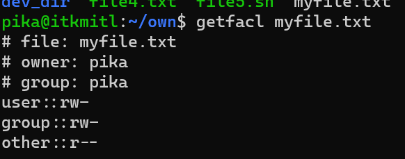
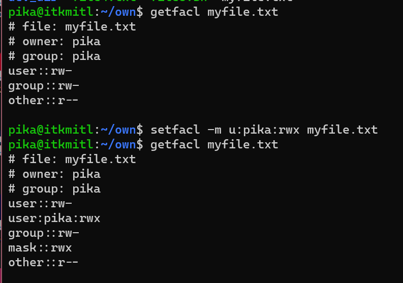
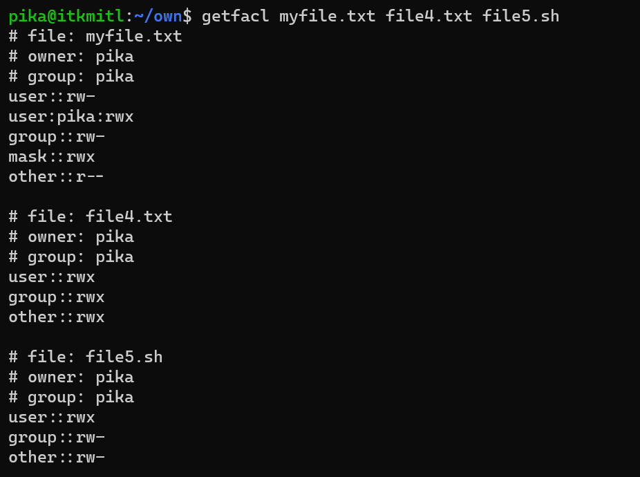
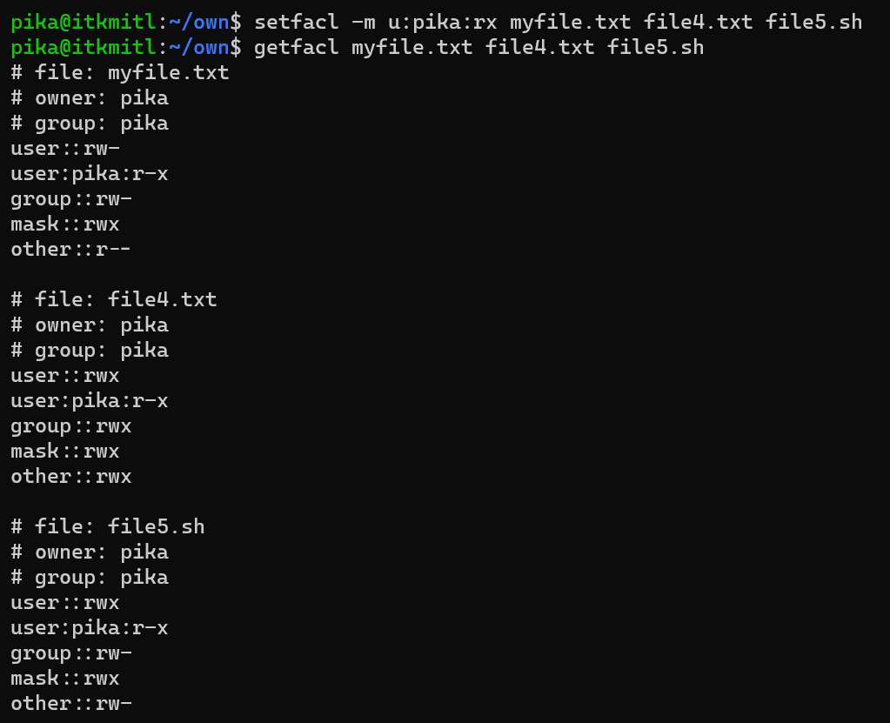
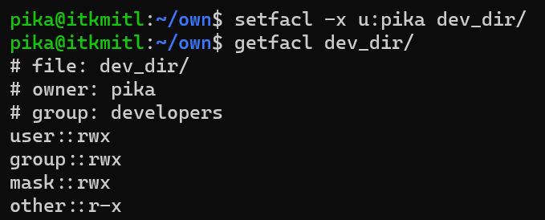
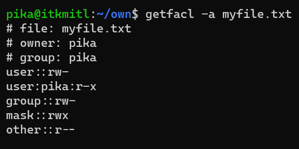
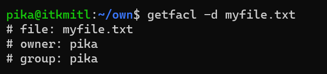

# User Authorization with getfacl and setfacl (POSIX ACL)
***Notes*** การใช้งาน POSIX ACL นั้นจำเป็นต้องติดตั้ง package acl ก่อน ด้วยคำสั่งดังนี้

``` Bash
sudo apt install acl
```

## ACL (Access Control List)
ACL คือชุดกฎเกณฑ์ของ Files, Directories, อุปกรณ์ด้าน Network และอื่นๆ โดยกฏและสิทธิ์ต่างๆ ที่ Users และ Group ได้รับจะขึ้นอยู่กับ Roles ของ Users และ Group นั้นๆ ซึ่งทั้งหมดนี้จะถูกควบคุมและกำหนดโดย Admin หรือ root ของระบบ

<br><br>

## What is getfacl and setfacl?
getfacl ย่อมาจาก Get File Access Control List ใช้เพื่อเรียกดูว่าไฟล์หรือ directory นั้นมี POSIX ACL เป็นอย่างไร 
<br>
setfacl ย่อมาจาก Set File Access Control List ใช้สำหรับการควบคุมรายการการเข้าถึง Files และ Directories 

<br> ทั้งหมดนี้ล้วนมีประโยชน์อย่างมากในการจัดการสิทธิ์การเข้าถึงของ Files ที่ Users และ Groups โดยตรงแทนการกำหนดสิทธิ์ในการเข้าถึงที่ตัว Files เอง

<br><br>

## Benefits of using POSIX ACL
- Admin สามารถกำหนดการเข้าถึง Files และ Directories ของแต่ละ Users และ Groups ได้แบบเฉาะเจาะจง
- มีความยิดหยุ่นมากกว่าการกำหนดสิทธิ์ Files ทั่วไป เพราะสามารถกำหนดสิทธิ์ได้หลายสิทธิ์พร้อมๆ กัน
- ช่วยในการจัดการสิทธิ์ใดๆ แบบเจาะจงโดยไม่กระทบกับสิทธิ์อื่นๆ
- ยกระดับความปลอดภัยเพราะมีเพียงผู้ที่ได้รับอนุญาตเท่านั้นจึงสามารถเข้าถึง Files และ Directories นั้นๆ ได้
- สามารถเปลี่ยนสิทธิ์ได้ทันทีโดยไม่กระทบกับการทำงานส่วนอื่น

<br><br>

# How To Use It?

getfacl จะใช้สำหรับการเรียกดู ACL ที่ถูกบันทึกไว้แล้วบนไฟล์ หรือ directory นั้นๆ

<br>

setfacl จะกำหนด (แทนที่), เปลี่ยนแปลง, หรือลบ ACL จาก Files และ Directories นอกจากนี้ยังสามารถ Update และลบบันทึก ACL สำหรับแต่ละ Files และ Directories ตาม Path ที่ระบุได้ หากไม่ได้ระบุ Path จะรับมาจาก stdin แทน

<br>

setfacl จะใช้ได้ก็ต่อเมื่อเป็นเจ้าของ File หรือ Superuser เท่านั้น

<br><br>

# Options Available and Syntax
| Option       | คำอธิบาย                                                    |
|--------------|----------------------------------------------------------------|
| -m, --modify | สำหรับแก้ไข ACL                                       |
| -x, --remove | ลบสิทธิ์จาก ACL                   |
| -b, --remove-all | ลบสิทธิ์ทั้งหมดจาก ACL               |
| -d, --default | เพิ่มสิทธิ์ตั้งต้นสำหรับ Files และ Folders ที่สร้างใหม่ใน Route นั้นๆ |
| -R, --recursive | ทำให้การแก้ไขทั้งหมดส่งผลย้อนหลังกับ Files และ Directries ทั้งหมดใน Path นั้นๆ  |
| -k, --remove-default | ลบบันทึกตั้งต้นของ File หรือ Directory จาก ACL |
| -n, --no-mask | ไม่อนุญาตให้คำนวณ effective rights mask โดยใช้บันทึกจาก ACL |
| -m, --mask | สำหรับกำหนด effective rights mask ในการแก้ไข  ACL |
| -M, --restore=file | สำหรับกู้คืน ACL จาก File นั้นๆ |
| -set file | สำหรับการเพิ่มสิทธิ์ให้กับ Files หรือ Directories ที่ระบุ |

file_owner: file-owner มีอยู่ 3 ประเภท:
| ประเภท | คำอธิบาย                                             |
|------|---------------------------------------------------------|
| 'u'  | ระบุ User/Owner สำหรับการกำหนด ACL |
| 'g'  | ระบุ Group สำหรับการกำหนด ACL  |
| 'o'  | ระบุ Other (คนอื่นๆ) สำหรับการกำหนด ACL      |

file_permission: file-permission มีอยู่ 3 ประเภท:
| ประเภท | คำอธิบาย                                       |
|------|---------------------------------------------------|
| 'r'  | สำหรับการอ่าน (read) คืออนุญาตให้ User เข้าถึง File ได้ |
| 'w'  | สำหรับการเขียน (write) คืออนุญาตให้ User แก้ไขและเปลี่ยนแปลงใน File ได้ |
| 'x'  | สำหรับการใช้งาน (execute) คืออนุญาตให้ User เรียกใช้ File ได้ |


***ตัวอย่าง***

```bash
getfacl myfile.txt
```



<br><br>

# 5 Examples

## 1: Set an ACL Rule on a Single File

ใช้เพื่อกำหนดสิทธิ์การเข้าถึงบนไฟล์หนึ่งหรือมากกว่าหนึ่งไฟล์โดยใช้ประเภทผู้ใช้ (ผู้ใช้, กลุ่ม, ผู้ใช้อื่นๆ) สามารถกำหนดผู้ใช้หลายคนสำหรับไฟล์เดียวกันได้:

<br>

โดยหากเราต้องการให้ user owner สามารถแก้ไขไฟล์ อ่านไฟล์ และ execute ไฟล์ได้ เราสามารถใช้คำสั่งดังนี้

``` Bash
setfacl -m u:pika:rwx myfile.txt
```



<br><br>

## 2: Set an ACL Rule on Multiple Files or Directories



เราสามารถใช้คำสั่ง setfacl กำหนดสิทธิ์บนไฟล์และ directory หลายๆ รายการพร้อมกันได้

``` Bash
setfacl -m u:pika:rx myfile.txt file4.txt file5.sh
```



<br><br>

## 3: Delete All ACL rules in the Specified Directory

เราสามารถลบ ACL ที่ตั้งไว้ทั้งหมดโดยใช้ตัวเลือก (-x) พร้อมกับการระบุประเภทผู้ใช้และชื่อไฟล์หรือ directory

```bash
setfacl -x u:pika dev_dir
```



<br><br>

## 4: Show All ACL Rule of the Specified File or Directory

ใช้เพื่อแสดงรายละเอียดของ ACL บนไฟล์หรือ directory ที่ระบุ ประกอบด้วยข้อมูลเช่น ชื่อไฟล์, เจ้าของและชื่อกลุ่ม, สิทธิ์ไฟล์, และ mask

``` Bash
getfacl -a myfile.txt
```



<br><br>

## 5: Show Basic Data of the Specified File or Directory

ใช้เพื่อแสดงข้อมูลพื้นฐานเช่น ชื่อไฟล์ และ ชื่อเจ้าของ/กลุ่ม

```bash
getfacl -d myfile.txt
```



<br><br>

## References
* [GeeksForGeeks](https://www.geeksforgeeks.org/linux-setfacl-command-with-example/)
* [IBM](https://www.ibm.com/docs/en/zos/3.1.0?topic=scd-setfacl-set-remove-change-access-control-lists-acls)
* [SpaLinux](https://spalinux.com/2008/08/using_posix_acl_on_linux_part1)
