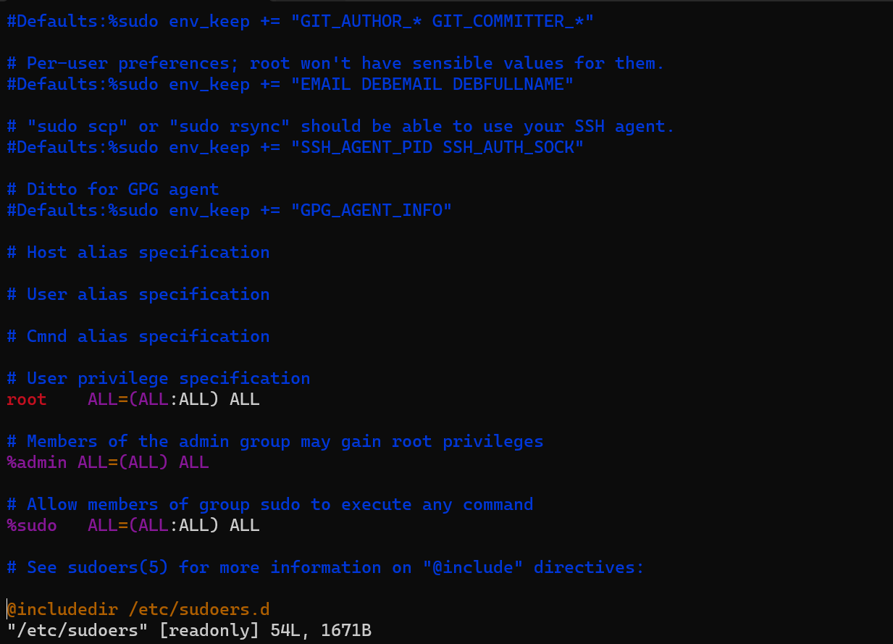

# User Authorization with sudoers

## What is sudo?

โดยปกติแล้วผู้ใช้ที่เป็น root ไม่จำเป็นต้องใช้คำสั่ง sudo แต่สำหรับผู้ใช้ธรรมดานั้นแล้ว sudo คือมีความจำเป็นในการทำหลายๆสิ่งมากที่ user ธรรมดาไม่มีสิทธ์เข้าถึง เช่น การติดตั้ง package หรือ การเพิ่ม user ในระบบ ล้วนแล้วแต่จำเป็นต้องใช้สิทธ์ root ในการเรียกใช้คำสั่ง เพราะ root มีสิทธ์ในระบบทุกอย่าง

ในการที่เราพิมพ์ sudo นำหน้าแล้วตามด้วยคำสั่ง คือการที่เราใช้สิทธ์ root เรียกคำสั่งนั้นขึ้นมา โดยผู้ใช้ sudo จะต้องกรอกรหัสผ่านของตัวเอง (Current User Password) ก่อนเพื่อยืนยันตัวตนถึงจะสามารถใช้คำสั่งที่เรียกได้

<br><br>

## The sudoers File

sudoers คือไฟล์ที่อยู่ใน */etc/sudoers* ทำหน้าที่ config คำสั่ง sudo ว่าใครสามารถใช้คำสั่ง sudo ได้บ้าง

***สำคัญ***
การแก้ไขไฟล์ sudo ต้องระวังอย่าให้มีข้อผิดพลาด หรือ syntax ที่ไม่ถูกต้องในไฟล์ไม่งั้นผู้ใช้ทั้งหมดอาจถูกล็อคออกไปจากระบบ

<br><br>

## sudoers File Syntax

เราสามารถเปิดไฟล์ sudoers ได้ด้วยคำสั่ง

``` Bash
sudo vi /etc/sudoers
```

ไฟล์ sudoers จะมีลักษณะแบบนี้



มาสังเกต syntax จากรูปกัน
- สัญลักษณ์ # คือ comment ยกเว้น # ที่เป็นส่วนหนึ่งของ #include หรือ #includedir
- *root ALL=(ALL:ALL) ALL* บรรทัดนี้หมายถึงผู้ใช้ที่เป็น root นั้นมีสิทธ์ไม่จำกัดและสามารถเรียกใช้คำสั่งได้ทุกอย่างในระบบ
- *%admin ALL=(ALL) ALL* % เป็นสัญลักษณ์ในการระบุ group สำหรับบรรทัดนี้นั้นหมายถึง ทุกคนใน group admin มีสิทธ์เทียบเท่า root
- *%sudo ALL=(ALL:ALL) ALL* ผู้ใช้ทุกคนใน group sudo มีสิทธ์ที่จะเรียกใช้ทุกคำสั่งได้ 
- @includedir หมายถึงเราสามารถเพิ่ม config ลงไปในไฟล์ sudoers.d และลิงค์มันมาที่นี่ได้

<br><br>

## Editing the sudoers File

ในการแก้ไขไฟล์ **/etc/sudoers** ใช้คำสั่งนี้

``` Bash
sudo visudo -f /etc/sudoers
```

ที่แนะนำให้ใช้ visudo ในการแก้ไขไฟล์ sudoers นั้นเพราะว่า Visudo ทำให้เรามั่นใจได้ว่าไฟล์ sudoers สามารถแก้ไขพร้อมกันได้แค่ user เดียว และมีการตรวจสอบ syntax ให้

<br><br>

เพื่อตรวจสอบผู้ใช้ที่อยู่ใน group sudo เราสามารถใช้คำสั่ง **grep** ได้

``` Bash
grep 'sudo' /etc/group
```

คำสั่งนี้จะแสดงรายการชื่อผู้ใช้ที่อยู่ใน group sudo

<br><br>

ในการเพิ่ม user ลงใน group sudo สมมุติว่าเราต้องการเพิ่ม user ที่ชื่อว่า john ลงใน group เราจะใช้คำสั่ง **adduser** ใน Terminal ดังนี้

``` Bash
sudo adduser bill sudo
```

ถ้าเราใช้คำสั่ง grep เพื่อตรวจสอบว่าใครอยู่ใน group sudo บ้าง เราจะเห็น username ที่ชื่อว่า john อยู่ในนั้น

<br><br>

ต่อมาการลบ user ออกจาก group sudo สามารถทำได้ดังนี้

``` Bash
sudo deluser bill sudo
```

เพียงเท่านี้ john ก็จะถูกลบออกจาก group และ john ก็จะไม่สามารถใช้งานคำสั่งที่ต้องการสิทธ์ sudo ได้อีกต่อไป

<br><br>

## Grant Specific Privileges Using sudoers

สมมุติว่าเราต้องการให้ john นั้นสามารถเรียกใช้คำสั่งที่ต้องใช้สิทธ์ sudo ได้แค่บางคำสั่งแต่ไม่ทั้งหมดล่ะ เช่น คำสั่งที่เกี่ยวกับ network

<br><br>

วิธีการก็แค่เราสร้างไฟล์ config ใน 
**/etc/sudoers.d/** ชื่อว่า networking โดยใช้คำสั่งดังนี้

``` Bash
sudo visudo -f /etc/sudoers.d/networking
```

จากนั้นใส่คำสั่งด้านล่างนี้ลงไปในไฟล์

``` Bash
Cmnd_Alias     CAPTURE = /usr/sbin/tcpdump
Cmnd_Alias     SERVERS = /usr/sbin apache2ctl, /usr/bin/htpasswd
Cmnd_Alias     NETALL = CAPTURE, SERVERS
%netadmin ALL=NETALL
```

และใช้คำสั่งนี้ใน Terminal

``` Bash
addgroup netadmin
```

สิ่งที่เราได้ทำไปก็คือการสร้าง group netadmin และให้ผู้ใช้ใน group นั้นสามารถเรียกใช้คำสั่งที่ระบุไว้ใน NETALL ซึ่งใน NETALL นั้นมีคำสั่งทั้งหมดที่อยู่ใน alias CAPTURE กับ SERVERS อย่างคำสั่งที่เราใส่เข้าไปใน alias CAPTURE คือคำสั่ง tcpdump ที่อยู่ใน **/usr/sbin/tcpdump**

<br><br>

เหลือเพียงแค่เพิ่ม john ลงไปใน group netadmin

``` Bash
sudo adduser bill netadmin
```

เพียงเท่านี้ john ก็สามารถเรียกใช้คำสั่ง tcpdump ไปพร้อม ๆ กับคำสั่งอื่นที่เกี่ยวข้องกับ network ได้แล้ว

<br><br>

## References

* [Ubuntu Official Document](https://help.ubuntu.com/community/Sudoers)
* [TechTarget Security](https://www.techtarget.com/searchsecurity/definition/sudo-superuser-do#:~:text=To%20use%20sudo%20to%20run,edit%20a%20system's%20host%20file.)
* [Hostinger Tutorials](https://www.hostinger.com/tutorials/sudo-and-the-sudoers-file/)

