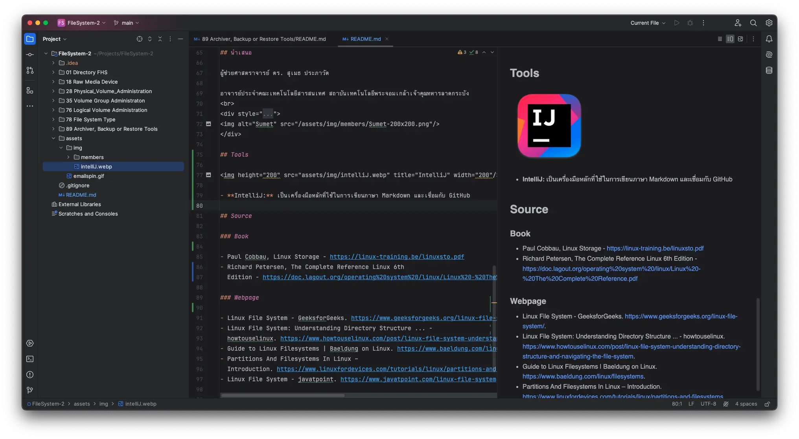

# FileSystem-2

Computer Organization and Operating System Assignment (Chapter: File System, Sec: 2)

[//]: # ([Contributors]&#40;#Contributors&#41;)

- [01 File Directory FHS](01%20File%20Directory%20FHS/README.md)
- [18 Raw Media Device](18%20Raw%20Media%20Device/README.md)
- [28 Physical_Volume_Administration](28%20Physical_Volume_Administration/README.md)
- [35 Volume Group Administraton](35%20Volume%20Group%20Administraton/README.md)
- [76 Logical Volume Administration](76%20Logical%20Volume%20Administration/README.md)
- [78 File System Type](78%20File%20System%20Type/README.md)
- [89 Archiver, Backup or Restore Tools](89%20Archiver%2C%20Backup%20or%20Restore%20Tools/README.md)

## Introduction to File System

สวัสดีครับ ในรายงานนี้นะครับ เราก็จะมาทำความรู้จักกับระบบของ File Systems เบื้องต้นนะครับ
ซึ่งระบบ File Systems
ก็ถือว่าเป็นระบบใช้โดยคอมพิวเตอร์และระบบปฏิบัติการเพื่อจัดระเบียบและเก็บข้อมูลบนอุปกรณ์เก็บข้อมูลนะครับ
ในรายงานนี้นะครับหลักๆเลยก็จะ เรียนรู้ความแตกต่างระหว่าง
File Systems แต่ละหัวข้อนะครับ เช่นระบบ Files, Directories ฯลฯ คืออะไรนะครับ มันทำงานยังไง แล้วมันแตกต่างกันยังไงนะครับ
เมื่อเพื่อนๆ อ่านรายงานนี้นะครับหรือว่าศึกษารายงานนี้จนจบแล้วนะครับก็หวังว่าเพื่อนๆ
จะมีความสามารถที่จะอธิบายให้เพื่อนคนอื่นฟังได้ครับว่าระบบ File System มันคืออะไรนะครับ

## Overview

ระบบไฟล์ (File System) ใน Linux
คือวิธีการจัดระเบียบและจัดเก็บไฟล์ในระบบปฏิบัติการโดยพื้นฐานแล้วระบบไฟล์จะทำหน้าที่เป็นโครงสร้างไดเร็กทอรีที่อนุญาตให้ผู้ใช้เข้าถึง,
จัดเก็บ, และจัดระเบียบไฟล์ได้อย่างมีประสิทธิภาพ

ระบบไฟล์มักจะประกอบด้วยหลายเลเยอร์ รวมถึงเลเยอร์ตรรกะที่ให้การโต้ตอบกับผู้ใช้ API สำหรับการทำงานของไฟล์ต่างๆ
อีกทั้งยังมีหน้าที่จัดเก็บข้อมูลระบบของคุณและจัดการข้อมูลเหล่านั้น. ระบบไฟล์สามารถกำหนดเป็นกลไกที่อยู่เบื้องหลัง
การจัดเก็บและดึงข้อมูล.

ระบบไฟล์ใน Linux มีหลายประเภท เช่น ext4 และ XFS ซึ่งเป็นที่นิยมเนื่องจากความเร็วและความน่าเชื่อถือ.
นอกจากนี้ยังมีตัวเลือกที่เป็นขั้นสูงขึ้นเช่น btrfs และ ZFS
ซึ่งมีความยืดหยุ่นและความปลอดภัยมากขึ้นสำหรับการจัดเก็บข้อมูลขนาดใหญ่.

## Key Areas of Focus

1. **Files, Directories and FHS:** มาตรฐานระบบไฟล์ (FHS)
   กำหนดโครงสร้างไดเรกทอรีและเนื้อหาในไดเรกทอรีในระบบปฏิบัติการที่คล้ายกับ Unix มันถูกดูแลโดย Linux Foundation
   และกำหนดชื่อ, ตำแหน่ง, และสิทธิ์สำหรับหลายประเภทของไฟล์และไดเรกทอรี
2. **Raw Media Devices:** ในระบบคอมพิวเตอร์เบื้องต้น, Raw Media Devices
   เป็นประเภทของอุปกรณ์ทางตรรกกะคอมพิวเตอร์ที่อนุญาตให้อุปกรณ์จัดเก็บข้อมูลเช่นฮาร์ดดิสก์ไดรฟ์เข้าถึงโดยตรง,
   ข้ามแคชและบัฟเฟอร์ของระบบปฏิบัติการ
3. **Physical Volume Administration:** หน่วยจัดเก็บข้อมูลทางกายภาพพื้นฐานของ LVM (Logical Volume Manager)
   ซึ่งสามารถเป็นอุปกรณ์บล็อกเช่นพาร์ทิชันหรือฮาร์ดดิสก์ทั้งหมด
4. **Volume Group Administration:**  กลุ่มของพื้นที่เสมือนในฮาร์ดดิสก์ถูกสร้างขึ้นมาโดยการแบ่งดิสก์ทางกายภาย (Physical
   Volume) ออกเป็นส่วนๆ สร้างพื้นที่ในส่วนของฮาร์ดดิสก์ที่สามารถจัดการส่วนของ Logical Volume ได้
5. **Logical Volume Administration:** เป็นการจัดการจัดการการแบ่งฮาร์ดดิสก์ทางตรรกะ (Logical Volumes)
   เปรียบเสมือนเป็นการสร้างกล่องจัดเก็บข้อมูลจำลองที่ระบบไฟล์ (File System), ระบบฐานข้อมูล (DMBS) หรือแอปพลิเคชั่นต่างๆ
   สามารถเข้าถึงได้ซึ่งการจัดการเหล่านี้จัดการโดย Volume Group
6. **File System Type:**
   ระบบไฟล์คือวิธีและโครงสร้างของข้อมูลที่ระบบปฏิบัติการใช้ในการควบคุมวิธีการจัดเก็บและเรียกคืนข้อมูล
   โดยจะมีระบบไฟล์หลายประเภทซึ่งแต่ละประเภทมีโครงสร้างและการทำงานเป็นของตัวเองเช่น NTFS, FAT32, exFAT, และ EXT2/2/4
7. **Archiver, Backup/Restore Tools:** เป็นเครื่องมือซอฟต์แวร์ทีสร้างและจัดการการสำรองข้อมูลของคุณและกู้คืนของข้อมูล

## Contributors

| ID       | Name                                  | Sub Topic                      | Img                                                                             |
|----------|---------------------------------------|--------------------------------|---------------------------------------------------------------------------------|
| 65070001 | นางสาวกชกร ครุธเวโช (แพรไหม)          | Files, Directories and FHS     |  |
| 65070018 | นายกิตติ์ชินทักษ์ หรรษานนท์โชติ (วิน) | Raw Media Devices              |      |
| 65070028 | นายคณิศร สมศรีอักษรแสง (เบส)          | Physical Volume Administration |     |
| 65070035 | นายจิรโชติ อินทรวงษ์โชติ (ไจ๋)        | Volume Group Administration    |      |
| 65070076 | นายณัฐนนท์ วงศ์หนองเเวง (นนท์)        | Logical Volume Administration  |     |
| 65070078 | นายณัฐพงศ์ มาสำราญ (เจมส์)            | File System Type               |    |
| 65070089 | นายธนกฤต ทรัพย์ประสิทธิ์ (เต้)        | Archiver, Backup/Restore Tools |      |

[//]: # (![GroupMembers]&#40;/assets/img/members/group-members.jpeg&#41;)

## นำเสนอ

ผู้ช่วยศาสตราจารย์ ดร. สุเมธ ประภาวัต

อาจารย์ประจำคณะเทคโนโลยีสารสนเทศ สถาบันเทคโนโลยีพระจอมเกล้าเจ้าคุณทหารลาดกระบัง

 

 

[sumet@it.kmitl.ac.th](mailto:sumet@it.kmitl.ac.th)

## Tools

- **IntelliJ:** เป็นเครื่องมือหลักที่ใช้ในการเขียนภาษา Markdown และเชื่อมกับ GitHub
  

[//]: # ()

## Source

- ### Book

    - Paul Cobbau, Linux Storage - https://linux-training.be/linuxsto.pdf
    - Richard Petersen, The Complete Reference Linux 6th
      Edition - https://doc.lagout.org/operating%20system%20/linux/Linux%20-%20The%20Complete%20Reference.pdf

- ### Webpage

    - Linux File System - GeeksforGeeks. https://www.geeksforgeeks.org/linux-file-system/.
    - Linux File System: Understanding Directory Structure ... -
      howtouselinux. https://www.howtouselinux.com/post/linux-file-system-understanding-directory-structure-and-navigating-the-file-system.
    - Guide to Linux Filesystems | Baeldung on Linux. https://www.baeldung.com/linux/filesystems.
    - Partitions And Filesystems In Linux –
      Introduction. https://www.linuxfordevices.com/tutorials/linux/partitions-and-filesystems.
    - Linux File System - javatpoint. https://www.javatpoint.com/linux-file-system.

