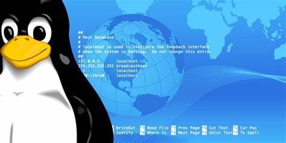
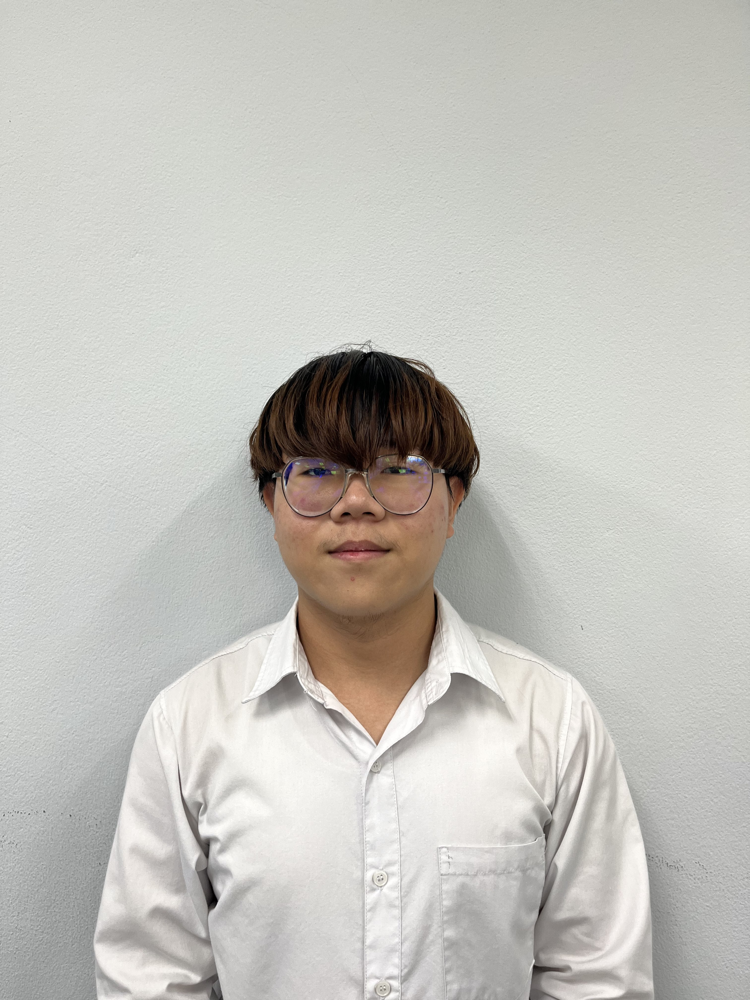
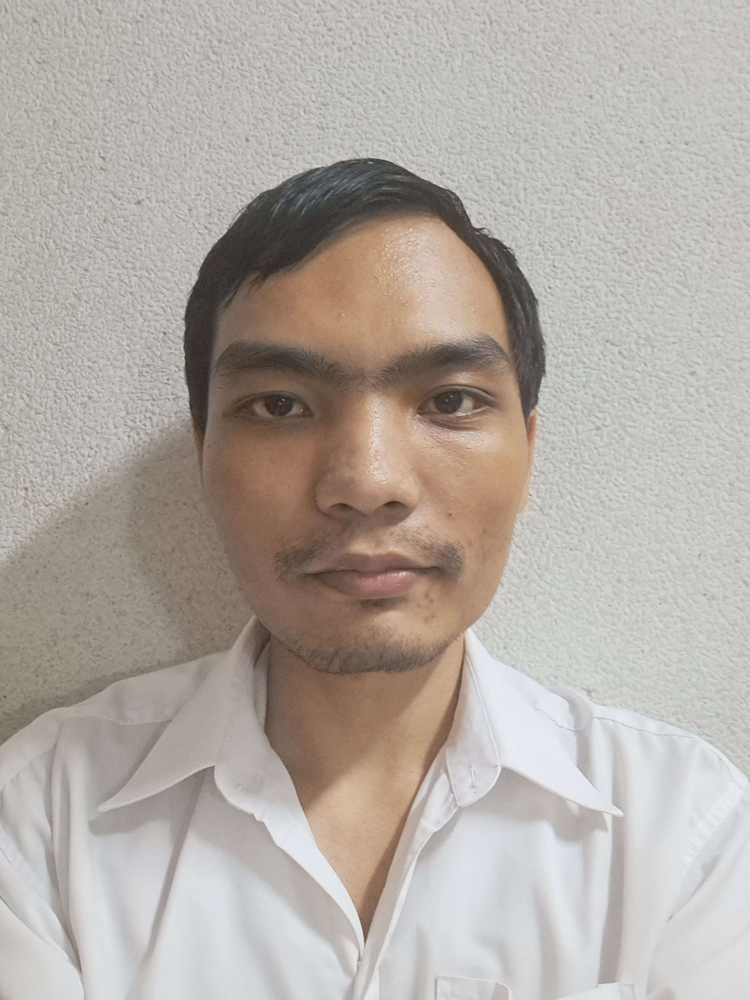
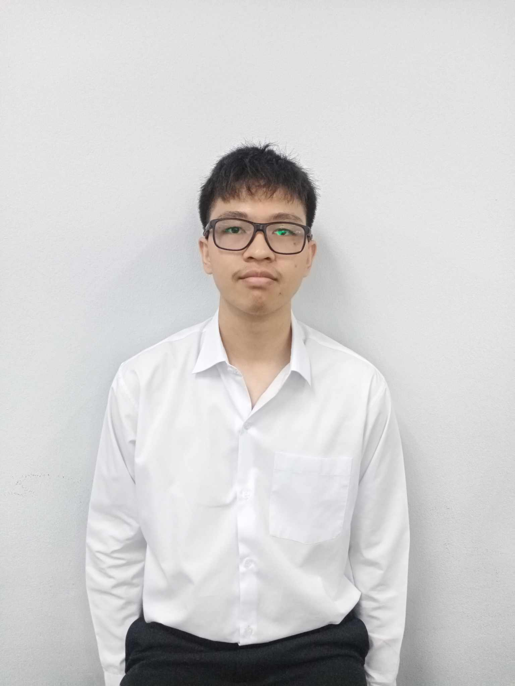
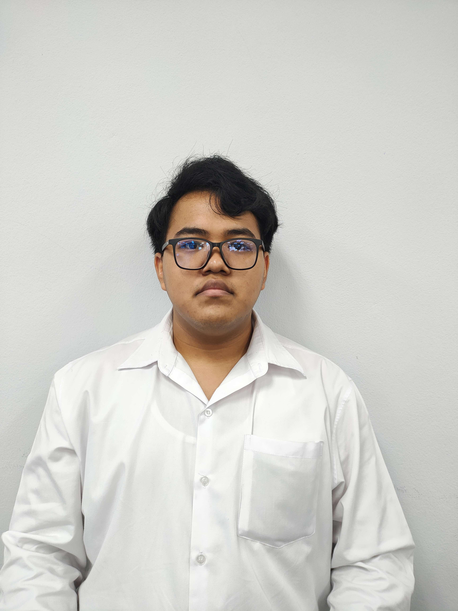
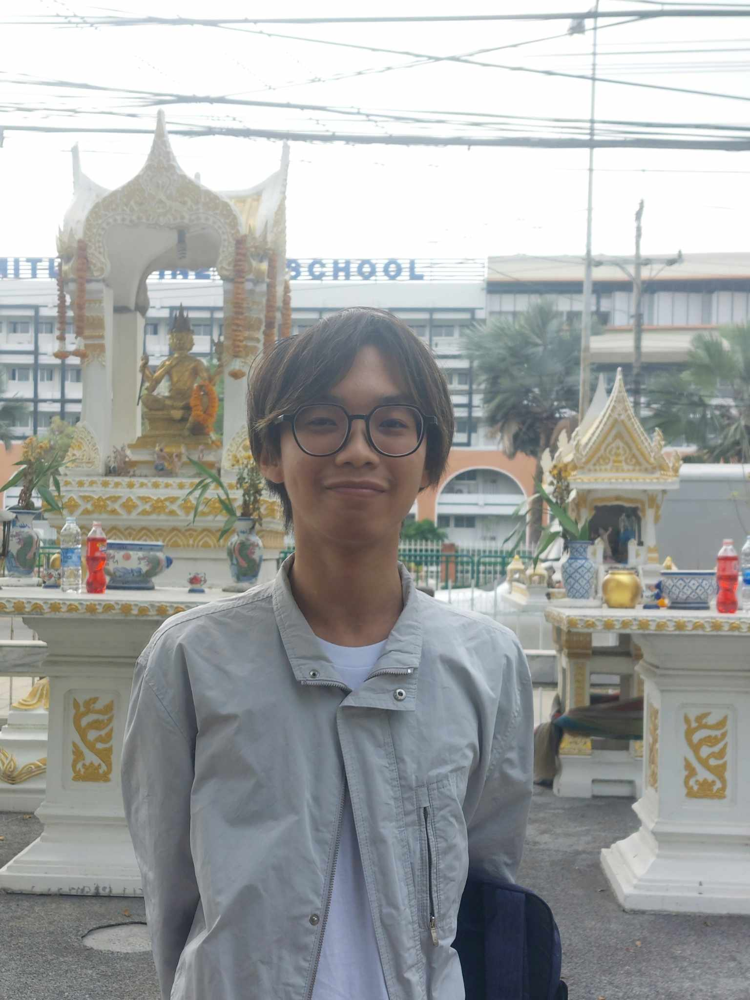

# HOST-1
Computer Organization and Operating System 2/2566 

# Intro

- Host คืออะไร ?
  - Host คือ เครื่องคอมพิวเตอร์หรืออุปกรณ์ที่ใช้ในการ Host บริการหรือแอปพลิเคชันต่างๆในระบบเครือข่ายเซิร์ฟเวอร์หรือเครื่องคอมพิวเตอร์ที่ใช้เก็บข้อมูลหรือแบ่งปันทรัพยากรต่างๆในเครือข่ายโดยโปรแกรมหรือบริการที่ทำงานบนเครื่องคอมพิวเตอร์นั้นๆจะมีการเรียกใช้งานผ่านทาง Host

- I/O มีไว้ทำไม ?
  - ทำการควบคุม และ timing
  - สื่อสารกับ CPU และ อุปกรณ์

- Kernel คือ อะไร ?
  - Kernel คือ ระบบปฏิบัติการที่มีหน้าที่จัดการทรัพยากรของระบบและจัดการกับการประมวลผล โดยจะเป็นตัวกลางที่มีหน้าที่ติดต่อระหว่าง Software กับ Hardware

- Memory คืออะไร ?
  - Memory คือ อุปกรณ์เก็บสถานะของข้อมูลและชุดคำสั่ง เพื่อการประมวลผลของคอมพิวเตอร์ หน่วยความจำสามารถแบ่งออกได้เป็น 2 ประเภท คือหน่วยความจำถาวรกับหน่วยความจำชั่วคราว 

# Topic

- [Host Configuration](https://earth123456789.github.io/Host-1/hostconfiguration/readme/)
- [I/O Devices](https://earth123456789.github.io/Host-1/iodevices/readme/)
- [Kernel](https://earth123456789.github.io/Host-1/kernel/readme/)
- [Memory](https://earth123456789.github.io/Host-1/memory/readme/)

# About Project
- Read On Web(Recommend) : [Link](https://earth123456789.github.io/Host-1/)
- Read On Github : [Link](https://github.com/Earth123456789/Host-3/tree/main/src/content/docs)
  
# References
- Read On Web(Recommend) : [Link](https://earth123456789.github.io/Host-1/reference/example/)
- Read On Github : [Link](https://github.com/Earth123456789/Host-1/blob/main/src/content/docs/reference/example.md)

# Group Member

|รหัสนักศึกษา|ชื่อ-นามสกุล|หน้าที่|ภาพสมาชิก|
|:----:|:----:|:----:|:----:|
|65070036|นายจิรภัทร สุขนิวัตรศิริ|Memory|

|
|65070187|นายมณฑล แก้วบริวงษ์|Kernel|

|
|65070196|นายรพีพงษ์ วิมลเมือง|Host|

|
|65070205|นายวรินทร ปิตินานนท์|I/O|

|
|65070206|นายวสุพล พลสวัสดิ์|Memory|

|
|65070209|นายวิปัศย์ โชคนันทวงศ์|Kernel|

|
|65070242|นายสุภัศชัย โพธิชัย|I/O|

|