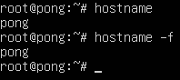
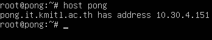
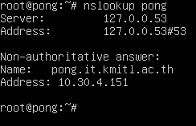
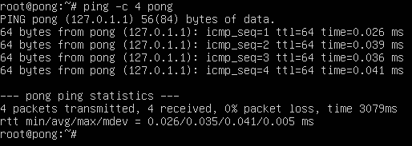
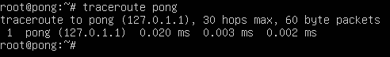
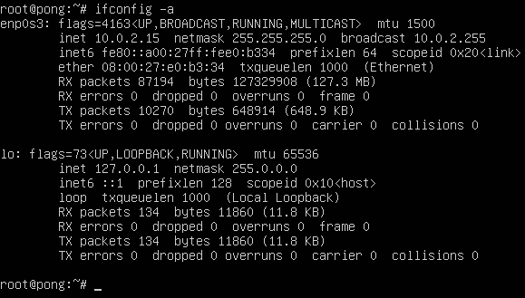
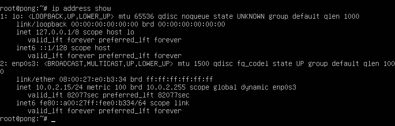
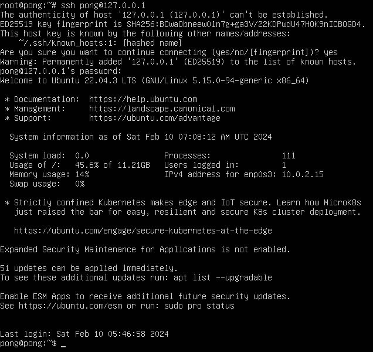

# Host
>Host คือ เครื่องคอมพิวเตอร์หรืออุปกรณ์ที่ใช้ในการ Host บริการหรือแอปพลิเคชันต่างๆในระบบเครือข่ายเซิร์ฟเวอร์หรือเครื่องคอมพิวเตอร์ที่ใช้เก็บข้อมูลหรือแบ่งปันทรัพยากรต่างๆในเครือข่ายโดยโปรแกรมหรือบริการที่ทำงานบนเครื่องคอมพิวเตอร์นั้นๆจะมีการเรียกใช้งานผ่านทาง Host

โดย Host สามารถแบ่งได้ดังนี้

1.Physical Host:เป็นเครื่องคอมพิวเตอร์ที่มีการติดตั้งระบบปฏิบัติการและใช้เป็นพื้นที่ในการให้บริการต่างๆซึ่งสามารถเชื่อมต่อกับเครือข่ายและให้บริการแก่ผู้ใช้หรืออุปกรณ์อื่นๆในเครือข่าย

2.Virtual Host:เป็นเครื่องเสมือนที่สร้างขึ้นบน Physical Host ซึ่งสามารถมีเครื่องเสมือนหลายอันอยู่บนเครื่องคอมพิวเตอร์เดียวกันได้

3.Container Host:เป็นเครื่องคอมพิวเตอร์ที่มีการติดตั้ง Docker Engine หรือระบบจัดการคอนเทนเนอร์อื่นๆเพื่อให้เครื่องคอมพิวเตอร์นั้นสามารถรันและจัดการกับคอนเทนเนอร์ได้อย่างมีประสิทธิภาพ

4.Server Host:เป็นเครื่องคอมพิวเตอร์ที่มีการกำหนดค่าและปรับแต่งให้เป็นเซิร์ฟเวอร์โดยเฉพาะโดยทำหน้าที่ให้บริการแก่ผู้ใช้หรืออุปกรณ์อื่นๆในเครือข่าย

## Host Command Options

|Option|คำอธิบาย|
|:---:|:---:|
|-v|แสดงผลลัพธ์อย่างละเอียดมากขึ้น แสดงข้อมูลเพิ่มเติมเกี่ยวกับคิวรี่|
|-t|ระบุประเภทคิวรี่|
|-a|ดำเนินการ DNS lookup แบบ reverse DNS lookup
|-T|เปิดใช้งาน โหมด TCP /IP|
|-c|ตั้งค่าคลาส DNS สำหรับการสืบค้น|
|-h|แสดงข้อความช่วยเหลือเพื่อแสดงตัวเลือกที่มีอยู่|
|-4|ใช้การขนส่งแบบสอบถาม IPv4 เท่านั้น|
|-6|ใช้การขนส่งแบบสอบถาม IPv6 เท่านั้น|
|-w|ระบุให้รอการตอบกลับตลอดไป|
|-W|กำหนดระยะเวลาในการรอการตอบกลับ|
|-s|ตั้งค่าเซิร์ฟเวอร์ DNS สำหรับการสืบค้น|

## คำสั่งเกี่ยวกับ Host ใน  Linux

>1. hostname,  hostname -f : ใช้เพื่อแสดงหรือตั้งค่าชื่อของเครื่อง Host

* โดย Host ที่เห็นคือชื่อของ Host ซึ่งในรูปคือ pong

>2. host[ชื่อ Domain],  host[ชื่อ Host] : ใช้สำหรับการตรวจสอบข้อมูล DNS ของ Host

* โดยสิ่งที่แสดงคือ Domain Address ของ host

>3. nslookup[ชื่อ Domain],  nslookup[ชื่อ Host] : ใช้สำหรับค้นหาข้อมูลเกี่ยวกับโฮสต์หรือโดเมนผ่านการสอบถามกับเซิร์ฟเวอร์ DNSโดยตรง

* โดยสิ่งที่แสดงคือข้อมูลที่เกี่ยวข้องกับ Host นั้นๆเป็นที่อยู่ IP หรือข้อมูลอื่น ๆ ที่เกี่ยวข้องกับ Host นั้น ๆ

>4. ping[Options][ชื่อ Host],  ping[Options][IP_Address] : ใช้ในการทดสอบการเชื่อมต่อระหว่างอุปกรณ์ในเครือข่ายโดยส่งแพ็คเก็ต ICMP ECHO_REQUEST ไปยังโฮสต์ที่ระบุและรอรับการตอบกลับเพื่อทดสอบว่าโฮสต์นั้นๆ ออนไลน์หรือไม่ และตรวจสอบเวลาที่เกิดการรับส่งข้อมูล

* โดยที่การ ping จะเป็นการส่งแพ็คเก็ตไปยัง Host ที่กำหนดส่วน -c 4 คือการส่ง4ครั้ง

>5. traceroute [ชื่อ Host],  traceroute[IP_Address] : ใช้ในการตรวจสอบเส้นทางของการส่งข้อมูลผ่านเครือข่ายจากเครื่องของเราไปยังเซิร์ฟเวอร์หรือโฮสต์ที่ระบุ โดยทำการส่งแพ็คเก็ตไปยังปลายทางที่ระบุและติดตามเส้นทางที่แพ็คเก็ตเดินทางผ่านเครือข่าย

* โดยที่การ traceroute คือการที่ตรวจสอบข้อมูลเส้นทางการส่งข้อมูลจาก Host ไปปลายทาง

>6. ifconfig [interface][option] : ใช้ในการแสดงข้อมูลเกี่ยวกับ network interface ของเครื่องคอมพิวเตอร์รวมถึงการตั้งค่า IP address,netmask,MAC address และสถานะอื่นๆของ interface นั้นๆ

* เป็นการแสดงข้อมูลเกี่ยวกับ interface ที่กำลังใช้อยู่บนเครื่องส่วน -a เป็นการทำให้ ifconfig แสดงรายการทั้งหมดของอินเทอร์เฟซ รวมถึงอินเทอร์เฟซที่ไม่ได้กำหนด IP address และกำลังถูกปิดการใช้งาน

>7. ip [options] object command : ใช้สำหรับแสดงข้อมูลหรือกำหนดค่าอินเตอร์เฟซเครือข่ายเช่นเดียวกันกับ ifconfig

* เป็นการแสดงข้อมูลเกี่ยวกับที่อยู่ IP ของ interface บนระบบส่วน address show เป็นการแสดงข้อมูลเกี่ยวกับทุก interface ที่มีอยู่บนระบบรวมถึง IP address, netmask, MAC address ด้วย

>8. ssh [ชื่อ host]@ip_address : ใช้ในการเชื่อมต่อและจัดการกับระบบคอมพิวเตอร์ระยะไกลอย่างปลอดภัย โดย SSH จะสร้างการเชื่อมต่อเข้าไปยังเครื่องคอมพิวเตอร์อื่นผ่านเครือข่ายอินเทอร์เน็ตหรือเครือข่ายภายใน

* เป็นการแสดงข้อมูลเกี่ยวกับการเชื่อมต่อและจัดการเครื่องคอมพิวเตอร์ระยะไกลผ่านเครือข่ายอินเทอร์เน็ตหรือเครือข่ายภายในโดยที่มีการเข้ารหัสข้อมูลและการรับรองตัวตน

