# Kernel

:::caution
> [!WARNING]
คำสั่งที่ใช้บางคำสั่งนั้นมีการ sudo นำหน้าเนื่องจากบางคำสั่งนั้นมีการกำหนด permission
:::

## Kernel คือ อะไร ?
>ระบบปฏิบัติการที่มีหน้าที่จัดการทรัพยากรของระบบและจัดการกับการประมวลผล โดยจะเป็นตัวกลางที่มีหน้าที่ติดต่อระหว่าง Software กับ Hardware
  
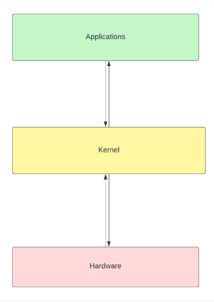

## หน้าที่ของ Kernel
>Kernel มีหน้าที่เป็นส่วนช่วยติดต่อสื่อสารระหว่างแอปพลิเคชั่นและฮาร์ดแวร์แบบ low-level services มีอยู่ 4 อย่างได้แก่

1. การจัดการการใช้งานหน่วยความจำ คอยติดตามปริมาณการการใช้หน่วยความจำ สิ่งที่ถูกจัดเก็บในหน่วยความจำ และที่อยู่ในหน่วยความจำ
2. การจัดการ process พิจารณาว่ากระบวนการใดบ้างที่สามารถใช้หน่วยประมวลผลกลาง (CPU) ได้  ใช้งานเมื่อไหร่ และใช้นานเพียงใด
3. การจัดการไดรเวอร์ของอุปกรณ์ ทำหน้าที่เป็นสื่อกลาง/ล่ามระหว่างฮาร์ดแวร์และ process ต่างๆ
4. การจัดการคำสั่งเรียกใช้ระบบและความปลอดภัย รับคำขอบริการจาก process ต่างๆ

## ประเภทของ Kernel

### 1. Microkernel
 เป็นสถาปัตยกรรมของระบบปฏิบัติการที่ kernel จะถูกทำให้มีขนาดเล็กที่สุดเท่าที่เป็นไปได้ โดยมีแค่ส่วนพื้นฐานที่จำเป็นต่อของระบบปฏิบัติการเท่านั้น

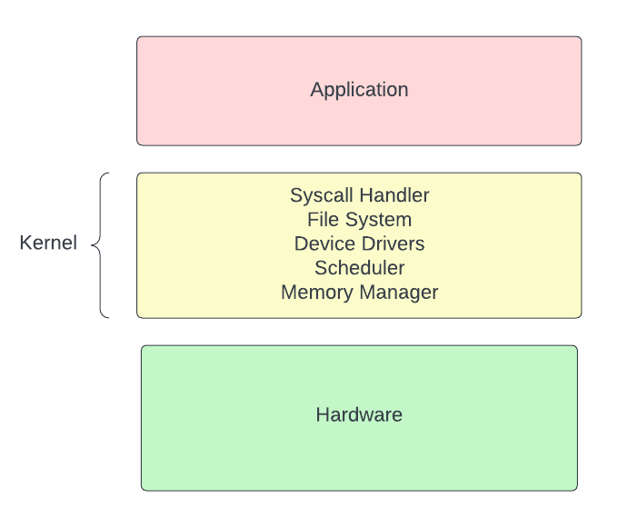

### 2. Monolithic kernel 
เป็นสถาปัตยกรรมของระบบปฏิบัติการที่ทำในรูปแบบรวม ไดรเวอร์ของอุปกรณ์ ระบบไฟล์ และคำสั่งเรียกใช้ระบบมาในตัวของ Kernel เลย

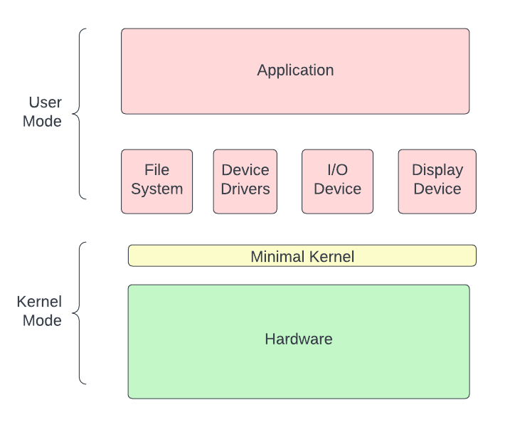

### 3. Hybrid kernel 
เป็นระบบปฏิบัติการที่รวมเอา Microkernel และ Monolithic kernel เข้าด้วยกัน เพื่อที่จะเอาข้อดีของทั้งสอง kernel มากลบข้อเสียซึ่งกันและกัน

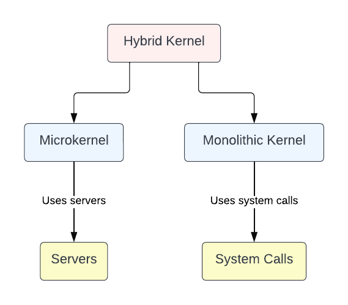

### 4. Exokernel 
เป็นสถาปัตยกรรมของระบบปฏิบัติการที่เน้นให้มี abstraction ในระบบให้น้อยที่สุด เสมือนเราไปควบคุมทรัพยากรของอุปกรณ์ต่างๆโดยตรง

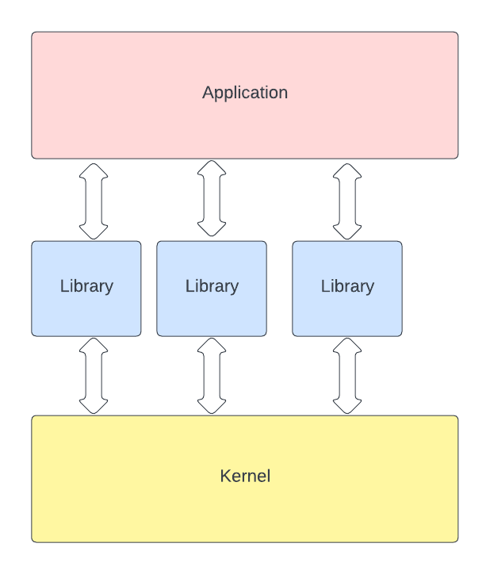

### 5. Nanokernel 
เป็นสถาปัตยกรรมของระบบปฏิบัติการที่ที่คล้ายกับ Microkernel แต่มีขนาดที่เล็กกว่าและทำให้มีประสิทธิภาพมากกว่าเมื่อเทียบกัน

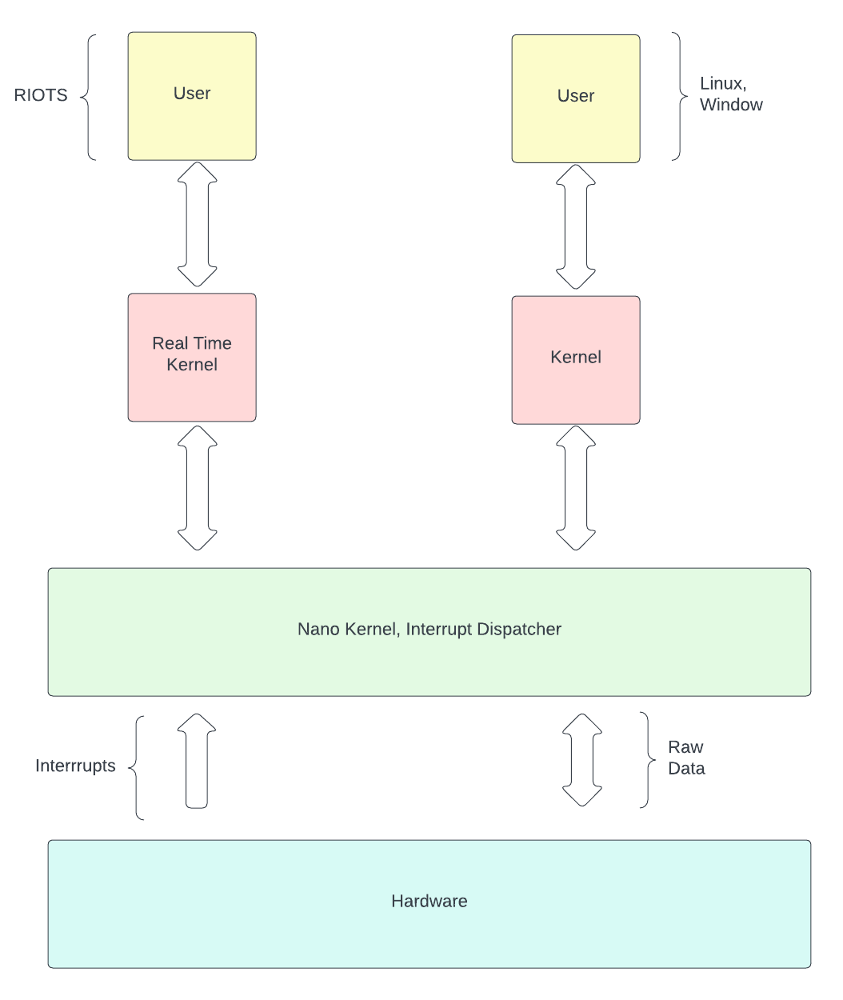

## คำสั่ง linux ที่เกี่ยวข้องกับ Kernel

### <h4 style="text-align: center;"><strong>lsmod [module name]</strong></h4>

lsmod เป็น tool ที่อนุญาตให้แสดงรายการโมดูลใน Linux Kernel 

ผลลัพธ์ เมื่อใช้ lsmod

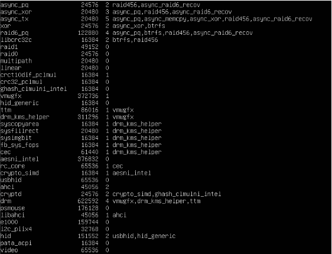

ซ้ายสุด = module  กลางซ้าย = size กลางขวา = used ขวา =  by

### <h4 style="text-align: center;"><strong>insmod [file name] [module-options...]</strong></h4>

insmod เป็นคำสั่งที่ใช้แทรกโมดูลเข้าไปใน Kernel ในรูปแบบ kernel object file ไฟล์ .ko

### <h4 style="text-align: center;"><strong>rmmod [-f] [-s] [-v] [modulename]</strong></h4>

rmmod เป็นคำสั่งที่ใช้เพื่อลบโมดูลที่เราไม่ต้องการออก

### <h4 style="text-align: center;"><strong>depmod [options] [kernel_version]</strong></h4>

depmod เป็นคำสั่งที่เพื่อสร้างหรืออัปเดตไฟล์ modules.dep, modules.dep.bin และ map file ซึ่งเป็นข้อมูลที่ใช้ modprobe เพื่อจัดการ kernel modules

ผลลัพธ์ เมื่อใช้ depmod

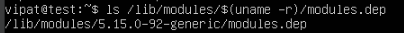

### <h4 style="text-align: center;"><strong>modinfo module_name</strong></h4>

modinfo เป็นคำสั่งที่แสดงข้อมูลของโมดูลนั้นๆ

ผลลัพธ์ เมื่อใช้ modinfo

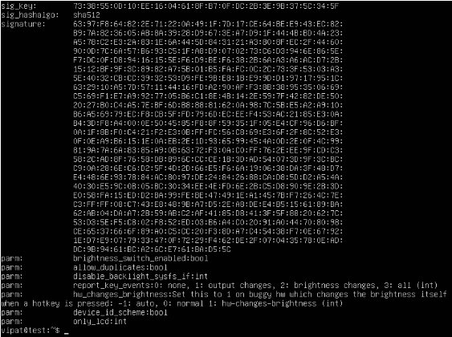

### <h4 style="text-align: center;"><strong>systool -v -m module_name</strong></h4>

systool เป็นคำสั่งที่ดูข้อมูลอุปกรณ์ที่มีการเชื่อมต่อกับระบบ และ kernel modules

ผลลัพธ์ เมื่อใช้ systool

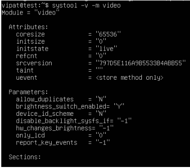

### <h4 style="text-align: center;"><strong>modprobe [options] [module_name]</strong></h4>

modprobe: ใช้ในการเพิ่ม หรือ ลบ kernel modules

:::caution
> [!WARNING]
การใช้ modprobe นั้นอาจเกิดการเปลี่ยนแปลงของระบบขึ้นได้
:::

ผลลัพธ์เมื่อใช้ modprode

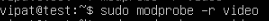

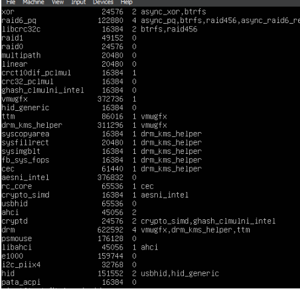

### <h4 style="text-align: center;"><strong>/sys/module</strong></h4>

| คำสั่ง                                    | คำอธิบาย                                                                                                                             |
|------------------------------------------|-------------------------------------------------------------------------------------------------------------------------------------|
| **/sys/module/[MODULENAME]**            | ถ้าโมดูลถูกคอมไพล์ในเคอร์เนลโดยตรงและไม่มีการระบุเวอร์ชันหรือพารามิเตอร์ ชื่อโมดูลจะปรากฏเฉพาะเมื่อมีการระบุเวอร์ชันหรือพารามิเตอร์ หากเป็นโมดูลไดนามิกที่โหลดได้ ชื่อโมดูลจะแสดงเสมอใน lsmod หรือ modinfo |
| **/sys/module/[MODULENAME]/parameters** | ไดเรกทอรีนี้มีไฟล์แต่ละไฟล์เป็นพารามิเตอร์แต่ละตัวของโมดูลที่สามารถเปลี่ยนแปลงได้ขณะทำงาน (runtime) ดูเอกสารของโมดูลเองเพื่อทราบรายละเอียดของพารามิเตอร์และผลกระทบที่เกิดขึ้นจากการเปลี่ยนแปลงพารามิเตอร์นั้นๆ |
| **/sys/module/[MODULENAME]/refcnt**    | ถ้าโมดูลสามารถถูกยกเลิกการโหลดออกจากเคอร์เนลได้, ไฟล์นี้จะแสดงจำนวนการอ้างอิงปัจจุบันของโมดูล                                                                                |
| **/sys/module/[MODULENAME]/srcversion** | ถ้าโมดูลมี MODULE_VERSION ในโค้ดต้นฉบับ, ไฟล์นี้จะประกอบด้วยเช็คซัมของโค้ดต้นฉบับ                                                                                         |
| **/sys/module/[MODULENAME]/version**    | ถ้าโมดูลมี MODULE_VERSION ในโค้ดต้นฉบับ, ไฟล์นี้จะประกอบด้วยเวอร์ชันของโค้ดต้นฉบับ                                                                                           |
| **/etc/os-release**                     | เป็น Directory ที่เก็บข้อมูลของระบบปฏิบัติการ                                                                                                                                          |
| **/usr/lib/os-release**                 | เป็น Directory ที่เก็บข้อมูลของระบบปฏิบัติการ                                                                                                                                          |
| **/etc/initrd-release**                 | ไฟล์ /etc/initrd-release ใน initrd เหมือนกับ /etc/os-release ในระบบหลัก และบอกว่าระบบอยู่ในเฟส initrd. ควรทำ symbolic link จาก /etc/os-release ไปยัง /etc/initrd-release เพื่อให้โปรแกรมที่มองหาเฉพาะ /etc/os-release ทำงานถูกต้อง. /etc/initrd-release ไม่ได้มีการใช้งานอย่างทั่วไปในระบบปฏิบัติการ Linux แต่มันอาจมีอยู่ในบางระบบซึ่งใช้งานแบบพิเศษหรือปรับแต่งที่เฉพาะกับระบบนั้น ๆ |
| **/usr/lib/extension-release.d/extension-release.IMAGE** | ไฟล์ ใน extension images เป็นเหมือน os-release ในระบบหลัก, ใช้ระบุประจำตัวของ extension และตรวจสอบความเข้ากันได้กับ base OS โดยตรวจสอบ ID=, SYSEXT_LEVEL= หรือ VERSION_ID=. ป้องกันไม่ให้รวมรูปภาพที่ไม่เข้ากันใน overlay |
  

/usr/src/linux-\<kernel-version\> เป็น directory ที่เก็บ kernel sources (source codes ของ kernel)  
  

/proc เป็น directory ที่เป็น virtual filesystem  ทำหน้าที่เป็นส่วนต่อประสานกับโครงสร้างข้อมูลภายใน Kernel สามารถใช้มันเพื่อรับข้อมูลหรือแก้ไขพารามิเตอร์ของ Kernel ในระหว่าง Runtime ได้  
  

sysctl เป็นคำสั่งเปลี่ยนพารามิเตอร์ของ Kernel ในระหว่าง Runtime โดยพารามิเตอร์คังกล่าวจะอยู่ใน /proc/sys/

    sysctl [options] [variable[=value]] [...]
    sysctl -p [file or regexp] [...]  

