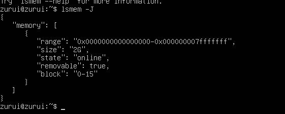

## Memory
>Memory คือ  อุปกรณ์เก็บสถานะของข้อมูลและชุดคำสั่ง เพื่อการประมวลผลของคอมพิวเตอร์ หน่วยความจำสามารถแบ่งออกได้เป็น 2 ประเภท คือหน่วยความจำถาวรกับหน่วยความจำชั่วคราว แต่ถ้าเราแบ่งตาม resource 
ตามการใช้งานของระบบเราสามารถแบ่งได้ 2 แบบคือ

* Physical Memory : คือหน่วยความจำหลักที่ติดตั้งอยู่ภายในเครื่องคอมพิวเตอร์ หรือที่เราเรียกว่า Random Access Memory (RAM) 
* Virtual Memory : เป็นหน่วยความจำเสมือนที่เอาไว้รองรับหาก RAM ความจุไม่เพียงพอหรือต้องการลดภาระของ RAM

โดย Virtual Memory จำเป็นต้องใช้ Physical Memory เพราะ Virtual Resource เป็นการแบ่ง 
Physical Resource มาแบ่งการใช้งาน แต่ Physical Memory ไม่จำเป็นต้องใช้ Virtual Memory
***

### คำสั่งที่ใช้ในการจัดการหรือตรวจสอบหน่วยความจำของ linux มีคร่าวๆ ดังนี้

>1.free : คำสั่งนี้จะแสดงรายละเอียดเกี่ยวกับขนาด memory(RAM) และ swap(Virtual) ที่ถูกใช้ไปและที่เหลืออยู่ภายในระบบ โดยมีหน่วยเป็น kilobytes จะแสดงข้อมูลดังนี้

|ข้อมูลที่แสดง|ความหมาย|  
|:---:|:---:|
|total|memory/swap ทั้งหมดที่มี|
|used|memory/swap ทั้งหมดที่ใช้อยู่|
|free|memory/swap ทั้งหมดที่ว่างอยู่|
|shared|memory มาใช้แทน disk ทำให้ทำงานได้เร็ว|
|buff/cache|memory/swap ที่ใช้งานโดย buff/cache|
|available|เป็น memory ที่ว่างให้ใช้สำหรับการเริ่มใช้งาน Application โดยไม่ต้องใช้ swap memory|
---
>1.1 free -h : จะแสดงผลเหมือนกับ free แต่หน่วยของขนาดข้อมูลจะอยู่ในรูปแบบ human-readable หรือที่เรียกว่ามนุษย์เข้าใจได้

***
>2.vmstat(virtual memory statistics) : เป็นคำสั่งที่ใช้แสดงผลรายงานเกี่ยวกับสถิติการทำงานของ Virtual memory

* Procs
    * r (running): จำนวนกระบวนการที่กำลังรอให้ CPU ประมวลผล
    * b (blocked): จำนวนกระบวนการที่รอให้ถูกเรียกใช้ถึงจะทำงานได้    
* Memory
    * swpd : จำนวน virtual memory ที่ถูกใช้ไป
    * free : จำนวน memory ที่ยังไม่ถูกใช้งาน
    * buff : จำนวน memory ที่ใช้งานโดย buffers
    * cache : จำนวน memory ที่ใช้งานโดย cache
* Swap
    * si (swap in) : จำนวนข้อมูลที่ถูกนำเข้ามาใน swap ที่มาจาก RAM
    * so (swap out) : จำนวนข้อมูลที่ถูกส่งออกจาก swap ไป RAM
* IO
    * Bi (blocks in) : จำนวนข้อมูลที่ถูกอ่านจาก block device
    * Bo (blocks out) : จำนวนข้อมูลที่ถูกส่งไปยัง block device
* System
    * In (interrupts) : จำนวนการเกิด interrupt ใน 1 วินาที
    * Cs (context switches) : จำนวนการเปลี่ยนสถานะของกระบวนการใน 1 วินาที
* CPU
    * us (user time) : เวลาที่ใช้ในการประมวลผลที่ไม่เกี่ยวข้องกับ kernal
    * sy (system time) : เวลาที่ใช้ประมวลผลงานที่เกี่ยวข้องกับ kernel
    * id (idle time) : เวลาว่างที่ CPU ไม่ทำงาน
    * wa (wait time) : เวลาที่ CPU ใช้รอ I/O
    * st (steal time) : เวลาที่ CPU ถูกขโมยจาก virtual machine
***
>2.1 vmstat -s : ใช้แสดงผลสถิติที่เกี่ยวข้องกับระบบทั้งหมด

>2.2 vmstat -s | grep -i '.......' : ถ้าหากเราต้องการแค่บางข้อมูล เราสามารถใช้ คำสั่งนี้ได้ แล้วภายใน single quote(‘ ’) ให้ระบุข้อมูลที่เราต้องการสังเกต เช่น

โดย grep ใช้สำหรับกรองและแสดงข้อมูล ส่วน -i ใช้เพื่อทำให้การค้นหาไม่ต้องพิจารณา case sensitive

>3.top : ใช้เพื่อตรวจสอบการใช้งานของ memory และ CPU ที่กำลังทำงานอยู่ขณะนั้นแบบ real-time โดยจะแสดงข้อมูลของระบบและรายชื่อของกระบวนการทำงานหรือ thread ที่ถูกจัดการโดย linux kernel ซึ่งประกอบไปด้วย

|ข้อมูลที่แสดง|ความหมาย|
|:---:|:---:|
|PID|แสดงรหัสลำดับของ task|
|PR|ลำดับความสำคัญของกระบวนการทำงาน ถ้าเลขยิ่งน้อยยิ่งสำคัญมาก|
|NI|เลขติดลบความสำคัญมาก เลขเป็นบวกความสำคัญจะน้อยกว่า|
|VIRT|ผลรวม virtual memory ที่ถูกใช้งาน|
|RES|แสดงการใช้งานของ RAM ขณะนั้น|
|SHR|แสดง shared memory size ที่ถูกใช้งาน|
|%CPU|แสดงการใช้งานของ CPU|
|%MEM|แสดงการใช้งานของ memory|
|TIME+|เวลาของ CPU แต่สะท้อนให้เห็นถึงรายละเอียดที่มากขึ้นตลอดเสี้ยววินาที|
|COMMAND|ชื่อของคำสั่งที่เริ่มกระบวนการทำงาน|
***

>4.htop : การใช้งานเหมือน top เพียงแค่มีฟีเจอร์มากกว่าตัว top เช่น รองรับการทำงานของ mouse มีสีเพื่อบ่งบอกข้อมูลที่ต่างกัน

 :::tip
 > [!TIP]
 หากใช้คำสั่ง htop แล้วขึ้นว่า Command htop not found ให้ทำการพิมพ์คำสั่ง sudo snap install htop
 :::

>5.lsmem: ใช้สำหรับแสดงข้อมูลเกี่ยวกับการใช้งานหน่วยความจำในระบบ รวมถึงข้อมูลเกี่ยวกับหน่วยความจำที่ระบบใช้งานอยู่

|ข้อมูลที่แสดง|ความหมาย|
|:---:|:---:|
|RANGE| แสดงช่วงของหน่วยความจำที่ระบบมีอยู่|
|SIZE| แสดงขนาดของหน่วยความจำในแต่ละช่วง|
|STATE| แสดงสถานะของหน่วยความจำ|
|REMOVABLE| แสดงว่าหน่วยความจำนั้นสามารถถอดออกได้หรือไม่|
|BLOCK| แสดงบล็อกที่เกี่ยวข้องกับแต่ละหน่วยความจำ|
***

>5.1 lsmem -h : จะแสดงคู่มือการใช้งานหรือคำสั่งช่วยเหลือ

>5.2 lsmem -a: จะแสดงข้อมูลเกี่ยวกับหน่วยความจำทั้งหมดในระบบที่สามารถเข้าถึงได้ รวมถึงข้อมูลเกี่ยวกับสถานะและรายละเอียดของแต่ละหน่วยความจำ รวมถึงข้อมูลเพิ่มเติมที่ lsmem ไม่ได้แสดง

:::note
> [!NOTE] 
> lsmem กับ lsmem -a ตรงที่ lsmem -a จะแสดงจะแสดงข้อมูลเพิ่มเติมเกี่ยวกับหน่วยความจำทั้งหมด แต่ lsmem เหมือนเป็นแค่ภาพรวมที่ไม่ได้ลงลายละเอียด 
 :::

>5.3 lsmem -b: แสดงขนาดของไบต์โดย ข้อมูลที่แสดงจะเป็นขนาดในหน่วยไบต์ทั้งหมดโดยตรง

>5.4 lsmem -J: แสดงผลในรูปแบบของ JSON

|ข้อมูลที่แสดง|ความหมาย|
|:---:|:---:|
|memories| ชื่อของชุดข้อมูลที่มีการแสดงข้อมูลของหน่วยความจำ|
|range| ช่วงของหน่วยความจำ|
|size| ขนาดของหน่วยความจำ|
|state| สถานะของหน่วยความจำ|
|removable| คือข้อมูลเกี่ยวกับความสามารถในการถอดออกได้ของหน่วยความจำ|
|block| แสดงบล็อกที่เกี่ยวข้องกับแต่ละหน่วยความจำ|
***

>5.5 lsmem -n: ไม่แสดงบรรทัดหัว

>5.6 lsmem -o: ระบุคอลัมน์ของผลลัพธ์ที่ต้องการแสดง ใช้ --help เพื่อรับรายการของคอลัมน์ที่รองรับทั้งหมด ใช้งานโดย + รายการที่อยากระบุคอลลัมน์ (e.g. lsmem -o +NODE)

* Output Columns ที่มี
    * RANGE : ช่วงของหน่วยความจำ
    * SIZE : ขนาดของหน่วยความจำ
    * STATE : สถานะของหน่วยความจำ
    * REMOVABLE : หน่วยความจำที่ถอดออกได้ 
    * BLOCK : แสดงช่วงของบล็อก
    * NODE : numa node ของหน่วยความจำ ( numa node คือโหนดในระบบคอมพิวเตอร์ที่มีหน่วยความจำในตัว โดยมีคุณสมบัติการเข้าถึงหน่วยความจำไม่เหมือนกันในทุกๆ โหนด)
    * ZONES : แสดงพื้นที่ที่ใช้ได้ของช่วงหน่วยความจำ

:::note
> [!NOTE]  
> lsmem --output-all จะแสดงคอลัมน์ทั้งหมดที่มี 
:::

>5.7 lsmem -P: สร้างผลลัพธ์ในูปแบบ key="value" โดยทุกตัวอักษรที่ไม่ปลอดภัยจะถูก hex-escaped

>5.8 lsmem -r: สร้างผลลัพธ์ในรูปแบบ raw ทั้งหมด

>6 /proc/meminfo Virtual File : คือจะมีไฟล์เสมือนพิเศษที่ชื่อ meminfo อยู่ภายในไดเรกทอรี /proc ที่สามารถอ่านได้ด้วยคำสั่งเช่น cat และ less เป็นต้น ไฟล์ meminfo เก็บข้อมูลเกี่ยวกับขนาดหน่วยความจำที่เป็นที่อยู่ในระบบของเรารวมถึงข้อมูลอื่นๆ ที่มีประโยชน์ มาอ่านไฟล์ /proc/meminfo ด้วยคำสั่ง cat โดยรายละเอียดของคำสั่งมีดังนี้

>6.1 Data Fields in /proc/meminfo : $ cat /proc/meminfo

:::note
> [!NOTE] 
>คำสั่งนี้จะแสดงกี่ยวกับหน่วยความจำทางกายภายในของเรา 
:::

>6.2 General Memory : $ cat /proc/meminfo | grep "Mem"

:::note
> [!NOTE]  
> คำสั่งนี้คือการต้องการข้อมูลพื้นฐานเกี่ยวกับหน่วยความจำ เช่น ว่าระบบของเรามีแรมเท่าไหร่ หรือมีพื้นที่ว่างเท่าไหร่ในขณะนี้ 
> 
:::

>6.3 Buffers and Cache : $ cat /proc/meminfo | grep -e "Buffers" -we "Cached"

*  Buffer: องค์ประกอบในหน่วยความจำที่เป็นการเก็บข้อมูลชั่วคราว ซึ่งมักจะไม่เกิน 20 เมกะไบต์โดยทั่วไป
* Cached: cache สำหรับไฟล์ที่อ่านจาก disk ซึ่งรวมถึง tmpfs และ shmem แต่ยกเว้น SwapCached

>6.4 Swap Space : $ cat /proc/meminfo | grep "Swap"

*  พื้นที่สำหรับการสลับ (swap space) เป็นพื้นที่สำรองบนดิสก์สำหรับหน่วยความจำแรม (RAM) เมื่อหน่วยความจำแรมทางกายภาพเต็ม ระบบจะใช้พื้นที่สำหรับการสลับนี้:
     * SwapCached: หน่วยความจำสำรองที่ใช้เมื่อเร็วๆ นี้ ซึ่งเพิ่มความเร็วของการนำเข้าและการส่งออกข้อมูล (I/O)
     * SwapTotal: จำนวนพื้นที่สำหรับการสลับทั้งหมดที่มีในระบบ
     * SwapFree: พื้นที่สำหรับการสลับที่ยังไม่ได้ใช้งาน, หรือหน่วยความจำที่ถูกย้ายจาก RAM ไปยังดิสก์ชั่วคราว

>6.5  Memory Activeness: $ cat /proc/meminfo | grep -e "Active" -e "Inactive" 

* Active: หน่วยความจำที่ใช้งานล่าสุด, ไม่เหมาะสมกับการเรียกคืนสำหรับแอปพลิเคชัน
* Inactive: หน่วยความจำที่ไม่ได้ใช้งานล่าสุด, เหมาะสมกับการเรียกคืนสำหรับแอปพลิเคชัน

>6.6 Writeback Into the Disk : $ cat /proc/meminfo | grep -e "Dirty" -e "Writeback" 

* Dirty: หน่วยความจำที่กำลังรอการเขียนกลับไปยังดิสก์
* Writeback: หน่วยความจำที่กำลังถูกเขียนกลับในขณะนี้
* WritebackTmp: บัฟเฟอร์ชั่วคราวสำหรับการเขียนกลับที่ใช้โดยโมดูล FUSE

>6.7 Shared Memory : $ cat /proc/meminfo | grep "Shmem"

* Shmem: ปริมาณที่ใช้โดยหน่วยความจำที่แชร์และระบบไฟล์ tmpfs
* ShmemHugePages: ปริมาณที่ใช้โดยหน่วยความจำที่แชร์และระบบไฟล์ tmpfs ด้วยหน้าเพจขนาดใหญ่
* ShmemPmdMapped: หน่วยความจำที่แชร์ที่มีการแมปในพื้นที่ผู้ใช้ด้วยหน้าเพจขนาดใหญ่

>6.8 Allocation Availability : $ cat /proc/meminfo | grep -ie "commit"

* CommitLimit: ปริมาณที่มีในปัจจุบันสำหรับการจัดสรรในระบบ
* Committed_AS: ปริมาณที่จัดสรรไว้ในระบบแล้ว

>6.9 Kernel Memory : $ cat /proc/meminfo | grep -ie "reclaim" -e "slab" -e "kernel"

* KReclaimable: หน่วยความจำที่ถูกจัดสรรโดยแกนเคอร์เนลและสามารถเรียกคืนได้
* Slab: หน่วยความจำระดับเคอร์เนลที่ใช้เก็บโครงสร้างข้อมูล
* SReclaimable: ส่วนที่สามารถเรียกคืนได้ของ Slab, เช่น caches
* SUnreclaim: ส่วนที่ไม่สามารถเรียกคืนได้ของ Slab
* KernelStack: หน่วยความจำสำหรับสแต็กเคอร์เนลของงานทั้งหมด

>6.10  Virtual Memory : $ cat /proc/meminfo | grep -e "PageTables" -e "Vmalloc"

* PageTables: ปริมาณหน่วยความจำที่ใช้โดยตารางหน้าที่ใช้โดยระบบหน่วยความจำเสมือน
* VmallocTotal: ขนาดรวมของพื้นที่หน่วยความจำ vmalloc เพื่อจัดสรรหน่วยความจำเสมือนต่อเนื่องทางเสมือน
* VmallocUsed: ขนาดของพื้นที่หน่วยความจำ vmalloc ที่ใช้งาน
* VmallocChunk: บล็อกหน่วยความจำ vmalloc ที่เหลือว่างใหญ่ที่สุดที่เป็นเนื้อเชื่อมต่อได้

