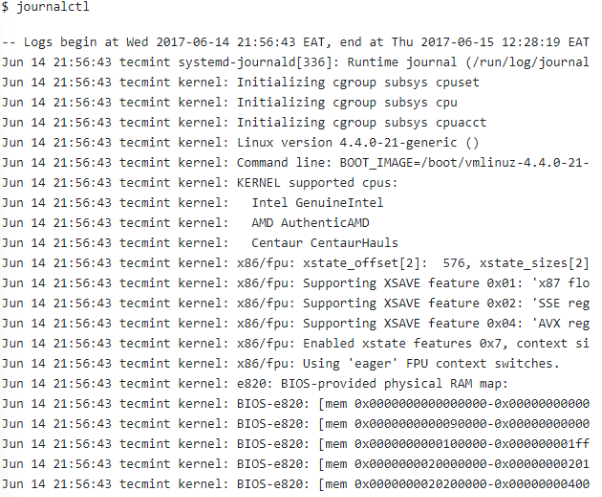
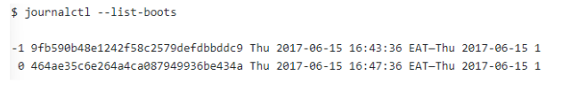
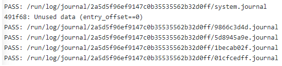
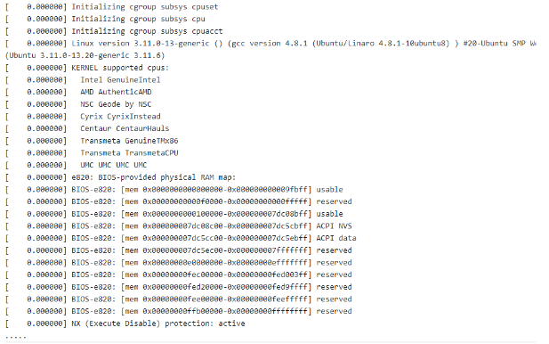
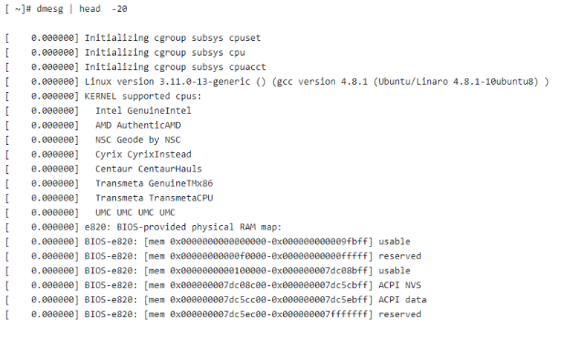
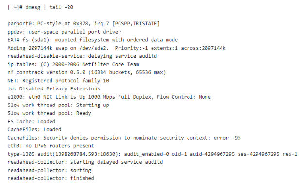
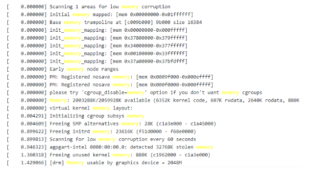
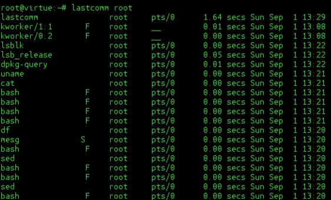

# Monitoring-Logging-Tools

## Topic
- Log Reader/Analysis
    - [ไปที่ Log Reader/Analysis](#log-readeranalysis)
- Log Collection/Server
    - [ไปที่ Log Collection/Server](#log-collectionserver)
- Log Files
    - [ไปที่ Log Files](#log-files)
- Working with Texts
    - [ไปที่ Working with Texts](#working-with-texts)

---

## Log Reader/Analysis


### Journalctl[^1][^2][^3]

[^1]:- https://th.linux-console.net/?p=678
[^2]:- https://th.linux-console.net/?p=20054
[^3]:- https://www.loggly.com/ultimate-guide/using-journalctl/


&nbsp;&nbsp;&nbsp;&nbsp;**Journald** เป็น **daemon** ที่รวบรวมและเก็บบันทึกจากทั้งระบบ โดยข้อความเหล่านั้นเป็นข้อความบูต ข้อความเคอร์เนลและจาก **syslog** หรือ app ต่าง ๆ และเก็บข้อความเหล่านั้นไว้ในตำแหน่งศูนย์กลาง **file journald**

ด้านล่างนี้คือตัวอย่างลักษณะของไฟล์ ดูโดยใช้คำสั่ง `cat`

```bash
$ cat /etc/systemd/journald.conf
```

ผลลัพท์ที่ได้

```bash
[Journal]
Storage=auto
Compress=yes
Seal=yes
SplitMode=uid
SyncIntervalSec=5m
RateLimitInterval=30s
RateLimitBurst=1000
SystemMaxUse=
\SystemKeepFree=
\SystemMaxFileSize=
\SystemMaxFiles=100
\RuntimeMaxUse=
\RuntimKeepFree=
\RuntimeMaxFiles=100
\MaxRetentionSec=
\MaxFileSec=1month
\ForwardToSyslog=yes
\ForwardToKMsg=no
\ForwardToConsole=no
\ForwardToWall=yes
\TTYPath=/dev/console
\MaxLevelStore=debug
\MaxLevelSyslog=debug
\MaxLevelKMsg=notice
\MaxLevelConsole=info
\MaxLevelWall=emerg
```

#### การดูข้อความบันทึกโดยใช้คำสั่ง **Journalctl**
- หากต้องการให้แสดงข้อความทั้งหมดโดยไม่มีการกรอง ให้ใช้
```bash
$ journalctl
```
ตัวอย่าง



#### ดูข้อความบันทึกตาม *Boots*
- เราสามารถแสดงรายการ *Boots ID* และการประทับเวลาของข้อความแรกและสุดท้ายโดยใช้
```bash
$ journalctl --list-boots
```
ตัวอย่าง



- หากต้องการดูรายการรายวันให้ใช้ `-b`
```bash
$ journalactl -b
```
- และหากอยากดูบันทึกจากการ Boots ครั้งก่อนให้ใช้ตัวเลือก `-b` ตามด้วยตัวชี้สัมพัทธ์ `-1`  หรือใช้ Boots ID
```bash
$ journalctl -b -1

$ journalctl -b 9fb590b48e1242f58c2579defdbbddc9
```
#### การกรองข้อความบันทึกตามเวลา
- หากต้องการใช้เวลาในรูปแบบเวลาสากลเชิงพิกัด (UTC) ให้ใช้ตัวเลือก `--utc`
```bash
$ journalctl --utc
```
- หากต้องการดูรายการตั้งแต่วันที่และเวลาใดให้ใช้คำสั่งดังนี้ `--since`
```bash
$ journalctl --since “2023-09-30 09:30:00” --until “2023-09-30 12:30:00”

$ journalctl --since “1 hour ago”

$ journalctl --since “2 days ago”

$ journalctl --since today

$ journalctl --since yesterday

```

#### การดูข้อความล่าสุดโดยกำหนดจำนวนบรรทัดที่แสดง
- หากต้องการกำหนดจำนวนบรรทัดที่แสดงให้ใช้  `-n` แล้วตามด้วยจำนวนบรรทัดที่ต้องการ
โดยจำนวนบรรทัดโดยค่าเริ่มต้นคือ 10
```bash
$ journalctl -n 25
```
#### การดูข้อความบันทึกที่สร้างโดย **Kernel**
- ให้ใช้แฟล็ก `-k` ซึ่งจะได้ ouput คล้ายกับ `dmesg`
```bash
$ journalctl -k
```
#### การดูข้อความบันทึกที่สร้างโดย *Unit*
- สำหรับเวลาที่ต้องการดูบันทึกของแต่ล่ะหน่วยให้ใช้ `-u` ตามด้วยหน่วยที่ต้องการ
```bash
$ journalctl -u aoache2.service
```
#### การดูข้อความบันทึกที่สร้างด้วยกระบวนการเฉพาะ
- หากต้องการดูบันทึกที่สร้างด้วยวิธีการเฉพาะ ให้ระบุ `PID`
```bash
$ journalctl _PID=19487
```
#### การดูข้อความบันทึกที่สร้างโดยผู้ใช้หรือ *ID* กลุ่ม
- หากต้องการดูบันทึกที่สร้างโดยผู้ใช้หรือกลุ่มเฉพาะ ให้ระบุ `ID`
```bash
$ journalctl _UID=1000
```
#### การดูบันทึกที่สร้างโดย *File*
- หากต้องการแสดงบันทึกทั้งหมดที่สร้างโดย *file* ให้พิมพ์ `/usr/bin/` ตามด้วย *file* ที่ต้องการดู
```bash
$ journalctl /usr/bin/dbus-daemon
```
#### ดูข้อความบันทึกตามความสำคัญ
- โดยคุณสามารถกรองได้โดยใช้ `-p` ตามด้วยระดับที่คุณเลือกโดยแบ่งระดับดังนี้<br>
    - 0 – ฉุกเฉิน, 
    - 1 – แจ้งเตือน, 
    - 2 – วิกฤติ, 
    - 3 – ผิดพลาด, 
    - 4 – เตือน, 
    - 5 – ประกาศ, 
    - 6 – ข้อมูล,
    - 7 – แก้ไขจุดบกพร่อง
```bash
$ journalctl -p err
$ journalctl -p 1..4
$ journalcrtl -p emerg..warning
```
#### ดูบันทึกแบบ real time
- สามารถดูได้โดยใช้ตัวเลือก `-f` (คล้าย *funtion* ของ `tail -f`)
```bash
$ journalctl -f
```
#### จัดรูปแบบการแสดงผลของบันทึก
- ถ้าต้องการควบคุมจัดการรูปแบบ *output* ของรายการ **journald** ให้ใช้ `-o` ตามด้วยตัวเลือกดังนี้
    - cat, 
    - export, 
    - json, 
    - json-pretty, 
    - json-sse, 
    - short, 
    - short-iso, 
    - short-monotonic, 
    - short-precise 
    - verbose
```bash
$ journalctl -b -u apache2.service -0 cat
```
#### การจัดระบบบันทึก
- หากต้องการตรวจสอบบันทึก *file* journald ให้ใช้ `--verify` หากทุกอย่างเรียบร้อย `PASS`
```bash
$ journalctl --verify
```


#### การลบ *File Journald* เก่า
- โดยคุณสามารถแสดงการใช้ *disk* ปัจจุบันของ **journald** ทั้งหมดได้โดยใช้ `--disk-usage`
```bash
$ journalctl --disk-usage
```
- หากต้องการลบ *file* เก่าที่ถูกเก็บถาวรให้ใช้คำสั่งตามด้านล่าง
```bash
$ sudo journalctl --vacuum-size=50M  
#delete files until the disk space they use falls below the specified size
$ sudo journalctl --vacuum-time=1years	
#delete files so that all journal files contain no data older than the specified timespan
$ sudo journalctl --vacuum-files=4     
#delete files so that no more than the specified number of separate journal files remain in storage location
```

### dmesg[^4][^5]
[^4]:- https://th.linux-console.net/?p=2256<br>
[^5]:- https://www.linuxadictos.com/

&nbsp;&nbsp;&nbsp;&nbsp;คือคำสั่งสำหรับใช้แสดงข้อความจาก **Kernel rail link buffer** ระบบผ่านระดับการทำงานหลายระดับ โดยข้อความที่แสดงขะมีข้อมูลเกี่ยวกับอุปกรณ์ ทั้งในระดับ *hardware* และระบบ

&nbsp;&nbsp;&nbsp;&nbsp;โดยคำสั่งส่วนมากจะถูกใช้ดังนี้
```bash
$ dmseg [option…]
```
#### แสดงรายการ driver ที่โหลดดิ้งหมดใน Kernel
- โดยเราสามารถใช้เครื่องมือจัการข้อความ เช่น `more`, `tail`, `less` หรือ `grep` กับคำสั่ง `dmesg` ได้เนื่องจาก *output* ของ `dmesg` ไม่พอดีในหน้าเดียว การใช้คำสั่ง dmesg ตามด้วยสัญลักษณ์ **pipr** ( `|` ) `more` หรือ `less` จะทำงห้ข้อความถูกแสดงออกมาในหน้าเดียว

```bash
$ dmesg | more

$ dmesg | less
```
ตัวอย่าง: 



#### แสดงรายการอุปกรณ์ทั้งหมดที่ตรวจพบ
- ถ้ากต้องการดูว่า **Kernel** ตรวจพบ *hardware* ใดบ้าง ให้ใช้ `| grep sda`
```bash
$ dmesg | grep sda
```
ตัวอย่าง: 


#### พิมพ์โดยกำหนดจำนวนบรรทัดและส่วนที่ต้องการของ output
- โดยใช้ `| head -x` โดย `x` คือจำนวนบรรทัดที่ต้องการ ก็จะได้ข้อมูลจากบรรทัดแรกจนถึงบรรทัดที่ `x`
```bash
$ dmesg | head -20
```
ตัวอย่าง:



- หากต้องการเป็นข้อมูลจากส่วนท้ายก็สามารถใช้รูปแบบคำสั่งตามเดิมได้เลยเพียงเปลี่ยนจาก `head` เป็น `tail`
```bash
$ dmesg | tail -20
```
ตัวอย่าง: 



#### ค้นหาอุปกรณ์ที่ตรวจพบหรือ *String* เฉพาะ
- เป็นเรื่องยากที่จะค้นหา *String* เฉพาะเนื่องจากความยาวของ *output* ของ `dmesg` ดังนั้นจึงต้องกรองบรรทัดที่มี *String* โดยใช้ `| grep -i txt` โดย `txt` คือ *String* เฉพาะที่ต้องการหา
```bash
$ dmesg | grep -i memory
```
ตัวอย่าง:



#### ล้างบันทึก *Buffer dmesg*
- เราสามารถล้างบันทึกใน *buffer* ได้โดยใช้ `-c`
```bash
$ dmesg -c
```
#### ตรวจสอบ `dmesg` แบบ *real time*
- **distro** บางตัวอนุญาตให้ใช้คำสั่ง *watch* **“someting”** เพื่อตรวจสอบตามเวลาจริงได้
```bash
$ watch “dmesg | tail -20”
```
### Last[^6]

[^6]:- https://www.thaiall.com/ 

&nbsp;&nbsp;&nbsp;&nbsp;เป็นคำสั่งสำหรับแสดงรายชื่อผู้ *login* เข้ามาล่าสุด
```bash
$ last | more
```
### Lastcomm[^7]

[^7]:- https://blog.desdelinux.net/

&nbsp;&nbsp;&nbsp;&nbsp;เป็นคำสั่งที่แสดงคำสั่งสุดท้ายที่ถูกดำเนินการของผู้ใช้แต่ละคน
```bash
$ lastcomm root
```
ตัวอย่าง: 



## Log Collection/Server
reference:[^bignote]
### Syslogd
&nbsp;&nbsp;&nbsp;&nbsp;เป็นระบบที่จัดเตรียม *utilities* ของระบบสองระบบที่ support การทำงาน เพื่อดักจับข้อความจาก s**ystem logging** และ **kernel**

&nbsp;&nbsp;&nbsp;&nbsp;**Syslogd** มีการบันทึกประเภทหนึ่ง ทุกข้อความจะมีบันทึกไว้อย่างน้อยหนึ่งครั้งรวมถึง *hostname field* ด้วย โดยปกติจะมี *program name* แต่นั่นขึ้นอยู่กับความน่าเชื่อถือของ **logging program** ด้วย

### Option
| flag               | description                                                                                                                                                                                  |
| ------------------ | -------------------------------------------------------------------------------------------------------------------------------------------------------------------------------------------- |
| `-a`               | ไม่แสดงการค้นหาชื่อโฮสต์แบบย้อนกลับสำหรับข้อความที่มาจากโฮสต์ระยะไกล และบันทึกที่อยู่ *IP* ของโฮสต์ที่ค้นหาในระยะไกลลงไฟล์บันทึก                                                                                       |
| `-d`               | เปิดใช้งาน **debugging**                                                                                                                                                                       |
| `-e`               | ระบุ *enhanced rotation* ไฟล์ทั้งหมดทั้งที่ **compressed** และ **uncompressed** ที่มีอยู่ใน *log directory* และถูกสร้างโดย **sydlogd daemon** โดยพิจารณาสำหรับการ *rotation*                                   |
| `-f config file`   | ระบุ *file config* สำรอง                                                                                                                                                                       |
| `-m markinterval`  | ระบุจำนวนนาทีที่อยู่ระหว่าง *mark command message* ถ้าไม่สามารถทำได้ *mark command* จะส่งข้อความตามลำดับความสำคัญของ **LOG_INFO** โดยจะส่งทุก ๆ 20 นาที                                                           |
| `-M all`           | ระบุว่าจะไม่ระงับข้อความที่ซ้ำกันใน *log file* ใช้ได้เฉพาะในกรณีที่ใช้กับ *argument* ทั้งหมด                                                                                                                    |
| `-s`               | ระบุข้อความเพื่อส่งข้อความแบบ "***shortened***" ไปยังระบบอื่น (ถ้ากำหนดไว้ก็ทำได้นะ) สำหรับข้อความของทั้งหมด **syslog** ไปสร้างบน *local system*                                                                  |
| `-r`               | ระงับข้อความที่มาจาก *remote hosts*                                                                                                                                                              |
| `-R`               | ปิดการรับข้อความที่ได้รับจาก *network* ที่ใช้ *internet domain socket*                                                                                                                                 |
| `-n`               | ระงับข้อความที่ขึ้นต้นด้วย "***Message forwarded from <log_host_name>:*** "ก่อนที่จะส่งไปให้ *remote log host*                                                                                            |
| `-N`               | ระงับการบันทึกข้อมูลลำดับความสำคัญและ *facility information* ของแต่ละ *log message*                                                                                                                    |
| `-p`               | ระบุเส้นทางอื่นของ *data socket*                                                                                                                                                                 |
| `-A additionalLog` | ระบุบันทึกเพิ่มเติมที่ **syslogd daemon** ตรวจสอบ ตาม **default syslogd daemon** โดยจะตรวจสอบไฟล์ `/dev/log` เพื่อหาข้อความ หากระบุได้ระบบจะตรวจสอบไฟล์เพิ่มเติมสำหรับข้อความด้วย บันทึกเพิ่มเติมอาจอยู่ในเส้นทาง *chroot* |

### Signals
&nbsp;&nbsp;&nbsp;&nbsp;**Syslogd** ตอบสนองกับชุดของสัญญาณ คุณสามารถส่งสัญญาณไปยัง **syslogd** ได้ด้วยวิธีดังนี้
- SIGHUP 
    - ส่งสัญญาณนี้เพื่อให้ *syslogd* ดำเนินการเริ่มต้นใหม่ ไฟล์ที่เปิดอยู่ทั้งหมดจะปิด และไฟล์การกำหนดค่า (ค่าเริ่มต้นคือ `/etc/syslog.conf`) จะถูกอ่านอีกครั้ง และสถานะ `syslog(3)` จะเริ่มต้นใหม่
- SIGTERM
    - *syslogd* จะหยุดการทำงาน
- SIGINT, SIGQUIT
    - ถ้าการ *debug* ถูกเปิดใช้งาน จะถูกละเว้นไป มิฉะนั้น **syslogd** จะหยุดการทำงาน
- SIGUSR1
    - เปิดหรือปิดโหมด *debug* นี้สามารถใช้ได้เฉพาะเมื่อ **syslogd** ถูกเรียกใช้โดยคำสั่ง `-d debug`
- SIGCHLD
    - รอรับการแจ้งเตือนเมื่อมี *child process* เกิดขึ้น เช่น เมื่อมีการส่งข้อความไปยังผู้ใช้โดยใช้คำสั่ง `wal`
#### ตัวอย่าง
&nbsp;&nbsp;&nbsp;&nbsp;ส่งสัญญาณไปยัง **syslogd** ได้โดยใช้คำสั่ง `kill` พร้อมกับระบุ `PID` (Process ID) ของ **syslogd** ซึ่งสามารถดึงมาจากไฟล์ `/var/run/syslogd.pid `ด้วยคำสั่ง `cat` ดังนี้:
- ส่งสัญญาณ `SIGHUP` (Hang Up) เพื่อให้ **syslogd** ดำเนินการ *re-initialization*:
```bash
kill -SIGHUP $(cat /var/run/syslogd.pid)
```
- ส่งสัญญาณ `SIGTERM` (Terminate) เพื่อให้ **syslogd** หยุดทำงาน:
```bash
kill -SIGTERM $(cat /var/run/syslogd.pid)
```
- ส่งสัญญาณ `SIGINT` (Interrupt) หรือ `SIGQUIT` (Quit) เพื่อให้ **syslogd** หยุดทำงาน โดยการปิดการทำงานอย่างปกติหรือออกจากโปรแกรม:
```bash
kill -SIGINT $(cat /var/run/syslogd.pid)
kill -SIGQUIT $(cat /var/run/syslogd.pid)
```
- ส่งสัญญาณ `SIGUSR1` เพื่อเปิดหรือปิดโหมด *debug* (การแสดงข้อมูลเพิ่มเติมเกี่ยวกับการทำงานของโปรแกรม) ของ **syslogd**:
```bash
kill -SIGUSR1 $(cat /var/run/syslogd.pid)
```
- ส่งสัญญาณ `SIGCHLD` เพื่อรอรับการแจ้งเตือนเมื่อมี *child process* ถูกสร้างขึ้น ซึ่งอาจเกิดขึ้นเมื่อมีการส่งข้อความไปยังผู้ใช้โดยใช้คำสั่ง `wall`:
```bash
kill -SIGCHLD $(cat /var/run/syslogd.pid)
```
***โปรดทราบว่าการส่งสัญญาณนี้จะมีผลเมื่อ syslogd ถูกเรียกใช้งานโดยคำสั่ง syslogd ซึ่งมักจะเป็นกรณีที่ส่งทางหน้าต่างของระบบ หาก syslogd ถูกเรียกใช้โดย systemd หรือ init ระบบนอกเหนือจากนี้ การส่งสัญญาณอาจมีผลต่อการทำงานของโปรแกรมได้ไม่เหมือนกัน***
### Configuration file
&nbsp;&nbsp;&nbsp;&nbsp;ไฟล์กำหนดค่าทำหน้าที่แจ้ง **syslogd daemon** ว่าจะส่งข้อความระบบไปที่ไหน ขึ้นอยู่กับระดับความสำคัญของข้อความและหน่วยงานที่สร้างข้อความนั้น

&nbsp;&nbsp;&nbsp;&nbsp;หากคุณไม่ใช้ `-f` flag ของ **syslogd daemon** จะอ่านไฟล์ที่ถูกกำหนดไว้เป็นค่าเริ่มต้น คือไฟล์ `/etc/syslog.con`

&nbsp;&nbsp;&nbsp;&nbsp;**daemon syslogd** จะไม่สนใจบรรทัดที่เว้นว่างและบรรทัดที่ขึ้นต้นด้วยเครื่องหมาย (`#`)

### Format

&nbsp;&nbsp;&nbsp;&nbsp;บรรทัดในไฟล์การกำหนดค่าสำหรับ daemon syslogd ประกอบด้วย *selector field*, *action field*, และ *optional rotation field* ซึ่งคั่นด้วย `tab` หรือ `space` หลาย ๆ ครั้ง
- ***Selector field*** ชื่อ *facility* และระดับความสำคัญ (priority level) โดยใช้ `,` (comma) คั่นระหว่างชื่อ *facility* และ `.` (period) คั่นระหว่าง *facility* และระดับความสำคัญใน ***selector field*** ด้วย `;` (semicolon) หากต้องการเลือกทุก *facility* ให้ใช้ `*` (asterisk)
- ***Action field*** ที่ระบุปลายทาง (ไฟล์, โฮสต์, หรือผู้ใช้) ที่จะรับข้อความ หากมีการส่งไปยัง *remote host* ส่วน *remote system* จะจัดการข้อความตามที่ระบุในไฟล์กำหนดค่าของตนเอง หากต้องการแสดงข้อความบนหน้าจอของผู้ใช้ ให้ใช้ชื่อผู้ใช้ที่ถูกต้องที่เป็นผู้ใช้ที่ล็อกอิน
- ***Rotation field*** ระบุว่าการหมุนเวียนใช้อย่างไร หากฟิลด์การทำงานเป็นไฟล์ *rotation* สามารถทำตามขนาดหรือเวลาหรือทั้งคู่ได้ ยังสามารถบีบอัดและ/หรือ เก็บไฟล์ที่หมุนเวียนได้

### Facilities
| Facilities          | Description               |
| ------------------- | ------------------------- |
| `kern`              | Kernel                    |
| `user`              | User level                |
| `mail`              | Mail subsystem            |
| `daemon`            | System daemons            |
| `auth`              | Security of authorization |
| `syslog`            | Syslogd daemon            |
| `lpr`               | Line-printer subsystem    |
| `news`              | New subsystem             |
| `uucp`              | Uucp subsystem            |
| `Locall0 ถึง local7` | Local use                 |
| `*`                 | All facilities            |

### Priority Levels
&nbsp;&nbsp;&nbsp;&nbsp;ใช้ระดับความสำคัญของข้อความต่อไปนี้ใน *selector field* ข้อความที่มีระดับความสำคัญที่ระบุและทุกระดับที่สูงกว่าจะถูกส่งตามที่กำหนด
| Priority  | Description                                                                                          |
| --------- | ---------------------------------------------------------------------------------------------------- |
| `emerg`   | ข้อความที่ต้องการทราบทันทีและต้องการการกระทำทันที                                                              |
| `alert`   | ข้อความที่ต้องการการกระทำทันที                                                                              |
| `crit`    | ข้อความที่มีปัญหาว่าอาจทำให้ระบบไม่สามารถทำงานได้                                                               |
| `err`     | ข้อความที่ระบุข้อผิดพลาด                                                                                   |
| `warning` | ข้อความที่เตือนว่ามีปัญหาหรือความเสี่ยง                                                                        |
| `notice`  | ข้อความที่บ่งบอกถึงสถานะหรือเหตุการณ์ที่เกิดขึ้น                                                                  |
| `info`    | ข้อความที่ให้ข้อมูลเกี่ยวกับการดำเนินการทั่วไป                                                                    |
| `debug`   | ข้อความที่ให้ข้อมูลเกี่ยวกับการดำเนินการเพิ่มเติมสำหรับการตรวจสอบข้อผิดพลาด                                            |
| `none`    | นอกเหนือจากสิ่งที่เลือกเอาไว้ ระดับความสำคัญนี้มีประโยชน์เฉพาะถ้ามีการกรอกที่มี * (asterisk) ในselector fieldเดียวกันก่อนนี้ |

### Destinations
&nbsp;&nbsp;&nbsp;&nbsp;ใช้เป้าหมายของข้อความต่อไปนี้ใน *action field*
- `File Name`
    - ชื่อเต็มของ *path* ที่ไฟล์ถูกเปิดใน *append mode*
- `@ Host`
    - *Host name*, นำหน้าด้วยสัญลักษณ์(`@`)
- `User[, User][...]`
    - *User names*
- `*`
    - All users
- `centralizedlog LogSpaceName/LogStreamName`
    - *PowerHA® pureScale® logstream*
        - คือ การรักษาความพร้อมใช้งานและความสมบูรณ์ของข้อมูลสำหรับภารกิจที่สำคัญที่กำลังทำงานบนฐานข้อมูล *IBM DB2* ที่มีการใช้งานแบบ *PureScale* โดยการทำซ้ำบันทึกธุรกรรมอย่างซิงโครนัส *Logstream* ช่วยลดการสูญเสียข้อมูลและเวลาหยุดชะงัก ให้การเข้าถึงต่อแอปพลิเคชันและบริการต่อไปได้ตลอดเวล
### Rotation	
&nbsp;&nbsp;&nbsp;&nbsp;ใช้คำหลักการหมุนเวียนต่อไปนี้ใน *rotation field*
- `rotate`
    - เป็น *keyword* ที่ต้องอยู่ด้านหลังของ *action field*
- `size`
    - ระบุว่า *rotation* ขึ้นอยู่กับขนาด ตามด้วยตัวเลขและ k (kilobytes) หรือ m (megabytes)
- `time`
    - ระบุว่า rotation ขึ้นอยู่กับเวลา ตามด้วยตัวเลขและ `h` (hour), `w` (week), `m` (month), `y` (year)
- `files`
    - ระบุจำนวนรวมของ *rotated files* ตามด้วยตัวเลข หากไม่ระบุ จะมีจำนวน *rotated files* ได้ไม่จำกัด
- `compress` 
    - บันทึก *rotated file* แบบ **compress**
- `archive`
    - บันทึก *rotated file* แบบ **copy** ลงใน *directory* ตามที่กำหนดเอาไว้

### Configuration File Syntax Differences
&nbsp;&nbsp;&nbsp;&nbsp;การตั้งค่าไฟล์ **syslogd** มีโครงสร้างไวยากรณ์ที่แตกต่างนิดหน่อยจากแหล่งฐานข้อมูล *BSD* ต้นฉบับ ในต้นแรก ข้อความทั้งหมดที่มีความสำคัญและสูงกว่าถูกส่งต่อไปยังไฟล์บันทึกข้อความ

ตัวอย่างเช่น บรรทัดต่อไปนี้ทำให้เกิดการส่งผลลัพธ์ทั้งหมดจาก*daemon*ที่ใช้หน่วยงานของ*daemon*ไปยัง `/usr/adm/daemons`:
```bash
daemon.debug
/usr/adm/daemons
```
ภายใต้ระบบใหม่นี้ พฤติกรรมนี้ยังคงเดิมไว้ ความแตกต่างคือการเพิ่มอีกสี่ตัวแปร ดังนั้น อักขระ `*` การแทนจำหน่าย, เครื่องหมายเท่ากัน (`=`), เครื่องหมายตรงข้าม (`!`), และ เครื่องหมายลบ (`-`)

- ระบุว่าข้อความทั้งหมดสำหรับหน่วยงานที่ระบุจะถูกส่งไปยังปลายทาง โปรดทราบว่าพฤติกรรมนี้ถูกลดลงกับการระบุระดับความสำคัญของ *debug* ผู้ใช้ได้ระบุว่าการเขียนด้วยอักขระ `*` นั้นมีความรู้สึกในการใช้งานมากกว่า
- `=` ใช้เพื่อจำกัดการบันทึกไปยังชั้นความสำคัญที่ระบุ นี้ช่วยให้สามารถกำหนดเส้นทางของ *debug message* เฉพาะไปยังแหล่งบันทึกข้อมูลเฉพาะได้
ตัวอย่างเช่น บรรทัดต่อไปนี้ใน `syslog.conf` จะส่ง *debug messages* จากทุกแหล่งไปยังไฟล์ `/usr/adm/debug`:
```bash
*.=debug
/urs/adm/debug
```
- `!` ใช้เพื่อยกเว้นการบันทึกของความสำคัญที่ระบุไว้ นี้มีผลต่อทุก (`!`) โอกาสในการระบุความสำคัญ

ตัวอย่างเช่น บรรทัดต่อไปนี้จะบันทึกข้อความทั้งหมดของหน่วยงาน *mail* ยกเว้นข้อความที่มีความสำคัญเป็น *info* ไปยังไฟล์ `/usr/adm/mail` และข้อความทั้งหมดจาก `news.info` (รวมถึง) ไปยัง `news.crit` (ยกเว้น) จะถูกบันทึกไปยังไฟล์ `/usr/adm/news`:
```bash
mail.*;mail.!=info
/urs/adm/mail
Mews.info;news.!crit
/urs/adm/news
```
- เราสามารถใช้งานได้อย่างสมเหตุสมผลเป็นตัวกําหนดการยกเว้น
การตีความที่กล่าวถึงด้านบนเพียงแค่ถูกกลับด้านเท่านั้น ด้วยการทํา
เช่นนั้นเราสามารถใช้
```bash
mail.none
# หรือ
mail.!*
# หรือ
mail.!debug
```
เพื่อข้ามข้อความทุกข้อความที่มากับหน่วยงานเมล
เครื่องหมาย `-` สามารถใช้เพื่อเติมหน้าชื่อไฟล์เฉพาะหากคุณต้องการ
ข้ามการซิงค์ไฟล์หลังจากทุกครั้งที่เขียนไปยังไฟล์นั้น
### Support For Remote Logging
&nbsp;&nbsp;&nbsp;&nbsp;การปรับแต่งเหล่านี้มอบการสนับสนุนเครือข่ายให้กับ facilit ของ
syslogd การสนับสนุนเครือข่ายหมายความว่าข้อความสามารถถูกส่ง ต่อจากโหนดหนึ่งที่ทําการเรียกใช้ syslogd ไปยังโหนดอื่นที่ทําการ เรียกใช้ syslogd โดยที่ข้อความเหล่านั้นจะถูกบันทึกไว้ในไฟล์ดิสก์
จริงๆ

&nbsp;&nbsp;&nbsp;&nbsp;เพื่อเปิดใช้งานคุณต้องระบุตัวเลือก -r ในบรรทัดคําสั่ง พฤติกรรมเริ่ม ต้นคือ syslogd จะไม่ได้ฟังก์ชันในเครือข่าย

&nbsp;&nbsp;&nbsp;&nbsp;วิธีการคือให้ syslogd ฟังก์ชันใน unix domain socket สําหรับ ข้อความการเขียนรายงานที่สร้างขึ้นในระบบเครือข่ายนี้จะช่วยให้ syslogd สามารถทํางานร่วมกับ syslog ที่พบในstandard C library ในเวลาเดียวกัน syslogd ฟังก์ชันบนพอร์ต syslog มาตรฐานสําหรับ ข้อความที่ถูกส่งต่อจากโฮสต์อื่น ๆ เพื่อให้สามารถทํางานได้ถูกต้อง services files (ซึ่งมักจะพบใน /etc) จําเป็นต้องมีรายการต่อไปนี้:

&nbsp;&nbsp;&nbsp;&nbsp;syslog 514/udp หากรายการนี้หายไป syslogd ไม่สามารถรับข้อความทางไกลหรือส่งได้เพราะพอร์ต UDP ไม่สามารถเปิดได้ แทนที่จะทำงานโดยทันที syslogd จะตายทันทีแล้วพร่าวข้อความข้อผิดพลาดออกมา เพื่อทำให้ข้อความถูกส่งต่อไปยังโฮสต์อื่น ๆ แทนการใช้ไฟล์ปกติในไฟล์ `syslog.conf`ด้วยชื่อของโฮสต์ที่ต้องการส่งข้อความมาก่อน

**ตัวอย่างเช่น** เพื่อส่งข้อความทั้งหมดไปยังโฮสต์ระยะไกลใช้รายการ syslog.conf ต่อไปนี้	

```bash
# Sample syslogd configuration file to
# messages to a remote host forward all.
*.*
@hostname
```
เพื่อส่งข้อความ kernel ทั้งหมดไปยังโฮสต์ระยะไกลไฟล์การกำหนดค่าจะเป็นดังนี้:
```bash
# Sample configuration file to forward all kernel
# messages to a remote host.
kern.*
@hostname
```
&nbsp;&nbsp;&nbsp;&nbsp;หากremote hostnameไม่สามารถแปลความได้ในขณะเริ่มต้นเพราะเซิร์ฟเวอร์ชื่ออาจไม่สามารถเข้าถึงได้ (อาจเริ่มต้นหลังจาก syslogd) คุณไม่ต้องกังวล Syslogd จะพยายามแปลความชื่อสิบครั้งและจึงจะบ่นถึงอื่นๆ วิธีการหนึ่งเพื่อหลีกเลี่ยงสถานการณ์นี้คือการวางชื่อโฮสต์ใน /etc/hosts บางที

&nbsp;&nbsp;&nbsp;&nbsp;กับ syslogd ปกติ คุณจะได้รับการตีกลับข้อความ syslog-loops หากคุณส่งข้อความที่ได้รับจากโฮสต์ระยะไกลกลับไปยังโฮสต์เดียวกัน (หรือซับซ้อนกว่านั้น ไปยังโฮสต์ที่สามที่ส่งกลับไปยังโฮสต์แรก และอื่น ๆ) ในโดเมนของฉัน (Infodrom Odenburg) เราได้รับหนึ่งอย่างโดยบังเอิญและดิสก์ของเราเต็มไปด้วยข้อความเดียวกันที่เดียว

&nbsp;&nbsp;&nbsp;&nbsp;เพื่อหลีกเลี่ยงปัญหานี้ในครั้งถัดไป ข้อความที่ได้รับจากโฮสต์ระยะไกลจะไม่ถูกส่งออกไปยังโฮสต์ระยะไกลอื่น (หรือโฮสต์เดียวกัน) อีกต่อไป หากมีสถานการณ์ใด ๆ ที่นี่ไม่เหมาะสม โปรดแจ้งกลับให้ต้นทางรู้ด้วย หากโฮสต์ระยะไกลตั้งอยู่ในโดเมนเดียวกันกับโฮสต์ที่ syslogd กำลังทำงานอยู่ จะมีการบันทึกชื่อโฮสต์เพียงชื่อโฮสต์เท่านั้นแทนที่จะเป็นชื่อโดเมนเต็ม

&nbsp;&nbsp;&nbsp;&nbsp;ในเครือข่ายภายในที่คุณสามารถให้เซิร์ฟเวอร์บันทึกข้อมูลกลางเพื่อเก็บข้อมูลสำคัญไว้บนเครื่องเดียวกันได้ หากเครือข่ายประกอบด้วยโดเมนที่แตกต่างกัน คุณไม่จำเป็นต้องร้องเรียกร้องเกี่ยวกับการบันทึกชื่อที่มีคุณสมบัติการทำงานที่เต็มรูปแบบแทนที่จะใช้ชื่อโฮสต์เท่านั้น คุณอาจต้องการใช้คุณสมบัติstrip-domain (`-s`) ของเซิร์ฟเวอร์นี้ คุณสามารถบอก syslogd ให้ตัดโดเมนหลายๆ รายละเอียดนอกเหนือจากโดเมนที่เซิร์ฟเวอร์ตั้งอยู่และบันทึกเพียงชื่อโฮสต์เท่านั้น

&nbsp;&nbsp;&nbsp;&nbsp;***การใช้ตัวเลือก ``-l`` ยังเป็นทางเลือกที่ให้เรากำหนดโฮสต์เดียวเป็นlocal machines ได้ด้วย นี่เช่นกันจะทำให้บันทึกเฉพาะชื่อโฮสต์เท่านั้นและไม่ใช่ชื่อโดเมนเต็ม***
### Security Threats
- ใช้การบังคับ Firewall ในระดับเคอร์เนลเพื่อจำกัดโฮสต์หรือเครือข่ายที่มีการเข้าถึง 514/UDP socket
- สามารถนำการบันทึกไปที่ระบบไฟล์ที่เป็นเอกลักษณ์หรือระบบไฟล์ที่ไม่ใช่ root ที่ถูกแยกออกไปและหากเต็มจะไม่ทำให้เครื่องเสียหาย
- สามารถใช้ระบบไฟล์ ext2 ซึ่งสามารถกำหนดค่าให้มีการใช้พื้นที่ของระบบไฟล์บางส่วนไว้สำหรับ root เท่านั้นได้ โดยการทำนี้จะต้องรัน syslogd เป็นกระบวนการที่ไม่ใช่ root และอีกสิ่งหนึ่งคือ การใช้ระบบไฟล์นี้จะป้องกันไม่ให้มีการบันทึกข้อมูลระยะไกล เนื่องจาก syslogd จะไม่สามารถผูกกับ 514/UDP socket ได้
- ปิดใช้งาน inet domain sockets จะจำกัดความเสี่ยงต่อเครื่องหรือระบบเครือข่ายภายใน
- ใช้ขั้นตอนที่ 4 และหากปัญหายังคงอยู่และไม่เกี่ยวข้องกับโปรแกรม/เดมอนที่ไม่เหมาะสม ให้ใช้ก้านค้อนควายยาวประมาณ 3.5 ฟุต (ประมาณ 1 เมตร) และพูดคุยกับผู้ใช้ที่เกี่ยวข้อง
---
[^bignote]:อ้างอิง : https://www.ibm.com/docs/en/aix/7.2?topic=s-syslogd-daemon <br>
https://linux.die.net/man/8/syslogd#:~:text=Syslogd%20provides%20a%20kind%20of,of%20notes%20are%20in%20order.

---
## Log Files
reference:[^9]

[^9]:- https://stackify.com/linux-logs/?fbclid=IwAR3voKfiAeL16lCU8nSwy_UbJJ6D8a6o0voL227B-srGwj6-O5UaF4pPPEs

ไฟล์ Log จะเก็บการทำงานต่าง ๆ ของ OS แอปพลิเคชัน และระบบ เมื่อเกิดปัญหากับระบบ หรือ applitcation การวิเคราะห์ logfiles ถือเป็นสิ่งแรกที่ผู้ดูแลระบบต้องทำ
### หลักการทำงานของไฟล์ Log
#### Troubleshooting
เมื่อมีสิ่งผิดปกติเกิดขึ้นกับระบบปฏิบัติการ Linux logfiles จะช่วยระบุปัญหาได้ ด้วยการตรวจสอบ system logs, application logs และ service logs 
การ Troubleshooting จะช่วยให้ระบุข้อผิดพลาด, คำเตือน, และข้อความอื่นๆ ที่บ่งชี่ถึงความผิดพลาดได้

#### Diagnosing Performance Issues
System loga สามารถช่วยระบุปัญหาด้านประสิทธิภาพ เช่น การรั่วไหลของหน่วยความจำหรือ disk i/o มีอาการคอขวดและการตรวจสอบ application logs สามารถช่วยระบุปัญหาด้านประสิทธิภาพการทำงานของแอปพลิเคชันเฉพาะได้อีกด้วย

#### Monitoring System Health
Linux logs สามารถใช้เพื่อตรวจสอบความสมบูรณ์ของระบบและตรวจหาปัญหาก่อนที่จะกลายเป็นปัญหา ด้วยการตรวจสอบ system logs ผู้ดูแลระบบสามารถระบุแนวโน้มว่าปัญหาจะเกิดจากอะไร

#### Compliance and Auditing
องค์กรหลายแห่งจำเป็นต้องดูแลรักษา logfiles เพื่อวัตถุประสงค์ในการปฏิบัติตามข้อกำหนดและการตรวจสอบ Linux logs ช่วยให้องค์กรปฏิบัติตามข้อกำหนดเหล่านี้ได้โดยจัดทำบันทึกกิจกรรมของระบบ

#### Security
Linux logs เป็นเครื่องมือสำคัญสำหรับการตรวจสอบและตรวจจับปัญหาด้านความปลอดภัย system logs สามารถใช้เพื่อตรวจจับความพยายามในการเข้าถึงโดยไม่ได้รับอนุญาต ในขณะที่ application logs สามารถช่วยระบุกิจกรรมที่น่าสงสัยภายในแอปพลิเคชันที่ระบุได้ ด้วยการตรวจสอบบันทึก ผู้ดูแลระบบสามารถระบุและตอบสนองต่อเหตุการณ์ด้านความปลอดภัยได้อย่างรวดเร็ว

### การเรียกใช้งานและผลลัพธ์ที่ได้:

```bash
$ tail -f /var/log/kern.log
```

คำสั่งนี้จะทำการเรียกดู logs ที่เกี่ยวกับ Kernel และ Warning Data ต่างๆ logs นี้มีความสำคัญสำหรับการ Troubleshooting kernel แบบกำหนดเอง
*/kern.log คือ Directory ที่เก็บการทำงานทั้งหมดของ Kernel


```bash
$ dmesg -H
```

คำสั่งนี้จะเรียกดู log ที่เก็บข้อความในไฟล์ของ Device driver
dmesg -H คือเรียกดูข้อความในไฟล์ของ Device driver ที่มนุษย์สามารถอ่านได้


```
/var/log/boot.log
```

ที่เก็บข้อมูลทั้งหมดที่เกี่ยวข้องกับการบูทและข้อความใด ๆ ที่บันทึกไว้ระหว่างที่เริ่มเปิดระบบปฏิบัติการ
boot.log จะเก็บ log เวลาบูทระบบปฏิบัติการขึ้นมา ทำให้สามารถดูได้ว่ามีอะไรทำงานผิดพลาดบ้าง

### ข้อควรระวัง
ต้องใช้ความระมัดระวังในการลบ logfiles เนื่องจากไฟล์เหล่านี้อาจมีข้อมูลสำคัญที่อาจจำเป็นในภายหลังสำหรับการแก้ไขปัญหาหรือการตรวจสอบ ก่อนที่จะลบควรจะตรวจสอบให้แน่ใจว่าไฟล์ที่ถูกลบนั้นเป็นไฟล์ที่ถูกต้อง เนื่องจากการลบไฟล์ผิดอาจส่งผลที่ตามมาโดยไม่ตั้งใจ

[แหล่งอ้างอิง](https://stackify.com/linux-logs/?fbclid=IwAR3voKfiAeL16lCU8nSwy_UbJJ6D8a6o0voL227B-srGwj6-O5UaF4pPPEs)


## Working with Texts
ไฟล์ส่วนใหญ่ในระบบมักจะถูกเก็บในรูปแบบของข้อความ ซึ่งในไฟล์ก็จะประกอบไปด้วยข้อความจำนวนมาก การจะดึงเอาข้อมูลที่ต้องการออกมาจึงต้องมีการใช้คำสั่งเพื่อให้ผู้ใช้งานจัดการกับข้อความได้เพื่อเพิ่มประสิทธิภาพในการแสดงออกของข้อมูล

### `cat`[^10]
[^10]:- https://www.geeksforgeeks.org/how-to-create-a-text-file-using-the-command-line-in-linux/

เป็นคำสั่งที่ใช้ในการแสดงข้อมูลในไฟล์นั้น ๆ โดยใช้คำสั่ง `cat` ตามด้วยชื่อไฟล์ที่ต้องการแสดง

```bash
$ cat food.txt
```

นอกจากนั้น `cat` ยังใช้สร้างไฟล์ใหม่ได้ด้วย โดยใช้คำสั่ง `cat` ตามด้วยชื่อไฟล์ที่ต้องการสร้าง และใช้ `>` ตามด้วยชื่อไฟล์ที่ต้องการสร้าง

```bash
$ cat > food.txt
```

จากนั้นให้พิมพ์ข้อความที่ต้องการเพิ่มลงไปในไฟล์ และกด `Ctrl + C` เพื่อบันทึกไฟล์

ในกรณีที่ใช้ `>` แล้วมีไฟล์ที่มีข้อมูลอยู่แล้ว การใช้คำสั่ง `cat` จะทำให้ข้อมูลในไฟล์เดิมถูกเขียนทับด้วยข้อมูลใหม่

แต่หากต้องการจะเพิ่มข้อมูลเข้าไปในไฟล์ที่มีข้อมูลอยู่แล้ว ให้ใช้คำสั่ง `cat` ตามด้วยชื่อไฟล์ที่ต้องการเพิ่มข้อมูล และใช้ `>>` ตามด้วยชื่อไฟล์ที่ต้องการเพิ่มข้อมูล

```bash
$ cat >> food.txt
```

### `echo`/`printf`[^11]
[^11]:- https://www.geeksforgeeks.org/how-to-create-a-text-file-using-the-command-line-in-linux/

2 คำสั่งนี้ทำหน้าที่คล้ายกับ `cat` แต่มีความหลากหลายในการใช้งานมากกว่า

`echo` สร้างพร้อมเพิ่มข้อความพร้อมกันได้โดยพิมพ์
    
```bash
$ echo "Hello" > greet.txt
```

หรือสามารถสร้างหลาย ๆ ไฟล์พร้อมกันได้โดยพิมพ์

```bash
$ echo >> file1.txt >> file2.txt
```

`printf` สามารถใช้สร้างข้อความที่มีรูปแบบได้แบบภาษา C อย่างเช่น `%s` `%d` และอื่น ๆ
```bash
$ printf "Hello\n" > greet.txt
```

### Vi / Vim Editor[^12][^13][^14][^15]
[^12]:- https://www.geeksforgeeks.org/how-to-create-a-text-file-using-the-command-line-in-linux/

[^13]:- https://arnondora.in.th/basic-vim/

[^14]:- https://web.stanford.edu/class/cs107/resources/vim#:~:text=vim%20has%20two%20%22modes%22%3A,and%20edit%20text%20in%20bulk.

[^15]:- https://towardsdatascience.com/vim-tutorial-edit-text-like-a-pro-ea13e45010f5

`vi` และ `vim` เป็นโปรแกรมที่ใช้ในการแก้ไขข้อความที่ติดตั้งพร้อมมากับ Linux Server

`vim` คือ `vi` ที่ถูกพัฒนาขึ้นมาใหม่ โดยมีความสามารถที่มากกว่า `vi` และมีการใช้งานที่ง่ายขึ้น ใช้งานโดยใช้คำสั่ง `vim` ตามด้วยชื่อไฟล์ที่ต้องการแก้ไข

```bash
$ vim food.txt
```

โดย `vi` และ `vim` จะมีโหมดการทำงาน 2 โหมด คือ

1. **Command Mode** โหมดนี้ใช้ในรับคำสั่งหรือคีย์ลัด เมื่อกด `I` จะเป็นการเข้า Insert mode หากต้องการกลับมาให้กด `ESC`

2. **Insert Mode** โหมดนี้ใช้ในการแก้ไขข้อมูลในไฟล์เราสามารถเปิดไฟล์อื่นมาแก้หรือสร้างขึ้นมาโดยการพิมพฺ `:e` ตามด้วยชื่อไฟล์ที่ต้องการเปิด

```bash
:e file.txt
```

#### คำสั่งที่ใช้บ่อย

| คำสั่ง   | คำอธิบาย                 |
| ----- | ---------------------- |
| `:w`  | บันทึกไฟล์                |
| `:q`  | ออกจากโปรแกรม          |
| `:wq` | บันทึกและออกจากโปรแกรม   |
| `:q!` | ออกจากโปรแกรมโดยไม่บันทึก |
| `:e`  | เปิดไฟล์ใหม่              |
| `:e!` | โหลดไฟล์ใหม่             |

#### คำสั่งใข้ Navigate
| คำสั่ง              | คำอธิบาย                              |
| ---------------- | ----------------------------------- |
| `h`              | ขยับไปทางซ้าย                         |
| `j`              | ขยับลง                               |
| `k`              | ขยับขึ้น                               |
| `l`              | ขยับไปทางขวา                         |
| `0`              | ไปที่ต้นบรรทัด                          |
| `$`              | ไปที่ท้ายบรรทัด                         |
| `123` หรือ `123G` | ขยับไปที่บรรทัดที่ 123                    |
| `gg`             | ขยับไปที่บรรทัดแรก                      |
| `G`              | ขยับไปที่บรรทัดสุดท้าย                    |
| `Ctrl + f`       | เลื่อนหน้าลง                           |
| `Ctrl + b`       | เลื่อนหน้าขึ้น                           |
| `Ctrl + u`       | เลื่อนขึ้นครึ่งหน้า                        |
| `Ctrl + d`       | เลื่อนลงครึ่งหน้า                        |
| `w`              | ขยับไปหน้าคำถัดไป                       |
| `b`              | ขยับไปหน้าคำก่อนหน้า                     |
| `e`              | ขยับไปท้ายคำถัดไป                       |
| `ge`             | ขยับไปท้ายคำก่อนหน้า                     |
| `*`              | ขยับไปท้ายคำถัดไปที่เหมือนกับคำที่เรากำลังเลือก   |
| `#`              | ขยับไปท้ายคำก่อนหน้าที่เหมือนกับคำที่เรากำลังเลือก |
| `(`              | ขยับไปหน้าประโยคถัดไป                  |
| `)`              | ขยับไปหน้าประโยคก่อนหน้า                |
| `}`              | ขยับไปหน้าย่อหน้าถัดไป                   |
| `{`              | ขยับไปหน้าย่อหน้าก่อนหน้า                 |
| `Ctrl + o`       | ขยับไปหน้าหน้าที่เราเคยอยู่                |
| `Ctrl + i`       | ขยับไปหน้าหน้าที่เราเคยอยู่ก่อนหน้า          |
| `Ctrl + g`       | แสดงข้อมูลของไฟล์                      |
| `Ctrl + r`       | ทำการ Undo                           |
#### คำสั่งใข้ค้นหา
| คำสั่ง    | คำอธิบาย                                                 |
| ------ | ------------------------------------------------------ |
| `/`    | ค้นหาข้อความ เช่น `/txt` จะค้นหาข้อความ `txt` ในไฟล์         |
| `n`    | ขยับไปหน้าข้อความถัดไปที่เราค้นหา                             |
| `N`    | ขยับไปหน้าข้อความก่อนหน้าที่เราค้นหา                           |
| `:noh` | ปิดการ Highlight ข้อความที่เราค้นหา จนกว่าเราจะค้นหาข้อความใหม่ |

#### คำสั่งใช้แก้ไขข้อความ
| คำสั่ง   | คำอธิบาย                                                 |
| ----- | ------------------------------------------------------ |
| `y`   | คัดลอกข้อความ                                            |
| `p`   | วางข้อความที่คัดลอกไว้                                      |
| `x`   | ลบข้อความ                                               |
| `dd`  | ลบบรรทัด                                                |
| `d$`  | ลบข้อความจากตำแหน่งปัจจุบันไปจนถึงท้ายบรรทัด                    |
| `d0`  | ลบข้อความจากตำแหน่งปัจจุบันไปจนถึงต้นบรรทัด                     |
| `d^`  | ลบข้อความจากตำแหน่งปัจจุบันไปจนถึงต้นบรรทัด                     |
| `dgg` | ลบข้อความจากตำแหน่งปัจจุบันไปจนถึงบรรทัดแรก                    |
| `dG`  | ลบข้อความจากตำแหน่งปัจจุบันไปจนถึงบรรทัดสุดท้าย                  |
| `d}`  | ลบข้อความจากตำแหน่งปัจจุบันไปจนถึงย่อหน้าถัดไป                   |
| `d{`  | ลบข้อความจากตำแหน่งปัจจุบันไปจนถึงย่อหน้าก่อนหน้า                 |
| `d*`  | ลบข้อความจากตำแหน่งปัจจุบันไปจนถึงคำถัดไปที่เหมือนกับคำที่เรากำลังเลือก   |
| `d#`  | ลบข้อความจากตำแหน่งปัจจุบันไปจนถึงคำก่อนหน้าที่เหมือนกับคำที่เรากำลังเลือก |
| `d(`  | ลบข้อความจากตำแหน่งปัจจุบันไปจนถึงประโยคถัดไป                  |
| `d)`  | ลบข้อความจากตำแหน่นไปจนถึงประโยคก่อนหน้า                     |
| `daw` | ลบคำที่เรากำลังเลือกพร้อมกับช่องว่างด้วย                          |
| `diw` | ลบคำที่เรากำลังเลือก                                         |

#### เลิกทำ/ทำซ้ำคำสั่ง
| คำสั่ง        | คำอธิบาย                |
| ---------- | --------------------- |
| `.`        | ทำซ้ำคำสั่งที่เราเคยทำ         |
| `u`        | ทำการ Undo             |
| `U`        | ทำการ Undo ในบรรทัดนั้น ๆ |
| `Ctrl + r` | ทำการ Redo             |

### Pager (less/more)[^16]
[^16]:- https://ioflood.com/blog/less-linux-command/#:~:text=The%20'more'%20command%20is%20similar,through%20a%20file%2C%20not%20backward.&text=To%20navigate%20to%20the%20next%20screen%2C%20simply%20press%20the%20spacebar.

`less` และ `more` เป็นคำสั่งที่ใช้ในการอ่านและค้นหาข้อมูลในไฟล์ขนาดนิยมใช้กับไฟล์ขนาดใหญ่เพื่อที่จะช่วยให้หาข้อมูลได้ง่ายขึ้น ซึ่งจะทำให้เราสามารถเลื่อนขึ้นลงไปด้วย Arrow keys

```bash
$ less food.txt
```

หรือ

```bash
$ more food.txt
```

- ไม่สน case sensitive (พิมพ์เล็กพิมพ์ใหญ่) โดยการพิมพ์ less -I filename.txt
- ค้นหาคำโดย / เช่น /text โดยเมื่อหาเจอจะ highlight ข้อความไว้ถ้าไม่เจอจะขึ้นว่า Pattern not found
- กระไปบรรทัดที่ต้องการโดยการพิมพ์ g เช่น g55 คือ กระโดดไปบรรทัดที่ 55
- h เพื่อแสดง command บางส่วนที่จำเป็น q เพื่อออกจาก less

more จะคล้ายกับ less เพียงแต่ more จะเลื่อนหน้าลงได้อย่างเดียวเลื่อนขึ้นไม่ได้

### Head/Tail[^17]
[^17]:- https://www.baeldung.com/linux/head-tail-commands#:~:text=As%20their%20names%20imply%2C%20the,the%20result%20to%20standard%20output.

`head` และ `tail` เป็นคำสั่งที่ใช้ในการแสดงข้อมูลบางส่วนของไฟล์ โดย `head` จะแสดงข้อมูลบรรทัดแรก ๆ ของไฟล์ และ `tail` จะแสดงข้อมูลบรรทัดสุดท้าย ๆ ของไฟล์

```bash
$ head food.txt
```

หรือ

```bash
$ tail food.txt
```

เราสามารถใช้คำสั่ง `head` และ `tail` พร้อมกับ `-n` เพื่อแสดงข้อมูลบรรทัดที่เราต้องการ เช่น 5 บรรทัด

```bash
$ head -n 5 food.txt
```

หรือ

```bash
$ tail -n 5 food.txt
```

### Grep/Pipe[^18][^19][^20]
[^18]:- https://earthly.dev/blog/linux-text-processing-commands/

[^19]:- https://www.scaler.com/topics/pipe-command-in-linux/

[^20]:- https://www.geeksforgeeks.org/grep-command-in-unixlinux/

`grep` เป็นคำสั่งที่ใช้ในการค้นหาข้อความในไฟล์ โดยเราสามารถใช้คำสั่ง `grep` พร้อมกับข้อความที่ต้องการค้นหา และชื่อไฟล์ที่ต้องการค้นหา

```bash
$ grep "text" food.txt
```

Pipe หรือ | ใช้ในการเชื่อม command เข้าด้วยกันทำให้การใช้งาน command มีประสิทธิภาพ ยิ่งขึ้นและมีความหลากหลายมากขึ้น

```bash
$ cat food.txt | grep "text"
```

หรือแสดงไฟล์ที่ใน directory เฉพาะที่มี .txt
```bash
$ ls -l | grep '.txt'
```

#### ตัวเลือกที่ใช้บ่อย
| ตัวเลือก | คำอธิบาย                                                 |
| ------ | ------------------------------------------------------ |
| `-i`   | ไม่สน case sensitive (พิมพ์เล็กพิมพ์ใหญ่)                     |
| `-c`   | แสดงจำนวนข้อความที่ตรงกับเงื่อนไข                             |
| `-l`   | แสดงชื่อไฟล์ที่เนื้อหาข้างในตรงกับเงื่อนไข                        |
| `-w`   | แสดงประโยคและ highlight ข้อความที่มันตรงกันกับคำในเงื่อนไขเท่านั้น |
| `-o`   | แสดงเฉพาะคำที่ข้อความตรงกันกับเงื่อนไข                         |
| `-n`   | แสดงบรรทัดของข้อความและประโยคที่ในบรรทัดที่ตรงกับเงื่อนไข        |
| `-v`   | แสดงบรรทัดที่ข้อความไม่ตรงกับเงื่อนไข                          |
| `^`    | แสดงข้อความที่คำในเงื่อนไขอยู่ตัวแรกสุดของบรรทัด                  |
| `$`    | ใช้แสดงข้อความที่จบบรรทัดด้วยคำในเงื่อนไข                       |

### Standard IO[^21][^22][^23]
[^21]:- https://content.netdevgroup.com/labs/linux-essentials/vBhGP3e4gJ/

[^22]:- https://www.makeuseof.com/linux-standard-input-output/

[^23]:- https://www.educative.io/answers/how-to-do-input-output-redirection-in-linux

คือการที่ระบบปฏิบัติการ linux สามารถช่วยให้เราเปลี่ยนช่องในการ input หรือ output โดยแบ่งได้เป็น 3 ส่วนคือ
- Standard Input (stdin) คือ input มาตรฐานในการรับคำสั่งโดยมักจะมาจาก keyboard แต่อาจมาจากไฟล์ก็ได้ สามารถใช้ < ในการเปลี่ยนช่อง input ได้ เช่น tr a-z A-Z > ex.txt เป็นการให้เรา input ด้วย keyboard ซึ่งข้อมูลจะอยู่ใน ex.txt
- Standard Output (stdout) คือ output มาตฐานในการแสดงผลของ command โดยมักจะแสดงผ่านทางหน้าจอ สามารถใช้ > ในการเปลี่ยนช่อง output ได้ เช่น ls > file.txt
- Standard Error (stderr) คือ การแสดงข้อมูลที่เกิดข้อผิดพลาดออกทางหน้าจอ ข้อผิดพลาดใดที่เกิดขึ้นจากโปรแกรม โดยมักจะแสดงออกทางหน้าจอ