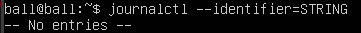
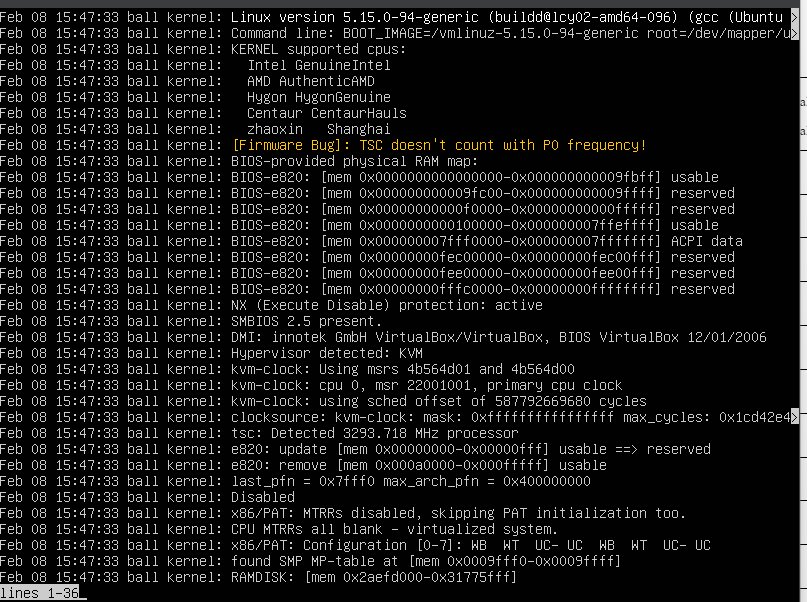
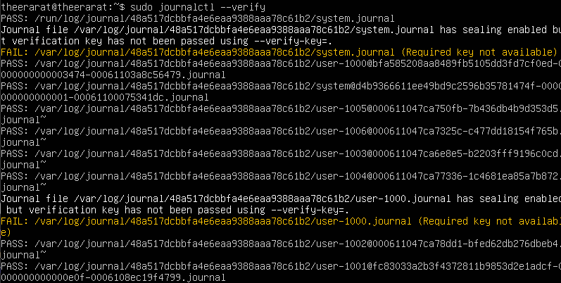

# Option และ Command ทั้งหมดของคำสั่ง journalctl

## Option ทั้งหมดของคำสั่ง journalctl

<table style="width: 100%; border-collapse: collapse;">
	
| Options                 | Description                | Example   | Result |
| :---------------:  | :---------------------: | :-----------------: | :----------------: |
| --system | แสดงข้อความจาก service ของระบบ | journalctl --system |  |
| --user | แสดงข้อความจาก service ของผู้ใช้ | journalctl --user |  |
| -M, --machine=CONTAINER | แสดงข้อความจาก machine หรือ container นั้นๆ | journalctl -M CONTAINER_NAME |  |
| -S, --since=DATE | แสดงข้อความตั้งแต่เวลาที่กำหนด | journalctl --since "2024-02-04 10:00:00" |  |
| -U, --until=DATE | แสดงข้อความจนถึงเวลาที่กำหนด | journalctl --until "2024-02-10 10:00:00" |  |
| -c, --cursor=CURSOR | แสดงบันทึกตามตำแหน่งที่กำหนด | journalctl -c <cursor_value> |  |
| --after-cursor=CURSOR | แสดงบันทึกที่เกิดขึ้นหลังจากตำแหน่งที่กำหนด | journalctl --after-cursor=<cursor_value> |  |
| --show-cursor | แสดง curosr | journalctl --show-cursor |  |
| --cursor-file=FILE |  |  |  |
| -b [ID][±offset], --boot [=ID][±offset] | แสดงข้อความที่เกี่ยวกับการบูต โดยกำหนดลำดับได้ | journalctl -b [ID][±offset] |  |
| --list-boots | แสดงผลบูตแบบ list | journalctl --list-boots |  |
| -k, --dmesg | แสดงบันทึกในระดับ kernel | journalctl -k |  |
| -u, --unit=UNIT | แสดงข้อความเกี่ยวกับ unit ใน system unit | journalctl -u UNIT |  |
| --user-unit=UNIT | แสดงข้อความเกี่ยวกับ unit ใน user unit | journalctl --user-unit=UNIT |  |
| -t, --identifier=STRING | แสดงบันทึกที่เป็นค่า identifier ที่กำหนด | journalctl -t STRING |  |
| -p, --priority=RANGE | แสดงข้อความตามระดับความสำคัญ (Range=0-7) | journalctl -p RANGE |  |
| --facility=FACILITY | กรองและแสดงข้อความตาม facility(0-23) | journalctl --facility=FACILITY |  |
| -g, --grep=PATTERN | กรองและแสดงข้อความตาม pattern | journalctl -g PATTERN |  |
| --case-sensitive[=BOOL] | เงื่อนไขเพิ่มเติม โดยไม่สนพิมพ์เล็ก-ใหญ่ | journalctl --grep “error ” --case-sensitive |  |
| -e, --pager-end | เพื่อเรียกใช้งาน pager | journalctl -e |  |
| -f, --follow | ติดตามบันทึกข้อความใหม่ที่เพิ่มเข้ามาใน journal ในขณะที่โปรแกรมกำลังทำงานอยู่ | journalctl -f |  |
| -n, --lines[=INTEGER] | กำหนดจำนวนบันทึกข้อความที่จะแสดง | journalctl -n 1 |  |
| --no-tail | แสดงบันทึกข้อความทั้งหมดโดยไม่ติดตามบันทึกใหม่ | journalctl --no-tail |  |
| -r, --reverse | แสดงบันทึกข้อความในลำดับย้อนกลับ คือจากบันทึกล่าสุดไปยังบันทึกเก่าสุด | journalctl -r |  |
| -o, --output=STRING | กำหนดรูปแบบการแสดงผลของบันทึกข้อความ เช่น json, json-pretty | journalctl -o json |  |
| --output-fields=LIST | กำหนดรายการของฟิลด์ที่ต้องการให้แสดง เช่น MESSAGE, PRIORITY, SYSLOG_IDENTIFIER | journalctl --output-fields=MESSAGE |  |
| --utc | แสดงเวลาในบันทึกข้อความตามเวลาสากล | journalctl --utc |  |
| -x, --catalog | แสดงผลลัพธ์ในรูปแบบ catalog | journalctl -x |  |
| --no-full | ปิดการแสดงผลข้อความในโหมดเต็มหน้าจอ | journalctl --no-full |  |
| -a, --all | แสดงข้อความทั้งหมด | journalctl -a |  |
| -q, --quiet | ปิดข้อความเตือน | journalctl -q |  |
| --no-pager | ปิดการแบ่งหน้า โดยจะแสดงข้อความทั้งหมดอัตโนมัติ | journalctl --no-pager |  |
| --no-hostname | ไม่แสดงชื่อโฮสต์ของระบบ | journalctl --no-hostname |  |
| -m, --merge | แสดงข้อความที่แทรกเข้ามา | journalctl -m |  |
| -D, --directory=PATH | ระบุไดเร็กทอรีที่จะใช้สำหรับการค้นหา journal files | journalctl -D |  |
| --file=PATH | ระบุไฟล์บันทึก journal ที่ต้องการอ่าน | journalctl --file=PATH |  |
| --root=ROOT | ใช้สำหรับระบุไดเร็กทอรีรูท | journalctl --root=ROOT |  |
| --image=IMAGE | แสดงภาพจาก disk image | journalctl --image=IMAGE |  |
| --namespace=NAMESPACE | ใช้ระบุ namespace | journalctl --namespace=NAMESPACE |  |
| --interval=TIME | กำหนดเวลาในการรีเฟรชข้อมูล เมื่อใช้ --setup-key | journalctl - f --interval=TIME |  |
| --verify-key=KEY | ใช้เพื่อระบุคีย์ FSS สำหรับ verify เป็นการตรวจสอบความสมบูรณ์และความถูกต้องของข้อมูลใน journal files | journalctl --verify-key=KEY |  |
| --force | เมื่อ --setup-keys ผ่าน และ FSS ถูกกำหนดค่าแล้ว จะทำการสร้าง FSS ใหม่ | journalctl --force |  |
</table>

## Command ทั้งหมดของคำสั่ง journalctl

<table style="width: 100%; border-collapse: collapse;">
	
| Options                 | Description                | Example   | Result |
| :---------------:  | :---------------------: | :-----------------: | :----------------: |
| -h, --help | แสดงข้อความช่วยเหลือ | journalctl -h |  |
| --version | แสดง version | journalctl --version |  |
| -N, --fields | แสดงรายการชื่อฟิลด์ทั้งหมดที่ใช้อยู่ในปัจจุบัน | journalctl -N |  |
| -F, --field=FIELD | แสดงรายการค่าทั้งหมดที่ฟิลด์ที่ระบุใช้ | journalctl -F _PID |  |
| --disk-usage | แสดงการใช้งานดิสก์ทั้งหมดของไฟล์เจอร์นัลทั้งหมด | journalctl --disk-usage |  |
| --vacuum-size=BYTES | ลดการใช้ดิสก์ให้ต่ำกว่าขนาดที่ระบุ | Journalctl –vauum-size=500 |  |
| --vacuum-files=INT | เหลือเพียงจำนวนไฟล์เจอร์นัลที่ระบุเท่านั้น | journalctl --vacuum-files=1 |  |
| --vacuum-time=TIME | ลบไฟล์เจอร์นัลที่เก่ากว่าเวลาที่กำหนด | journalctl --vacuum-time=2weeks |  |
| --verify | ตรวจสอบความสอดคล้องของไฟล์ jounal | journalctl --verify |  |
| --sync | ซิงโครไนซ์ข้อความบันทึกประจำวันที่ไม่ได้เขียนไปยังดิสก์ | journalctl journalctl --sync |  |
| --relinquish-var |หยุดการบันทึกลงในจาน เข้าสู่ระบบไฟล์ชั่วคราว | journalctl journalctl --relinquish-var |  |
| --smart-relinquish-var | คล้ายกัน แต่ NOP หากไดเร็กทอรีบันทึกอยู่บนรูทเมาท์ | journalctl --smart-relinquish-var | |
| --flush | ล้างข้อมูลเจอร์นัลทั้งหมดจาก /run ลงใน /var | journalctl --flush |  |
| --rotate | ขอหมุนเวียนไฟล์เจอร์นัลทันที | journalctl --rotate |  |
| --header | แสดงข้อมูลส่วนหัวของวารสาร | journalctl --header |  |
| --list-catalog | แสดงรหัสข้อความทั้งหมดในแค็ตตาล็อก | journalctl --list-catalog |  |
| --dump-catalog | แสดงรายการในแค็ตตาล็อกข้อความ | journalctl --dump-catalog |  |
| --update-catalog | อัพเดตฐานข้อมูลแค็ตตาล็อกข้อความ | sudo journalctl --update-catalog |  |
| --setup-keys |สร้างคู่คีย์ FSS ใหม่ | sudo journalctl --setup-keys |  |
</table>

