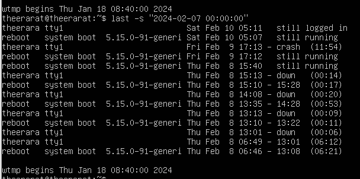

# Option และ Command ทั้งหมดของคำสั่ง last

## Option ทั้งหมดของคำสั่ง last

<table style="width: 100%; border-collapse: collapse;">
	
| Options                 | Description                | Example   | Result |
| :---------------:  | :---------------------: | :-----------------: | :----------------: |
| -<number> | แสดงกี่บรรทัด | last -5 |  |
| -a, --hostlast | แสดง hostname ในคอมลัมสุดท้าย | last -a |  |
| -d, --dns | แปลงเลข IP เป็น hostname | last -d |  |
| -f, --file <file> | ใช้ไฟล์อื่นแทน /var/log/wtmp | last -f /var/log/dmseg |  |
| -F, --fulltimes | พิมพ์เวลาและวันที่เข้าสู่ระบบและออกจากระบบแบบเต็ม | last -F |  |
| -i, --ip | แสดงที่อยู่ IP ในรูปแบบจุด | last -i |  |
| -n, --limit <number> | ระบุจำนวนบรรทัดที่จะแสดง | last -n 5 |  |
| -R, --nohostname | ไม่แสดงฟิลด์ hostname | last -R |  |
| -s, --since <time> | แสดงตั้งแต่เวลานี้เป็นต้นมา | last -s “2024-02-07 00:00:00” |  |
| -t, --until <time> | แสดงรายการที่ย้อนกลับไปตามเวลาที่กำหนด | last -t “2024-01-19 00:00:00” |  |
| -p, --present <time> | แสดงรายการที่ตรงตามเวลานั้น | last -p “2024-02-08 15:28:25” |  |
| -w, --fullnames | แสดงชื่อผู้ใช้และโดเมนแบบเต็ม | last -w |  |
| -x, --system | แสดงรายการการปิดระบบและการเปลี่ยนแปลงระดับการดำเนินการ | last -x |  |
| --time-format <format> | แสดง timestamps ในรูปแบบ (notime/short/full/iso) | last --time-format notime |  |
| -h, --help | แสดง help | last --h |  |
| -V, --version | แสดง version | last --V |  |
</table>

