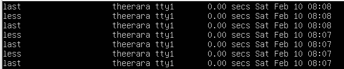
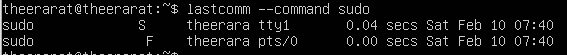
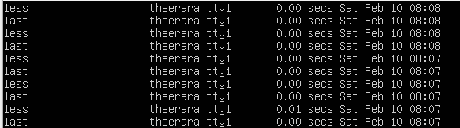
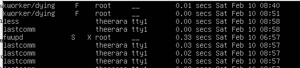
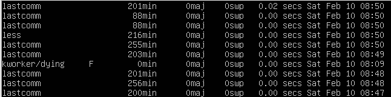
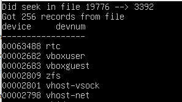
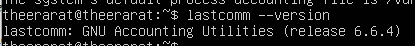
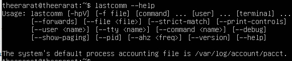

# Option และ Command ทั้งหมดของคำสั่ง lastcomm

<table style="width: 100%; border-collapse: collapse;">
	
| Options                 | Description                | Example   | Result |
| :---------------:  | :---------------------: | :-----------------: | :----------------: |
| --user name | แสดงรายการบันทึกสำหรับผู้ใช้ที่มีชื่อนี้ | lastcomm --user theerarat |  |
| --command name | แสดงรายการบันทึกสำหรับชื่อคำสั่ง | lastcomm --command sudo |  |
| -tty name | แสดงรายการบันทึกสำหรับชื่อ tty | lastcomm --tty tty1 |  |
| -f filename, --file filename | อ่านจากชื่อไฟล์แทนไฟล์บัญชีของระบบ | lastcomm -f hehehe |  |
| --ahz hz | ใช้แฟล็กนี้เพื่อบอกโปรแกรมว่า AHZ ควรเป็นอย่างไร (เป็นเฮิรตซ์)  คำสั่งนี้จะพยายามดูไฟล์ acct ที่สร้างบนเครื่องอื่นซึ่งมีลำดับไบต์และรูปแบบไฟล์เหมือนกับเครื่องปัจจุบันของคุณ แต่มีค่า AHZ ที่แตกต่างกัน | lastcomm -ahz 5 |  |
| -p, --show-paging | แสดงสถิติเพจ | lastcomm -p |  |
| --debug | แสดงข้อมูลภายในอย่างละเอียด | lastcomm --debug |  |
| --version | แสดง version | lastcomm --version |  |
| --help | แสดงคำสั่งทั้งหมด | lastcomm --help |  |
</table>

