# Option และ Command ทั้งหมดของคำสั่ง dmesg

## ก่อนเราจะไป เรามารู้จักคำซัก 2 คำกันก่อน
- Facilities แสดงถึงกระบวนการที่สร้างข้อความ dmesg มีดังต่อไปนี้
    -	kern – kernel messages (ข้อความเคอร์เนล)
    -	user – user-level messages (ข้อความระดับผู้ใช้)
    -	mail – mail system (ระบบเมล)
    -	daemon – system daemons (ระบบ daemon)
    -	auth – security/authorization messages (ข้อความความปลอดภัย/การอนุญาติ)
    -	syslog – internal syslogd messages (ข้อความ syslogd ภายใน)
    -	lpr – line printer subsystem (ระบบย่อยเครื่องพิมพ์บรรทัด)
    -	news – network news subsystem (ระบบย่อยข่าวเครือข่าย)

- Level แสดงความสำคัญของข้อความ dmesg มีดังต่อไปนี้
    -	emerg – system is unusable (ระบบใช้ไม่ได้)
    -	alert – action must be taken immediately (จะต้องดำเนินการทันที)
    -	crit – critical conditions (เงื่อนไขที่สำคัญ)
    -	err – error conditions (เงื่อนไขข้อผิดพลาด)
    -	warn – warning conditions (เงื่อนไขคำเตือน)
    -	notice – normal but significant condition (สภาพปกติแต่สำคัญ)
    -	info – informational (ข้อมูล)
    -	debug – debug-level messages (ข้อความระดับการแก้ไขข้อบกพร่อง)

## Option ทั้งหมดของคำสั่ง dmesg

<table style="width: 100%; border-collapse: collapse;">
	
| Options                 | Description                | Example   | Result |
| :---------------:  | :---------------------: | :-----------------: | :----------------: |
| -C, --clear | ล้าง ring buffer | sudo dmesg -C |  |
| -c, --read-clear | แสดง ring buffer แล้วค่อยลบ | sudo dmesg -c |  |
| -D, --console-off | ปิดการใช้งานการพิมพ์ข้อความไปยังคอนโซล | sudo dmesg -D |  |
| -E, --console-on | เปิดการใช้งานการพิมพ์ข้อความไปยังคอนโซล | sudo dmesg -E |  |
| -F, --file <file> | ใช้ไฟล์แทนบัฟเฟอร์บันทึกเคอร์เนล | sudo dmesg -F FileChkSum | 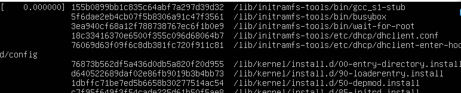 |
| -f, --facility <list> | output ขึ้นกับ facilities | sudo dmesg -f syslog | 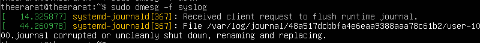 |
| -H, --human | แสดง output ที่มนุษย์สามารถอ่านได้ | sudo dmesg -H | 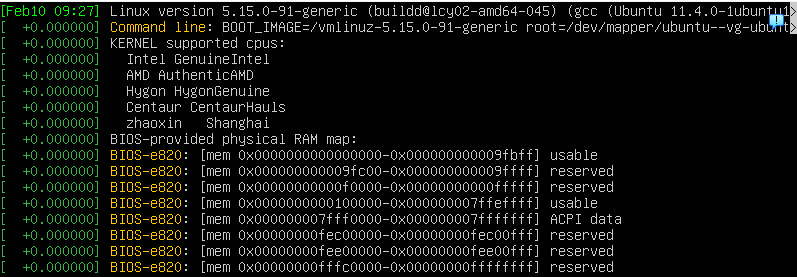 |
| -k, --kernal | แสดงข้อความเคอร์เนล | sudo dmesg -k | 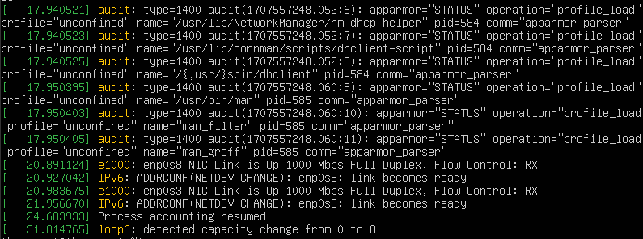 |
| -L, --color [=<when>] | ปรับสีข้อความ (defalut เปิดตลอด) | sudo dmesg --color=never | 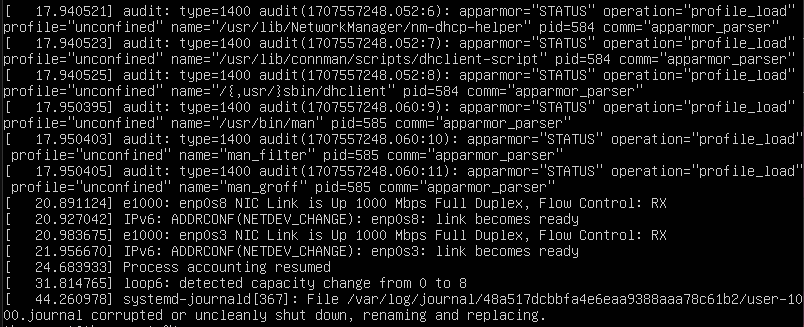 |
| -l, --level <list> | จำกัดเอาต์พุตให้อยู่ในlevel ที่กำหนด | sudo dmesg -l err | 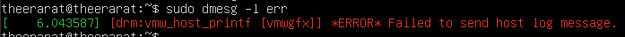 |
| -n, --cnsole-level <level> | กำหนดระดับของข้อความที่พิมพ์ไปยังคอนโซล | sudo dmesg -n info |  |
| -P, --nopager | อย่าไปป์เอาต์พุตลงในเพจเจอร์ | sudo dmesg -P | 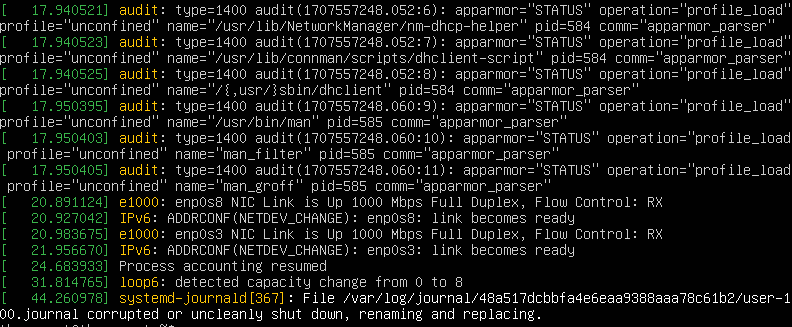 |
| -p, --force-prefix | บังคับให้ส่งออกการประทับเวลาในแต่ละบรรทัดของข้อความหลายบรรทัด | sudo dmesg -p | 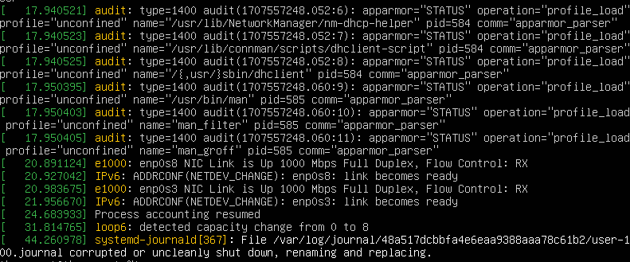 |
| -r, --raw | พิมพ์บัฟเฟอร์ข้อความดิบ | sudo dmesg -r | 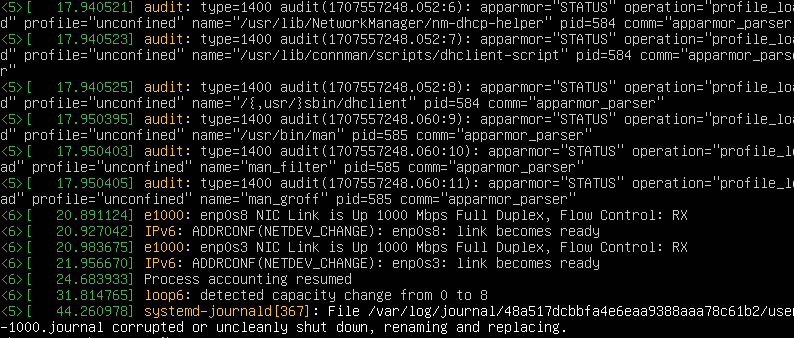 |
| --noescape | อย่าหลีกหนีจากอักขระที่ไม่สามารถพิมพ์ได้ | sudo dmesg --noescape |  |
| -S, --syslog | บังคับให้ใช้ syslog(2) แทนที่จะเป็น /dev/kmsg | sudo dmesg -S |  |
| -s, --buffer-size <size> | ขนาดบัฟเฟอร์เพื่อสอบถามบัฟเฟอร์วงแหวนเคอร์เนล | sudo dmesg -s 1 | |
| -u, --userspace | แสดงข้อความพื้นที่ผู้ใช้ | sudo dmesg -u | 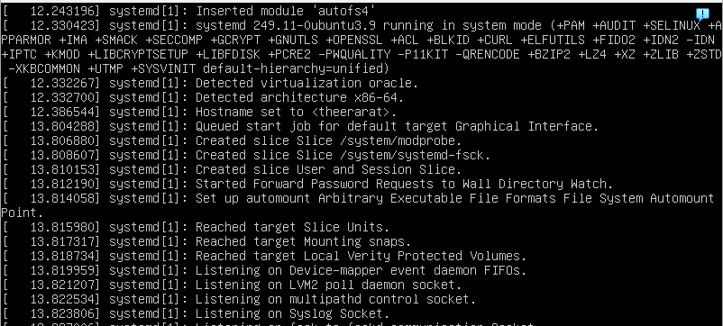 |
| -w, --follow | รอข้อความใหม่ | sudo dmesg -w | 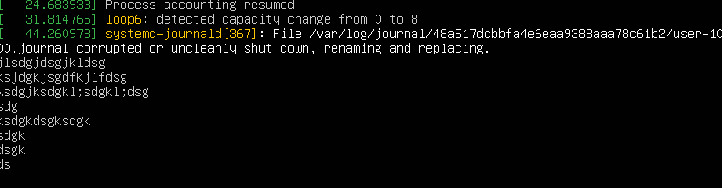 |
| -W, --follow-new | รอและแสดงเฉพาะข้อความใหม่ | sudo dmesg -W | 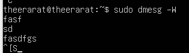 |
| -x, --decode | ถอดรหัส facility และlevel เป็นสตริงที่อ่านได้ | sudo dmesg -x | 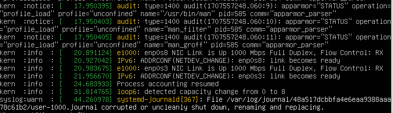 |
| -d, --show-delta | แสดงเดลต้าเวลาระหว่างข้อความที่พิมพ์ | sudo dmesg -d | 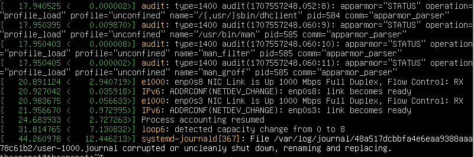 |
| -e, --reltime | แสดงเวลาท้องถิ่นและเดลต้าเวลาในรูปแบบที่อ่านได้ | sudo dmesg -e | 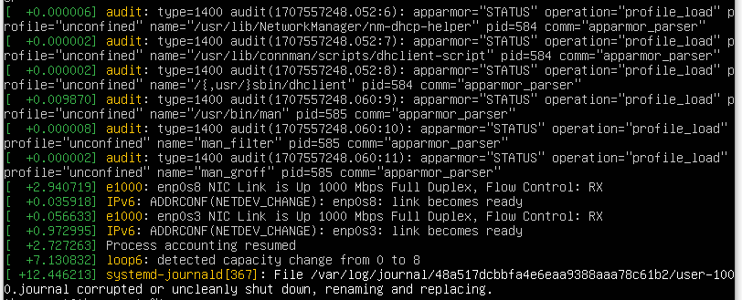 |
| -T, --ctime | แสดงการประทับเวลาที่มนุษย์อ่านได้ (อาจไม่ถูกต้อง!) | sudo dmesg -T | 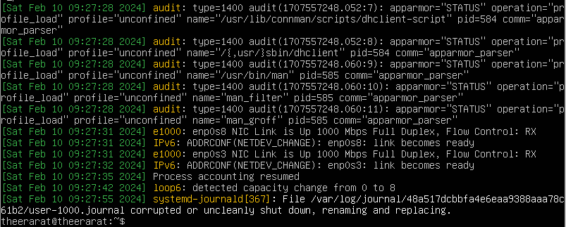 |
| -t, --notime | ไม่ต้องแสดงการประทับเวลาใดๆ พร้อมข้อความ | sudo dmesg | 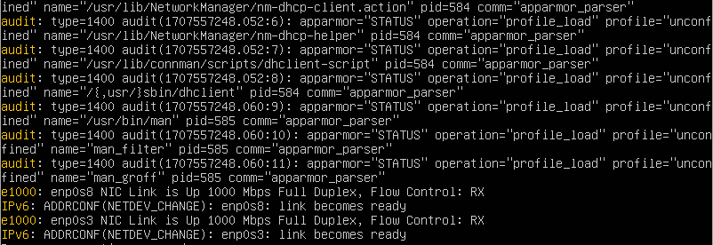 |
| --time-format <format> | แสดงการประทับเวลาโดยใช้รูปแบบที่กำหนด (delta/reltime/ctime/notime/iso) | sudo dmesg --time-format iso | 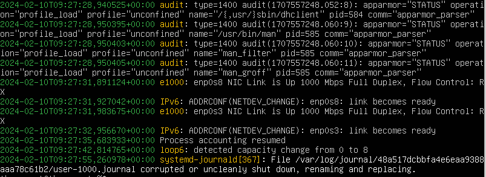 |
</table>

