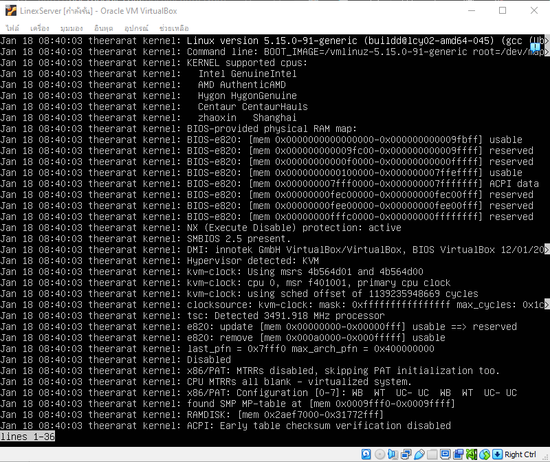
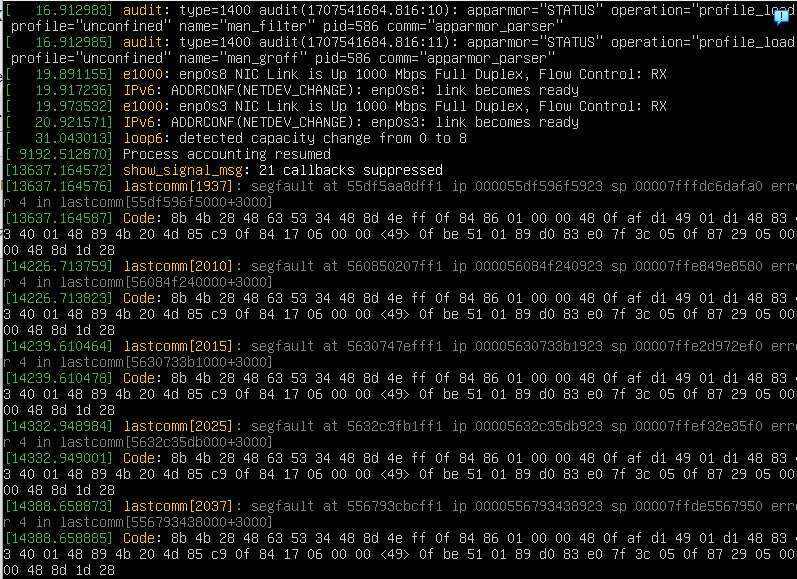
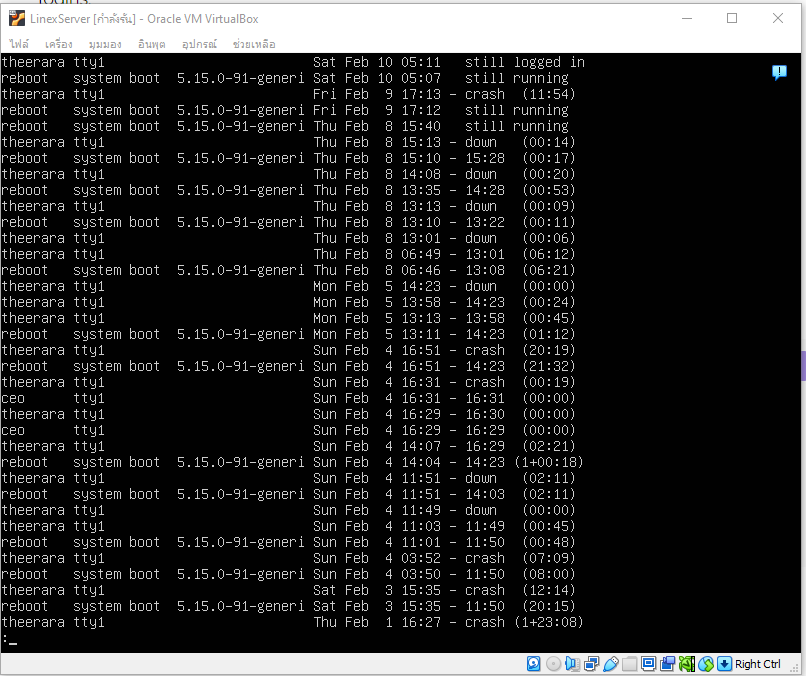
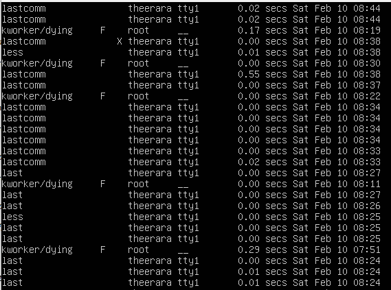

# Chapter 2 Log Reader/Analysis
## Log Reader/Analysis มันคืออะไร?
   **Log Analysis**  เป็นกระบวนการตรวจสอบ วิเคราะห์การบันทึก(logs) เพื่อตรวจดูพฤติกรรมของโปรแกรม และคาดการณ์ปัญหาที่อาจจะเกิดขึ้นจากการใช้งาน
### มีกระบวนการพื้นฐาน 5 ขั้นตอนด้วย log analysis software
- Instrument and Collect เกี่ยวข้องกับการติดตั้ง Collector เพื่อไว้คอยรวบรวมข้อมูลจากส่วนต่างๆของผู้ใช้ และสามารถให้ Log file ถ่ายโอนไปให้ตัว Collector ที่ใช้งาน หรือจะเก็บเป็นไฟล์ เพื่อตรวจสอบในภายหลัง
- Centralize and Index เกี่ยวข้องกับการรวมข้อมูลจาก Logs ทั้งหมดลงศูนย์กลางเพื่อแก้ไขการค้นหาและการวิเคราะห์ ให้ดียิ่งขึ้น การทำ Index ช่วยให้สามารถค้นหาได้
- Search and Analyze ใช้การจดจำรูปแบบ (Pattern Recognition), การทำให้ง่ายขึ้น (normalization), การตรวจจับ (Tagging) และหาความสัมพันธ์ (Correlation) เทคนิคนี้สามารถทำได้ด้วยตัวเองหรือจะใช้ software การเรียนรู้ แบบ native machine ก็ได้
- Moniter and Alert ทำได้โดยใช้ Machine learning และ การวิเคราะห์ เป็นเทคโนโลยีช่วยให้ผู้ใช้สามารถตรวจสอบ log ได้โดยอัตโนมัติแบบเรียลไทม์ และจะส่งการแจ้งเตือนเมื่อตรงตามเงื่อนไข
- Report and Dashboard การใช้ Software มาวิเคราะห์ Log ที่ดี สามารถปรับปรุง Report และ Dashboard ได้อย่างมีประสิทธิภาพ

## คำสั่งพื้นฐานสำหรับ Log Analysis
### 👉 Journalctl
   **Journalctl** - เป็นส่วนหนึ่งของชุดยูทิลิตี้ systemd และใช้เพื่อค้นหาและแสดงข้อความบันทึกจาก Systemd Journal(ระบบการบันทึกแบบรวมศูนย์ที่รวบรวมและจัดเก็บข้อมูลบันทึกจากแหล่งต่างๆ รวมถึงบริการของระบบ เหตุการณ์เคอร์เนล และแอปพลิเคชันผู้ใช้)

#### Syntax ของคำสั่ง journalctl
	journalctl [options] [unit]

#### ตัวอย่างเมื่อใช้คำสั่ง journalctl

  

#### Option และ Command ทั้งหมดของคำสั่ง journalctl
- 📚 [**การใช้และคำอธิบายเบื้องต้นของ Option&Command ทั้งหมดของคำสั่ง journalctl**](https://github.com/Jxwgame/Monitoring-and-Logging-Tools-Sec-2/blob/main/Chapter%202/Op%26Com_Journalctl/Readme.md)

### 👉 Dmesg
   **dmesg** มาจาก divide message มอบวิธีที่สะดวกในการตรวจสอบเคอร์เนลริงบัฟเฟอร์ ซึ่งจัดเก็บข้อความที่สร้างโดยเคอร์เนลระหว่างกระบวนการบู๊ตและในขณะที่ระบบกำลังทำงาน ข้อความเหล่านี้มีข้อมูลสำคัญเกี่ยวกับการตรวจหาฮาร์ดแวร์ การเริ่มต้นอุปกรณ์ และปัญหาที่อาจเกิดขึ้นกับเคอร์เนล

#### Syntax ของคำสั่ง dmesg
	sudo dmesg [options]
  **จำเป็นต้องใช้สิทธิ์ root ในการใช้คำสั่ง

#### ตัวอย่างเมื่อใช้คำสั่ง dmesg

  

#### Option และ Command ทั้งหมดของคำสั่ง dmesg
- 📚 [**การใช้และคำอธิบายเบื้องต้นของ Option&Command ทั้งหมดของคำสั่ง dmesg**](https://github.com/Jxwgame/Monitoring-and-Logging-Tools-Sec-2/blob/main/Chapter%202/Op%26Com_dmesg/Readme.md)

### 👉 Last
   **last** ใช้เพื่อแสดงรายการผู้ใช้ทั้งหมดที่เข้าสู่ระบบและออกจากระบบตั้งแต่ไฟล์ `/var/log/wtmp` ถูกสร้างขึ้น สามารถกำหนดชื่อผู้ใช้ตั้งแต่หนึ่งรายการขึ้นไปเป็นอาร์กิวเมนต์เพื่อแสดงเวลาเข้าสู่ระบบเข้า (และออก) และชื่อโฮสต์

#### Syntax ของคำสั่ง last
	last [options] [username...] [tty...]

#### ตัวอย่างเมื่อใช้คำสั่ง last

  

#### ทำเข้าใจความหมายแต่ละคอลัมน์ ที่ถูกสร้างด้วยคำสั่ง last
- คอลัมน์ที่ 1 แสดงชื่อผู้ใช้ที่เข้าสู่ระบบ
- คอลัมน์ที่ 2 ระบุวิธีที่ผู้ใช้เชื่อมต่อกับระบบ เช่น ผ่าน pts (pseudo-terminal) หรือ tty (teletypewriter) แต่หากเป็นกิจกรรมการรีบูต ระบบจะแสดงการบูตระบบ
- คอลัมน์ที่ 3 บอกว่าผู้ใช้เชื่อมต่อจากที่ใด ค่าอาจเป็น:
  	- ชื่อโฮสต์หรือที่อยู่ IP - หากผู้ใช้เชื่อมต่อจากคอมพิวเตอร์ระยะไกล
	- ค่าว่าง - หากผู้ใช้เชื่อมต่อผ่าน tty
	- เวอร์ชันเคอร์เนล - หากเป็นกิจกรรมการรีบูต
	- ค่าเฉพาะแอปพลิเคชันบางอย่าง เช่น tmux(6716).%6 หมายถึง ProcessName(PID).WindowID

- คอลัมน์ที่ 4 รายงานเมื่อกิจกรรมการเข้าสู่ระบบเกิดขึ้น
- คอลัมน์ที่ 5 แสดงเวลาออกจากระบบ อาจเป็นค่าต่อไปนี้:
	- a timestamp - หากผู้ใช้ออกจากระบบแล้ว
	- still running - หากการบูตระบบยังคงทำงานอยู่
	- still logged in - หากผู้ใช้ยังคงเข้าสู่ระบบอยู่
	- down – ระบบปิดตามปกติ
	- crash - หากไม่มีรายการออกจากระบบในไฟล์ /var/log/wtmp ซึ่งมักจะหมายถึงระบบขัดข้อง

- คอลัมน์ที่ 6 จะบอกเราว่าผู้ใช้เข้าสู่ระบบมานานแค่ไหนในรูปแบบ (ชั่วโมง: นาที)

#### Option และ Command ทั้งหมดของคำสั่ง last
- 📚 [**การใช้และคำอธิบายเบื้องต้นของ Option&Command ทั้งหมดของคำสั่ง last**](https://github.com/Jxwgame/Monitoring-and-Logging-Tools-Sec-2/blob/main/Chapter%202/Op%26Com_Last/Readme.md)

### 👉 Lastcomm
   **lastcomm** ให้ข้อมูลเกี่ยวกับคำสั่งที่ดำเนินการก่อนหน้านี้ Lastcomm ที่ไม่มีอาร์กิวเมนต์จะแสดงข้อมูลเกี่ยวกับคำสั่งทั้งหมดที่บันทึกไว้ระหว่างอายุการใช้งานของไฟล์การบัญชีปัจจุบัน ต้องรันคำสั่ง sudo apt  install acct เพื่อติดตั้งก่อนจึงจะสามารถรันคำสั่ง Lastcomm ได้ 

#### Syntax ของคำสั่ง lastcomm
	lastcomm [ -X ][ Command ] [ Name ] [ Terminal ]

- Command คำสั่งที่ระบุโดยพารามิเตอร์ 
- Name คำสั่งที่ดำเนินการโดยผู้ใช้ที่ระบุโดยพารามิเตอร์ 
- Terminal คำสั่งจากเทอร์มินัลที่ระบุโดยพารามิเตอร์ เทอร์มินัลสามารถตั้งชื่อแบบเต็มหรือย่อเป็น tty ตัวอย่างเช่น คุณสามารถระบุเทอร์มินัล tty0 หรือเทอร์มินัล 0 ได้

#### ตัวอย่างเมื่อใช้คำสั่ง lastcomm

  

#### ในแต่ละ process จะปรากฏสิ่งเหล่านี้
- ชื่อของผู้ใช้ที่รันกระบวนการ
- แฟล็กใดๆ ที่เกี่ยวข้องกับการบัญชีที่รวบรวมเมื่อคำสั่งดำเนินการ ต่อไปนี้เป็นแฟล็กที่ถูกต้อง:

<table style="width: 100%; border-collapse: collapse;">
	
| Item | Description |
| :---------------:  | :---------------------: |
|  S   | Root ดำเนินการคำสั่ง |
|  F   | คำสั่งรันตามทางแยก แต่ไม่มีรูทีนย่อยต่อไปนี้ |
|  C   | คำสั่งทำงานในโหมดความเข้ากันได้ของ PDP-11 |
|  D   | คำสั่งสิ้นสุดลงด้วยการสร้างไฟล์หลัก |
|  X   | คำสั่งถูกยกเลิกโดยมีสัญญาณ |
</table>

- ชื่อของคำสั่งที่ใช้เรียกกระบวนการ
- วินาทีของเวลา CPU ที่ใช้โดยกระบวนการ
- เวลาที่กระบวนการเริ่มต้นขึ้น

#### Option และ Command ทั้งหมดของคำสั่ง lastcomm
- 📚 [**การใช้และคำอธิบายเบื้องต้นของ Option&Command ทั้งหมดของคำสั่ง lastcomm**](https://github.com/Jxwgame/Monitoring-and-Logging-Tools-Sec-2/blob/main/Chapter%202/Op%26Com_Lastcomm/Readme.md)

## คำสั่งเพิ่มเตอมไว้คอยช่วยเหลือ
  
### 👉 Sort
**sort**  คือ คำสั่งที่ช่วยในการลำดับไฟล์ จากน้อยไปหามาก

#### Syntax ของคำสั่ง sort
	sort [options] [file(s)]

#### Option และ Command ทั้งหมดของคำสั่ง sort
- 📚 [**การใช้และคำอธิบายเบื้องต้นของ Option&Command ทั้งหมดของคำสั่ง sort**](https://github.com/Jxwgame/Monitoring-and-Logging-Tools-Sec-2/blob/main/Chapter%202/Op%26Com_sort/Readme.md)

# Other Chapter
- 🛠 [**Introduction Monitoring and Logging Tools**](https://github.com/Jxwgame/Monitoring-and-Logging-Tools-Sec-2/blob/main/README.md)
- 🛠 [**Chapter 1 Monitoring and Logging Tools**](https://github.com/Jxwgame/Monitoring-and-Logging-Tools-Sec-2/blob/main/Chapter%201/Readme.md)
- 📝 [**Chapter 3 Log Collection and Server**](https://github.com/Jxwgame/Monitoring-and-Logging-Tools-Sec-2/blob/main/Chapter%203/Readme.md)
- 📚 [**Chapter 4 Log Files**](https://github.com/Jxwgame/Monitoring-and-Logging-Tools-Sec-2/blob/main/Chapter%204/Readme.md)
- 📩 [**Chapter 5 Working with Texts**](https://github.com/Jxwgame/Monitoring-and-Logging-Tools-Sec-2/blob/main/Chapter%205/Readme.md)

# Source
- [Reference Log Reader and Analysis](https://github.com/Jxwgame/Monitoring-and-Logging-Tools-Sec-2/blob/main/Reference/Chapter%202.md)
