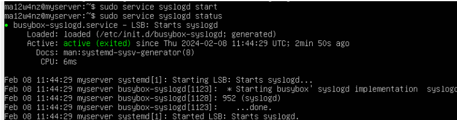
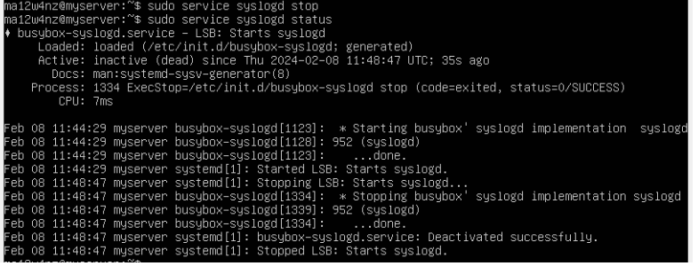
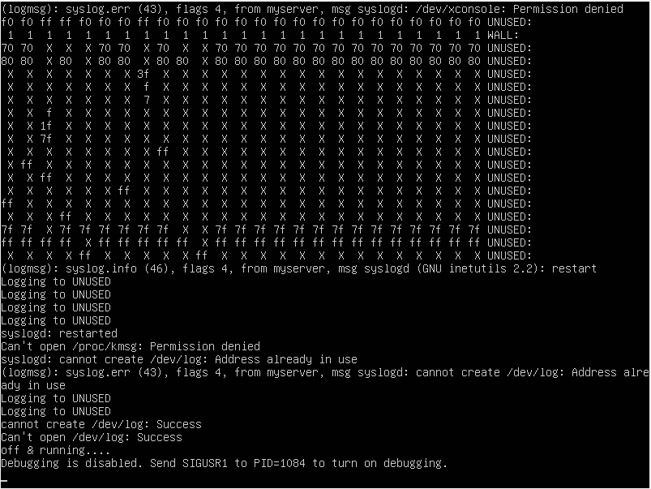
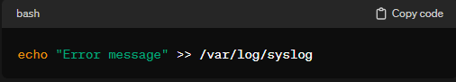
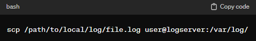
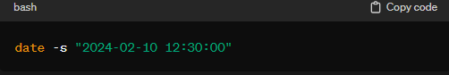
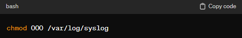
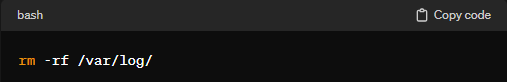
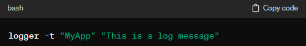

<h1>Log Collection / Server🌐</h1>

เป็นส่วนสำคัญในการบริหารจัดการบันทึก (logs) ที่ระบบทำการสร้างขึ้นในทุก ๆ กิจกรรมของระบบคอมพิวเตอร์
<ol>
  <li>
    <b>Log Collection</b> เป็นกระบวนการที่เกี่ยวข้องกับการรวบรวมข้อมูลบันทึกจากระบบหลาย ๆ แหล่งไปเก็บไว้ในที่เดียว เพื่อให้ง่ายต่อการจัดการ ตรวจสอบ และวิเคราะห์ ข้อมูลบันทึกที่รวบรวมนั้นสามารถมีทั้งข้อมูลการเข้าถึงระบบ ข้อผิดพลาด และกิจกรรมอื่นๆ ที่เกิดขึ้นในระบบ
  </li>
  <li>
    <b>Log Server</b> เป็นเซิร์ฟเวอร์ที่ใช้เก็บรวบรวมข้อมูลบันทึกจากระบบต่าง ๆ ที่เชื่อมต่อมา โดยทั่วไป log server จะมีซอฟต์แวร์ที่จัดการกับการรับ เก็บ และนำเสนอข้อมูลบันทึกในรูปแบบที่ง่ายต่อการทำความเข้าใจ เช่น การแสดงผลในรูปแบบกราฟ ตาราง และรายงาน เป็นต้น
  </li>
</ol>

<h2>บทบาทและหน้าที่</h2>
<ul>
  <li>เก็บข้อมูลบันทึก</li>
  <li>การจัดเก็บข้อมูล</li>
  <li>การส่งข้อมูล</li>
  <li>การคัดกรองข้อมูล</li>
  <li>การรักษาความปลอดภัย</li>
</ul>
<h2>พื้นฐานหรือหลักการทำงานของ log collection บน Linux</h2>
<ol>
  <li><b>การสร้าง Logs</b>
    ระบบปฏิบัติการและแอปพลิเคชันต่าง ๆ บน Linux สร้าง logs เพื่อบันทึกข้อมูลเหตุการณ์ทเกิดขึ้นในระบบ Logs เหล่านี้มักถูกเขียนลงในไฟล์ที่ตั้งไว้ล่วงหน้า
  </li>
  <li><b>Log Rotation</b>
    เนื่องจากข้อมูล logs มีขนาดใหญ่และมีการเขียนอย่างต่อเนื่อง การจัดการขนาดและการจัดเก็บ logs เป็นสิ่งสำคัญ Log rotation เป็นกระบวนการที่หลับตามโดยทำให้ logs เก่าถูกบีบอัด ย้าย หรือลบเพื่อทำให้พื้นที่ไม่เต็ม
  </li>
  <li><b>Log Collection Agents</b>
    บางครั้งจะมีตัวแทน (agents) ที่ทำหน้าที่เก็บ logs จากระบบและแอปพลิเคชันที่ต่างกันไป Agents นี้สามารถส่ง logs ไปยังตำแหน่งที่กำหนดได้ เช่น central log server หรือ log aggregator
  </li>
  <li><b>Centralized Log Server</b>
    การนำ logs มาเก็บไว้ที่ตำแหน่งเดียวกัน (centralized log server) เป็นแนวคิดที่พึงสำคัญ สิ่งนี้ทำให้ผู้ดูแลระบบสามารถจัดการ logs จากหลายแหล่งในที่เดียว ช่วยในการวิเคราะห์ข้อมูล ค้นหาข้อผิดพลาด และดำเนินการต่อไป
  </li>
  <li><b>Log Formats</b>
    ข้อมูล logs มักจะถูกจัดเก็บในรูปแบบที่เป็นทางการ (standardized format) เพื่อทำให้ง่ายต่อการอ่านและวิเคราะห์ รูปแบบทั่วไปที่ใช้กันมากคือ syslog และ JSON
  </li>
  <li><b>Security and Access Controls</b>
    การควบคุมการเข้าถึง logs เพื่อความปลอดภัยมีความสำคัญ สิทธิ์และการตรวจสอบความปลอดภัยควรถูกกำหนดให้เพียงพอเพื่อป้องกันการเข้าถึงที่ไม่ถูกต้อง
  </li>
  <li><b>Log Analysis Tools</b>
    มีเครื่องมือต่าง ๆ ที่ใช้ในการวิเคราะห์ logs เพื่อหาข้อมูลที่มีประโยชน์ เครื่องมือเหล่านี้สามารถช่วยในการตรวจสอบปัญหา ค้นหาแนวโน้ม และเพิ่มประสิทธิภาพของระบบ
  </li>
  <li><b>การแจ้งเตือน (Alerting)</b>
    การตั้งค่าระบบแจ้งเตือนเพื่อแจ้งเตือนผู้ดูแลระบบเมื่อเหตุการณ์ที่สำคัญเกิดขึ้น นี้ช่วยในการตอบสนองได้เร็วต่อปัญหาหรือเหตุการณ์ที่มีความสำคัญ
  </li>
</ol>
<h2>การเรียกใช้งาน</h2>

  <h4>สามารถเรียกใช้งานด้วยคอมมานด์ syslogd หรือ rsyslog</h4>
  <b>syslogd</b> daemon อ่าน Datagram Socket และส่งแต่ละบรรทัดข้อความไปยังปลายทางที่อธิบายโดยไฟล์ configuration <b>/etc/syslog.conf</b> 
  
<b>syslogd</b> daemon อ่านไฟล์ configuration เมื่อเปิดใช้งานและเมื่อได้ hangup signal

  <h4>การเปิดปิด และตรวจสอบสถานะ</h4>
  
  
  <h4>การใช้ syslogd -d</h4>
  
  <h4>การใช้ syslogd -n(detach)</h4>
  

<h2>syslogd [option]</h2>
<table>
  <tr>
    <th>option</th>
    <th>describe</th>
    <th>example</th>
  </tr>
  <tr>
    <td>-V</td>
    <td>print  หมายเลขเวอร์ชัน</td>
    <td>syslogd -V</td>
  </tr>
  <tr>
    <td>--help</td>
    <td>แสดงข้อมูลความช่วยเหลือ</td>
    <td>syslogd --help</td>
  </tr>
  <tr>
    <td>--usage</td>
    <td>แสดงข้อมูลการใช้คำสั่งต่างๆ ของ syslogd</td>
    <td>syslogd --usage</td>
  </tr>
  <tr>
    <td>-d</td>
    <td>เข้าสู่โหมดแก้ไขข้อบกพร่อง(debug mode) syslogd ไม่ได้ใส่ตัวเองในพื้นหลัง ไม่แยกและแสดงข้อมูลการดีบัก</td>
    <td>syslogd -d</td>
  </tr>
  <tr>
    <td>-a</td>
    <td>ระบุ socket เพิ่มเติมจากที่ syslogd ต้องรับฟัง นี่เป็นสิ่งจำเป็นถ้าคุณจะปล่อยให้ daemon บางตัวทำงานภายในสภาพแวดล้อม chroot()'ed คุณสามารถระบุ socket เพิ่มเติมได้สูงสุด 19 ช่อง</td>
    <td>syslogd -a [SOCKET]</td>
  </tr>
  <tr>
    <td>-f, --rcfile=FILE</td>
    <td>ระบุชื่อ path ของ configuration file สำรอง มีค่าเริ่มต้นคือ system specific และแสดงใน output วิธีใช้</td>
    <td>syslogd -f [FILE]</td>
  </tr>
  <tr>
    <td> --rcdir=DIR</td>
    <td>ระบุชื่อ path ของ configuration directory สำรอง ค่าเริ่มต้นคือ system specific และแสดงใน output วิธีใช้</td>
    <td>syslogd --rcdir=DIR</td>
  </tr>
  <tr>
    <td>-h, --hop</td>
    <td>เปิดใช้งานการส่งต่อข้อความระยะไกล โดยค่าเริ่มต้น syslogd จะไม่ส่งต่อข้อความนั้นที่ได้รับจาก host ระยะไกล</td>
    <td>syslogd --hop</td>
  </tr>
  <tr>
    <td>-l</td>
    <td>รายชื่อ host ที่คั่นด้วยเครื่องหมาย colon(:) ซึ่งควรได้รับการพิจารณาว่าเป็น local โดยจะถูกบันทึกไว้โดยใช้ host name แทนโดย FQDN</td>
    <td>syslogd -l [HOSTLIST]</td>
  </tr>
  <tr>
    <td>-m, --mark=INTERVAL/fP</td>
    <td>เลือกจำนวนนาทีระหว่างข้อความ `` ทำเครื่องหมาย '' ค่าเริ่มต้นคือ 20 นาที หากตั้งเป็น 0 คือการปิดใช้งาน time stamp</td>
    <td>syslogd -m [INTVAL]</td>
  </tr>
  <tr>
    <td>-n, --no-detach</td>
    <td>ระงับการทำงานเบื้องหลังและการปลด daemon จากการควบคุม terminal</td>
    <td>syslogd -n</td>
  </tr>
  <tr>
    <td>-p, --socket=PATH</td>
    <td>ระบุชื่อ path ของ socket log สำรอง</td>
    <td>syslogd -p [FILE]</td>
  </tr>
  <tr>
    <td>-r, --inet</td>
    <td>เปิดใช้งานเพื่อรับข้อความระยะไกลโดยใช้ internet domain socket</td>
    <td>syslogd -r</td>
  </tr>
  <tr>
    <td>-s</td>
    <td>list ของ domain name ซึ่งควรแยกออกจาก FQDN ของ host เมื่อ logging</td>
    <td>syslogd -s [DOMAINLIST]</td>
  </tr>
  <tr>
    <td>--no-klog</td>
    <td>อย่าฟังอุปกรณ์บันทึกเคอร์เนล(kernel log device)</td>
    <td>syslogd --no-klog</td>
  </tr>
  <tr>
    <td>--no-unixaf</td>
    <td>อย่าฟัง unix domain socket ใดๆ</td>
    <td>syslogd --no-unixaf</td>
  </tr>
  <tr>
    <td>--no-forward</td>
    <td>ห้ามส่งต่อข้อความใดๆ</td>
    <td>syslogd --no-forward</td>
  </tr>
</table>
<blockquote>เพิ่มเติม file dir</blockquote>
<ul>
  <li>/etc/syslog.conf     	  <blockquote>ไฟล์ configuration</blockquote></li>
  <li>/var/run/syslog.pid  	  <blockquote>process id ของ syslogd ปัจจุบัน</blockquote></li>
  <li>/dev/log             	  <blockquote>ชื่อของ UNIX domain datagram log socket</blockquote></li>
  <li>/dev/klog, /proc/kmsg	  <blockquote>อุปกรณ์บันทึก kernel</blockquote></li>
</ul>
<h2>ข้อควรระวังในการใช้งาน</h2>
<ol>
  <li><b>ความปลอดภัย</b>
    ตรวจสอบและดูแน่ใจว่า log server มีการตั้งค่าที่ปลอดภัย, ไม่เผยแพร่ข้อมูลที่สำคัญ, และมีการให้กำลังความมั่นคงป้องกันการเข้าถึงที่ไม่ได้รับอนุญาต
  </li>
  <li><b>การจัดการข้อมูล</b>
    รักษาการจัดการข้อมูล log อย่างเหมาะสม, ไม่เก็บข้อมูลที่ไม่จำเป็นที่อาจทำให้เกิดความสับสนหรือเสี่ยงทางความปลอดภัย
  </li>
  <li><b>การส่งข้อมูล</b>
    ตรวจสอบว่าการส่งข้อมูล log ไปยัง log server ถูกต้องและปลอดภัย. ใช้การเข้ารหัส (encryption) เมื่อส่งข้อมูลผ่านเครือข่าย
  </li>
  <li><b>การบันทึกข้อมูลแบบละเอียด</b>
    กำหนดระดับ log อย่างเหมาะสม, ไม่ต้องบันทึกข้อมูลทุกระดับ log ทั้งหมดในโหมดการดำเนินการปกติ
  </li>
  <li><b>การจัดการบันทึกข้อมูลขนาดใหญ่</b>
    หากมีปริมาณข้อมูล log มาก, ควรพิจารณาเรื่องการจัดการบันทึกข้อมูลให้มีประสิทธิภาพ เช่น การใช้ compression หรือการเก็บข้อมูล log ในระบบเก็บข้อมูลที่ทำงานได้ (data storage solution) อย่างเหมาะสม
  </li>
  <li><b>การตรวจสอบการเข้าถึง</b>
    ควรตรวจสอบการเข้าถึง log server เพื่อป้องกันการเข้าถึงที่ไม่ได้รับอนุญาต และติดตั้งระบบควบคุมการเข้าถึงอย่างเหมาะสม
  </li>
  <li><b>การตรวจสอบปัญหา</b>
    มีการติดตั้งระบบตรวจสอบข้อผิดพลาด (error checking) และการแจ้งเตือนในกรณีที่เกิดปัญหากับ log collection หรือ log server
  </li>
  <li><b>การบันทึกเวลา</b>
    การบันทึกเวลาใน log ต้องถูกต้องและปลอดภัย, ดังนั้นต้องตั้งค่าเครื่องหมายเวลา (timestamp) ใน log server ให้ถูกต้อง
  </li>
  <li><b>การเลือกเก็บข้อมูล</b>
   ตัดสินใจถึงปริมาณข้อมูลที่ต้องการเก็บรักษา, ห้ามเก็บข้อมูลที่ละเอียดมากเกินไปหรือข้อมูลที่ล่าช้ามาก
  </li>
  <li><b>ความถี่ในการส่งข้อมูล</b>
    กำหนดความถี่ในการส่งข้อมูล log ไปยัง log server ให้เหมาะสมเพื่อลดการใช้ทรัพยากรและเพิ่มประสิทธิภาพ
  </li>
</ol>
<h2>Bug ที่อาจเกิดขึ้นได้</h2>

การแก้บั๊กในระบบ log collection หรือ log server เป็นกระบวนการที่มีขึ้นแต่ละระบบมีความซับซ้อนและความสำคัญแตกต่างกันไป ต่อไปนี้คือตัวอย่างของบางคำสั่งที่อาจจะเกิดปัญหาเมื่อใช้งาน
<ol>
  <li><b>การบันทึกข้อมูล log ที่ไม่ถูกต้อง</b>
     
  </li>
  <li><b>การเข้าถึง log server ที่ไม่ได้รับอนุญาต</b>
   
   
กรณีที่ไม่ได้รับอนุญาต, คำสั่งนี้อาจทำให้ไม่สามารถทำการคัดลอกไฟล์ log ไปยัง log server ได้

  </li>
  <li><b>การส่งข้อมูล log ที่ไม่สมบูรณ์</b>
   
   
ในกรณีนี้, คำสั่ง nc (netcat) อาจทำให้ข้อมูล log ถูกส่งไปยัง log server ไม่สมบูรณ์หรือเสียหาย

  </li>
  <li><b>การบันทึกเวลาที่ไม่ถูกต้อง</b>
   
   
การตั้งค่าเวลาที่ไม่ถูกต้องบน log server สามารถทำให้ข้อมูล log ที่บันทึกไม่ถูกต้อง

  </li>
  <li><b>การเปลี่ยนแปลงสิทธิ์ (permissions) ของไฟล์ log</b>
   
   
การเปลี่ยนแปลงสิทธิ์ของไฟล์ log สามารถทำให้ log server ไม่สามารถเข้าถึงไฟล์ log ได้

  </li>
  <li><b>การดำเนินการใน log directory ที่ไม่ถูกต้อง</b>
   
   
การลบ directory ที่มีไฟล์ log ทั้งหมดอาจทำให้ข้อมูล log สูญหาย

  </li>
  <li><b>การใช้คำสั่งที่ไม่ถูกต้องในการเพิ่ม log</b>
   
   
ในกรณีที่ใช้คำสั่ง logger โดยไม่ได้ระบุ tag หรือทำงานอย่างไม่ถูกต้อง, ข้อมูล log ที่เพิ่มเข้าไปอาจไม่ถูกต้อง

  </li>
</ol>

<h2>Reference</h2>
<ul>
  <li><a href="https://manpages.ubuntu.com/manpages/xenial/man8/syslogd.8.html">Ubuntu manuals</a></li>
  <li><a href="https://link.springer.com/book/10.1007/978-1-4302-1890-6">The begining Linux Command line</a></li>
</ul>
