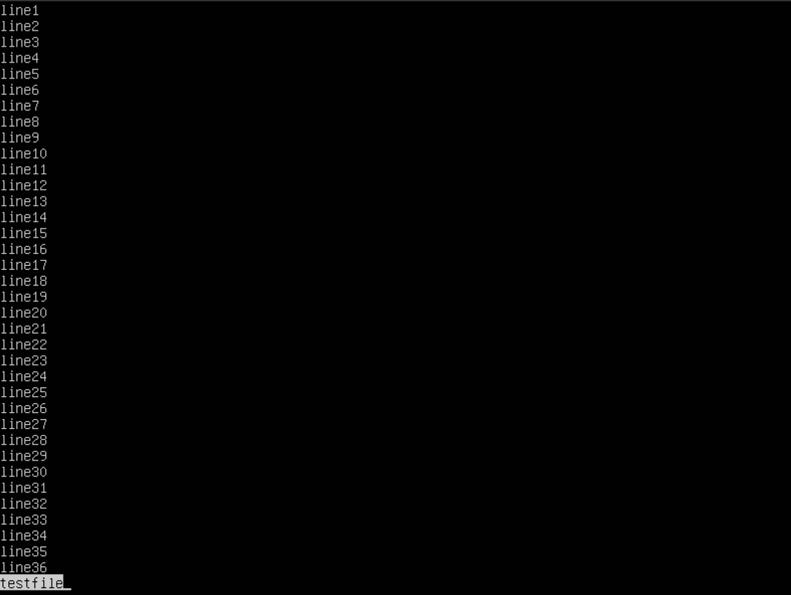
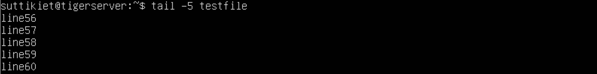
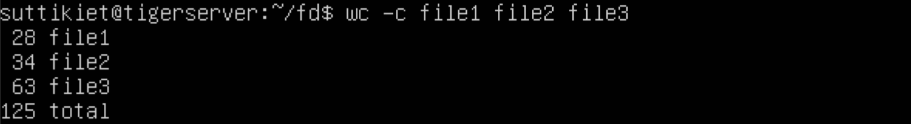

<h1 style="text-align : center;">Working with Texts</h1>
<h2>บทบาทหรือหรือหน้าที่บน linux </h2>
<ul><li>เป็นเครื่องมือที่ใช้ในการจัดการ, แยกข้อมูลและทำงานกับไฟล์textในระบบปฏิบัติการ Linux ซึ่งเป็นสิ่งที่สำคัญในการเขียนโปรแกรม เช่น vi, more, less, tail, wc เครื่องมือเหล่านี้ช่วยให้ผู้ใช้สามารถทำงานกับข้อความได้อย่างมีประสิทธิภาพ</li></ul>
<h2>พื้นฐานหรือหลักการทำงาน</h2>
การทำงานกับข้อความใน Linux เป็นหนึ่งในพื้นฐานหรือหลักการทำงานของระบบปฏิบัติการ Linux โดยมีหลาย

องค์ประกอบที่สำคัญดังนี้:

<ol><li>ไฟล์ข้อความ: ในระบบปฏิบัติการ Linux, ข้อความถูกจัดเก็บในรูปแบบไฟล์เช่นเดียวกับข้อมูลอื่น ๆ ไฟล์ข้อความสามารถเก็บข้อมูลต่าง ๆ เช่น สคริปต์, การตั้งค่า, ข้อความที่ใช้เป็นเอกสาร, และอื่น ๆ</li>
<li>เครื่องมือการจัดการข้อความ: Linux มีเครื่องมือหลายตัวที่ช่วยในการจัดการข้อความ เช่น grep, sed, awk, cat, sort, cut ซึ่งช่วยในการค้นหา, แก้ไข, และประมวลผลข้อความต่าง ๆ</li>
<li>การทำงานกับไฟล์ข้อความผ่านคำสั่ง: ผู้ใช้ Linux สามารถใช้คำสั่งบน Command Line Interface (CLI) เพื่อทำงานกับไฟล์ข้อความ เช่น แสดงเนื้อหาของไฟล์, แก้ไขไฟล์, ค้นหาข้อมูลในไฟล์, ลบข้อมูล, และอื่น ๆ</li>
<li>การแสดงผลผ่านทาง CLI: การแสดงผลข้อความใน Linux ส่วนใหญ่จะทำผ่าน Command Line Interface โดยผู้ใช้สามารถใช้คำสั่งเพื่อแสดงผลข้อความในรูปแบบต่าง ๆ เช่น ค้นหาข้อความ, แสดงผลเฉพาะบรรทัดที่ตรงตามเงื่อนไข,แสดงผลเนื้อหาของไฟล์หรือผลลัพธ์จากการทำงานของคำสั่งอื่น ๆ</li>
<li>การแก้ไขหรือสร้างสคริปต์: การทำงานกับข้อความใน Linux ยังมีการใช้งานสำหรับการแก้ไขไฟล์หรือสร้างสคริปต์เพื่อทำงานต่าง ๆ โดยสร้างหรือแก้ไขข้อความในไฟล์เป็นวิธีที่สำคัญในการสร้างสคริปต์หรือทำงานต่าง ๆ ในระบบปฏิบัติการ Linux</li></ol>
โดยรวมแล้ว การทำงานกับข้อความใน Linux เป็นส่วนสำคัญที่ช่วยให้ผู้ใช้สามารถจัดการข้อมูลและทำงานต่างๆ ได้อย่างมีประสิทธิภาพในระบบปฏิบัติการนี้

<h3><code>VI (Visual Editor)</code></h3>
<ul><li>เป็นตัวแก้ไขข้อความที่มีความทรงจำมากและมีประสิทธิภาพ. มันมีโหมดการแก้ไข (Insert mode) และโหมดคำสั่ง (Command mode) ในโหมดคำสั่ง, สามารถใช้คำสั่งเพื่อบันทึก, ออก, ค้นหา, แทรกบรรทัด, ลบ, และทำอื่น ๆ ได้ vi มีการใช้งานที่มีประสิทธิภาพสูงสุดในการแก้ไขไฟล์ข้อความ</li>
<li>เป็นตัวแก้ไขข้อความ Unix ที่ได้รับความนิยมและใช้งานอย่างแพร่หลาย</li></ul>

<h3><code>More</code></h3>
<ul><li>ใช้ในการดูไฟล์ข้อความโดยแสดงทีละหน้าในกรณีที่ไฟล์มีขนาดใหญ่ (เช่น ไฟล์บันทึก) คำสั่ง more ยังอนุญาตให้ผู้ใช้เลื่อนขึ้นและลงผ่านหน้าได้ ไวยากรณ์พร้อมกับตัวเลือกและคำสั่งมีดังนี้ เมื่อเอาต์พุตมีขนาดใหญ่ เราสามารถใช้คำสั่ง 'more' เพื่อดูเอาต์พุตทีละรายการได้</li></ul>

<h3><code>Less</code></h3>
<ul><li>เป็นการพัฒนาขึ้นจาก more และมีฟีเจอร์ที่มากขึ้น Less สามารถใช้เพื่ออ่านเนื้อหาของไฟล์ข้อความทีละหน้า
 (หนึ่งหน้าจอ) เข้าถึงได้เร็วกว่าเพราะหากไฟล์มีขนาดใหญ่ ก็ไม่สามารถเข้าถึงไฟล์ทั้งหมดได้ แต่จะเข้าถึงทีละหน้า</li>
 <li>ตัวอย่างเช่น หากเป็นไฟล์ขนาดใหญ่และคุณกำลังอ่านโดยใช้โปรแกรมแก้ไขข้อความ ไฟล์ทั้งหมดจะถูกโหลดไปยังหน่วยความจำหลัก คำสั่ง less จะไม่โหลดไฟล์ทั้งหมด แต่จะโหลดทีละส่วนซึ่งทำให้เร็วขึ้น</i></ul>

<h3><code>Tail</code></h3>
<ul><li>เป็นการเสริมคำสั่งของ head คำสั่ง tail จะพิมพ์ข้อมูลจำนวน N สุดท้ายของอินพุตที่กำหนดตามชื่อ ตามค่าเริ่มต้น จะพิมพ์ 10 บรรทัดสุดท้ายของไฟล์ที่ระบุ หากมีการระบุชื่อไฟล์มากกว่าหนึ่งชื่อ ข้อมูลจากแต่ละไฟล์จะขึ้นต้นด้วยชื่อไฟล์</li></ul>

<h3><code>WC</code></h3>
<ul><li>wc ย่อมาจาก word count หมายถึงการนับจำนวณคำ ตามชื่อที่สื่อถึง ส่วนใหญ่จะใช้เพื่อจุดประสงค์ในการนับ</li>
<li>ใช้เพื่อค้นหาจำนวนบรรทัด จำนวนคำ ไบต์ และจำนวนอักขระในไฟล์ที่ระบุในอาร์กิวเมนต์ของไฟล์</li>
<li>ตามค่าเริ่มต้น จะแสดงเอาต์พุตแบบสี่คอลัมน์</li>
<li>คอลัมน์แรกแสดงจำนวนบรรทัดที่มีอยู่ในไฟล์ที่ระบุ คอลัมน์ที่สองแสดงจำนวนคำที่มีอยู่ในไฟล์ คอลัมน์ที่สามแสดงจำนวนอักขระที่มีอยู่ในไฟล์ และคอลัมน์ที่สี่คือชื่อไฟล์ที่กำหนดเป็นอาร์กิวเมนต์</li></ul>
 

<h2>การเรียกใช้งานหรือผลลัพธ์ที่ได้</h2>
แต่ละ command ที่เกี่ยวข้องนั้นมี options หรือ Arguments อะไรที่ควรทราบและได้อะไรออกมา
    ตัวอย่าง code การเรียกใช้งานที่ต้องการผลลัพธ์แบบต่างๆ

<h3>*VI – ใช้ในการสร้างหรือแก้ไข file ข้อมูล text</h3>
<h3>Syntax : <code>$ vi < filename_NEW > or < filename_EXISTING ></h3></ul></code>
หลังจากเข้าสู่หน้า vi prompt แล้วจะจะพบว่าเราไม่สามาถพิมพ์ข้อมูลลงไปได้โดยตรง จะต้องเลือกคำสั่งก่อนว่าจะทำอะไรกับ file ข้อมูล เมื่อเลือกคำสั่งแล้วถ้าจะกลับสู่ vi prompt ใหม่ก็ให้กด ESC

<h3>ตัวอย่างการใช้งานแบบต่างๆของ vi :</h3>

สร้างfileใหม่

 </img>

 </img>

พิมพ์ i เข้าสู่โหมด insert และเพิ่ม content

 </img>

esc เพื่อออกจากโหมด insert

 </img>

พิมพ์ o เพื่อเข้าโหมด insert และ ขึ้นบรรทัดใหม่

 </img>

esc และ ค้นหาข้อความด้วย /

 </img>

esc และ :wq เพื่อบันทึกไฟล์และออก

 </img>

ตรวจสอบไฟล์ที่สร้าง

 </img>

<h3>VI Editing Commands</h3>
    <ul>
    <li><code>i</code> - แทรกที่เคอร์เซอร์ (เข้าสู่โหมดinsert)</li>
    <li><code>a</code> - เขียนหลังเคอร์เซอร์ (เข้าสู่โหมดinsert)</li>
    <li><code>A</code> - เขียนที่จุดสิ้นสุดของบรรทัด (เข้าสู่โหมดinsert)</li>
    <li><code>ESC</code> - สิ้นสุดโหมดแทรก</li>
    <li><code>u</code> - เลิกทำการเปลี่ยนแปลงล่าสุด</li>
    <li><code>U</code> - เลิกทำการเปลี่ยนแปลงทั้งหมดในบรรทัด</li>
    <li><code>o</code> - เปิดบรรทัดใหม่ (เข้าสู่โหมดinsert)</li>
    <li><code>dd</code> - ลบบรรทัด</li>
    <li><code>3dd</code> - ลบ 3 บรรทัด</li>
    <li><code>D</code> - ลบเนื้อหาของบรรทัดหลังเคอร์เซอร์</li>
    <li><code>C</code> - ลบเนื้อหาของบรรทัดหลังเคอร์เซอร์และแทรกข้อความใหม่ กดปุ่ม ESC เพื่อสิ้นสุดการinsert</li>
    <li><code>dw</code> - ลบคำ</li>
    <li><code>4dw</code> - ลบ 4 คำ</li>
    <li><code>cw</code> - เปลี่ยนคำ</li>
    <li><code>x</code> - ลบอักขระที่เคอร์เซอร์</li>
    <li><code>r</code> - แทนที่อักขระ</li>
    <li><code>R</code> - เขียนทับอักขระตั้งแต่เคอร์เซอร์ไปข้างหน้า</li>
    <li><code>s</code> - แทนที่อักขระใต้เคอร์เซอร์และดำเนินการแทรกต่อไป</li>
    <li><code>S</code> - แทนที่บรรทัดทั้งหมดและเริ่มinsertที่จุดเริ่มต้นของบรรทัด</li>
    <li><code>~</code> - เปลี่ยนตัวอักษรตัวแต่ละตัว</li>
    <li><code>/</code> - ค้นหาข้อความในเคอร์เซอร์</li>
</ul>
   
<h3>การเคลื่อนไหวภายในไฟล์</h3>
    <ul>
        <li>k - ย้ายเคอร์เซอร์ขึ้น</li>
        <li>j - ย้ายเคอร์เซอร์ลง</li>
        <li>h - ย้ายเคอร์เซอร์ไปทางซ้าย</li>
        <li>l - ย้ายเคอร์เซอร์ไปทางขวา</li>
        <li>หมายเหตุ: คุณต้องอยู่ในโหมดคำสั่งเพื่อเคลื่อนไหวภายในไฟล์ แต่ละคีย์เริ่มต้นสำหรับการนำทางถูกกล่าวถึงด้านล่างเลย; คุณยังสามารถใช้ปุ่มลูกศรบนคีย์บอร์ดได้ด้วย</li>
    </ul>
    
<h3>การบันทึกและปิดไฟล์</h3>
    <ul>
        <li><code>Shift+zz</code> - บันทึกไฟล์และออก</li>
        <li><code>:w</code> - บันทึกไฟล์แต่ยังเปิดอยู่</li>
        <li><code>:q!</code> - ออกจาก vi และไม่บันทึกการเปลี่ยนแปลง</li>
        <li><code>:wq</code> - บันทึกไฟล์และออก</li>
        <li>หมายเหตุ: คุณควรอยู่ในโหมดคำสั่งเพื่อออกจากตัวแก้ไขและบันทึกการเปลี่ยนแปลงในไฟล์</li>
    </ul>

<h3>โหมดคำสั่งรับคำสั่งจากผู้ใช้ และโหมดแทรกเหมาะสำหรับแก้ไขข้อความ</h3>
<ul>
    <li>โหมดคำสั่งรับคำสั่งจากผู้ใช้ และโหมดแทรกเหมาะสำหรับแก้ไขข้อความ</li>
</ul>

<h3><code>more</code> - ใช้ในการดูไฟล์ข้อความโดยแสดงทีละหน้าจอ</h3>
<h3>Syntax : <code>more [-options] [-num] [+/pattern] [+linenum] [file_name]</code></h3>
<ul>
    <li><code>[-options]</code>: ตัวเลือกใดๆ ที่คุณต้องการใช้เพื่อเปลี่ยนวิธีการแสดงไฟล์ เลือกอย่างใดอย่างหนึ่งจากรายการต่อไปนี้: (<code>-d</code>, <code>-l</code>, <code>-f</code>, <code>-p</code>, <code>-c</code>, <code>-s</code>, <code>-u</code>)</li>
    <li><code>[-num]</code>: พิมพ์จำนวนบรรทัดที่คุณต้องการแสดงต่อหน้าจอ</li>
    <li><code>[+/pattern]</code>: แทนที่รูปแบบด้วยสตริงใดๆ ที่คุณต้องการค้นหาในไฟล์ข้อความ</li>
    <li><code>[+linenum]</code>: ใช้หมายเลขบรรทัดที่คุณต้องการเริ่มแสดงเนื้อหาข้อความ</li>
    <li><code>[file_name]</code>: ชื่อของไฟล์ที่มีข้อความที่คุณต้องการแสดงบนหน้าจอ</li>
</ul>

<h3>ขณะดูไฟล์ข้อความให้ใช้การควบคุมเหล่านี้</h3>
<ul>
    <li>ปุ่ม Enter: เพื่อเลื่อนลงทีละบรรทัด</li>
    <li>Space bar: เพื่อไปยังหน้าถัดไป</li>
    <li>ปุ่ม b: เพื่อย้อนกลับหนึ่งหน้า</li>
</ul>

<h3>Options in more command :</h3>
<ul>
    <li><code>-d</code> : ใช้ option นี้เพื่อช่วยผู้ใช้ในการนำทาง "[กด space เพื่อดำเนินการต่อ, 'q' เพื่อออก]" และ"[กด 'h' เพื่อดูคำแนะนำ]" เมื่อกดปุ่มผิด</li>
    <li><code>-f</code> : option นี้จะไม่ตัดบรรทัดยาวๆ</li>
    <li><code>-p</code> : option นี้จะล้างหน้าจอแล้วแสดงข้อความ</li>
    <li><code>-c</code> : คำสั่งนี้ใช้เพื่อแสดงเพจในพื้นที่เดียวกันโดยซ้อนทับข้อความที่แสดงก่อนหน้านี้</li>
    <li><code>-s</code> : ตัวเลือกนี้จะบีบบรรทัดว่างหลายบรรทัดให้เป็นบรรทัดว่างบรรทัดเดียว</li>
    <li><code>-u</code> : ตัวเลือกนี้จะละเว้นการขีดเส้นใต้</li>
</ul>

<h3>เสริม</h3>
<ul>
    <li><code>+/pattern</code> : ตัวเลือกนี้ใช้เพื่อค้นหาสตริงภายในเอกสารข้อความ สามารถดูอินสแตนซ์ทั้งหมดได้โดยเลื่อนไปตามผลลัพธ์</li>
    <li><code>+num</code> : ตัวเลือกนี้จะแสดงข้อความหลังจำนวนบรรทัดที่ระบุของเอกสาร</li>
</ul>

<h3><code>less</code> - ใช้เพื่ออ่านเนื้อหาของไฟล์ข้อความทีละ
หน้า (หนึ่งหน้าจอ)</h3>
<h3>Syntax : <code>less [options] filename</code></h3>
`filename` แสดงถึงชื่อของไฟล์ที่เราต้องการดูโดยใช้คำสั่ง `less`  

 </img> 
 </img>

<h3>ใช้ Less กับ Pipelines</h3>
less ใช้ร่วมกับคำสั่งอื่นผ่านไปป์ไลน์ได้ สิ่งนี้ช่วยให้เราสามารถดูผลลัพธ์ของคำสั่งได้โดยตรงในหน้าที่น้อยลง
ตัวอย่าง  : <code>dmesg | less</code>  

 </img>

 </img>

<h3>Option in less command</h3>
<ul>
  <li><code>-E</code> ออกโดยอัตโนมัติเมื่อถึงจุดสิ้นสุดของไฟล์</li>
  <li><code>-f</code> บังคับให้เปิดไฟล์ที่ไม่ปกติ</li>
  <li><code>-F</code> ออกจาก command ถ้าหากสามารถแสดงไฟล์ทั้งหมดบนหน้าจอแรกได้</li>
  <li><code>-g</code> เน้นสตริงที่พบโดยคำสั่งค้นหาล่าสุด</li>
  <li><code>-G</code> ระงับการเน้นการจับคู่การค้นหา</li>
  <li><code>-i</code> ละเว้นกรณีเมื่อค้นหา</li>
  <li><code>-n</code> ระงับหมายเลขบรรทัด</li>
  <li><code>-p</code> (pattern) เริ่มต้นที่การเกิดขึ้นครั้งแรกของรูปแบบที่ระบุในไฟล์</li>
  <li><code>-s</code> บีบบรรทัดว่างที่ต่อเนื่องกันให้เป็นบรรทัดเดียว</li>
</ul>

<h3>ตัวอย่างการใช้งานแบบต่างๆของ less :</h3>
-Searching for a pattern  
ตัวอย่าง  :  <code>dmesg | less -p "fail"</code>  

 </img>

 </img>

คำสั่งข้างต้นจะเริ่มแสดงจากบรรทัดที่มีข้อความว่า “fail” ครั้งแรก

-Displaying line number  
ตัวอย่าง  :  <code>dmesg | less -N</code>

 </img>

 </img>

ตัวเลือกนี้จะแสดงหมายเลขบรรทัดพร้อมกับเนื้อหาไฟล์ ทำให้คุณสามารถอ้างอิงบรรทัดที่ต้องการได้อย่างง่ายดาย -N

<table>
  <tr>
    <th>แบบสั้น</th>
    <th>แบบยาว</th>
    <th>การบรรยาย</th>
  </tr>
  <tr>
    <td>-c</td>
    <td><code>--bytes=[+]NUM</code></td>
    <td>แสดงไบต์ NUM สุดท้ายของไฟล์ การใช้ + แสดงไบต์ต่อไปนี้จากไบต์ NUM ที่ระบุของแต่ละไฟล์</td>
  </tr>
  <tr>
    <td>-f</td>
    <td><code>--follow[={name|descriptor}]</code></td>
    <td>ตรวจสอบไฟล์สําหรับการเปลี่ยนแปลงและส่งออกข้อมูลใหม่เมื่อไฟล์เติบโตขึ้น เมื่อไม่มีการระบุค่าหลังจาก  <code>--follow=</code>  ตัวอธิบายจะถูกใช้เป็นค่าเริ่มต้น ซึ่งหมายความว่าโหมดการอัปเดตยังคงทํางานต่อไปแม้ว่าไฟล์จะถูกเปลี่ยนชื่อหรือย้าย  
    ระบุอาร์กิวเมนต์ 
     <code>--max-unchanged-stats=N</code>  
    เพื่อเปิด [file] ที่ไม่เปลี่ยนขนาดอีกครั้งหลังจากการวนซ้ํา N (ค่าเริ่มต้น 5) เพื่อตรวจสอบว่าถูกยกเลิกการลิงก์หรือเปลี่ยนชื่อหรือไม่
    ระบุอาร์กิวเมนต์ --pid=PID เพื่อออกจากหางหลังจากกระบวนการที่มีรหัสกระบวนการ PID สิ้นสุดลง
    </td>
  </tr>
  <tr>
    <td>-F</td>
    <td><code>--follow= name --retry</code></td>
    <td>สั่งให้อัปเดตเอาต์พุตต่อไปแม้ว่าไฟล์ต้นฉบับจะถูกลบออกระหว่างการหมุนบันทึกและแทนที่ด้วยไฟล์ใหม่ที่มีชื่อเดียวกัน</td>
  </tr>
  <tr>
    <td>-n</td>
    <td><code>--lines=[+]NUM</code></td>
    <td>ถ้าใช้ -n NUM จะแสดง NUM บรรทัดสุดท้าย แต่ถ้าใช้ -n +NUM จะเริ่มต้นแสดงด้วยบรรทัด NUM</td>
  </tr>
  <tr>
    <td>-q</td>
    <td><code>--quiet, --silent</code></td>
    <td>ละเว้นชื่อไฟล์จากเอาต์พุต โดยแสดงเฉพาะเนื้อหา</td>
  </tr>
  <tr>
    <td>-s</td>
    <td><code>--sleep-interval=N</code></td>
    <td>ใช้ร่วมกับ -f สั่งให้ tail รอ N วินาที (ค่าเริ่มต้น 1) ระหว่างการวนซ้ํา</td>
  </tr>
  <tr>
    <td>-v</td>
    <td><code>--verbose</code></td>
    <td>ทําให้หางพิมพ์ชื่อไฟล์ก่อนแสดงเนื้อหาเสมอ</td>
  </tr>
  <tr>
    <td>-z</td>
    <td><code>--zero-terminated</code></td>
    <td>ใช้ NUL เป็นตัวคั่นบรรทัดแทนอักขระบรรทัดใหม่</td>
  </tr>
</table>

<h3>ตัวอย่างการใช้งานแบบต่างๆของ tail :</h3>
<h3>-Print Last 10 Lines</h3>
Ex:

 </img>

คำสั่ง output 10 บรรทัดสุดท้ายจากไฟล์ที่ระบุ

<h3>-Print Specific Number of Lines</h3>
ใช้ตัวเลือก <code>tail -NUM file_name</code> จะแสดง NUM บรรทัดสุดท้าย  ตัวอย่างเช่น:

 </img>

หรือระบุตัวเลือก <code>tail +NUM file_name</code> เพื่อพิมพ์เนื้อหาโดยเริ่มจากบรรทัด NUM ในตัวอย่างต่อไปนี้ ผลลัพธ์จะเริ่มต้นแสดงจากบรรทัดที่ 52 จนถึงจุดสิ้นสุดของไฟล์:

 </img>

<h3><code>WC</code> – การนับจำนวณคำ</h3>
<ul>
  <li>(number of line) <code>-l</code> : ตัวเลือกนี้จะพิมพ์จำนวนบรรทัดที่มีอยู่ในไฟล์ ด้วยตัวเลือกนี้ คำสั่ง wc จะแสดงเอาต์พุตแบบสองคอลัมน์ คอลัมน์ที่ 1 จะแสดงจำนวนบรรทัดที่มีอยู่ในไฟล์ และคอลัมน์ที่ 2 จะแสดงชื่อไฟล์</li>
  <li>(number of word) <code>-w</code> : ตัวเลือกนี้จะพิมพ์จำนวนคำที่มีอยู่ในไฟล์ ด้วยตัวเลือกนี้ คำสั่ง wc จะแสดงเอาต์พุตแบบสองคอลัมน์ คอลัมน์ที่ 1 จะแสดงจำนวนคำที่มีอยู่ในไฟล์ และคอลัมน์ที่ 2 คือชื่อไฟล์</li>
  <li>(count of bytes) <code>-c</code>: ตัวเลือกนี้แสดงจำนวนไบต์ที่มีอยู่ในไฟล์ ด้วยตัวเลือกนี้ จะแสดงเอาต์พุตแบบสองคอลัมน์ คอลัมน์ที่ 1 แสดงจำนวนไบต์ที่มีอยู่ในไฟล์ และคอลัมน์ที่ 2 คือชื่อไฟล์</li>
  <li>(count of characters) <code>-m</code>: การใช้คำสั่งนี้จะแสดงจำนวนอักขระในไฟล์</li>
  <li><code>-L</code>: ใช้เพื่อพิมพ์บรรทัดที่ยาวที่สุด (จำนวนอักขระ) ในไฟล์ แต่ด้วยตัวเลือกนี้ หากมีการระบุชื่อไฟล์มากกว่าหนึ่งชื่อ แถวสุดท้ายคือแถว
</ul>

<h3>ตัวอย่างการใช้งานแบบต่างๆของ wc :</h3>

1.ในการนับไฟล์และโฟลเดอร์ทั้งหมดที่มีอยู่ในไดเร็กทอรี: ตามที่เราทุกคนทราบกันดีว่าคำสั่ง ls ใน linux ใช้เพื่อแสดงไฟล์และโฟลเดอร์ทั้งหมดที่มีอยู่ในไดเร็กทอรี เมื่อไพพ์ด้วยคำสั่ง <code>wc</code> พร้อมด้วยตัวเลือก <code>-l</code> จะแสดงจำนวนทั้งหมด ไฟล์และโฟลเดอร์ที่อยู่ในไดเร็กทอรีปัจจุบัน

 </img>

2.นับจำนวนคำของไฟล์:  ทำได้ด้วยคำสั่ง <code>wc</code> ที่มีตัวเลือก <code>-w, (wc -w file_name)</code> คำสั่งนี้แสดงเอาต์พุตแบบสองคอลัมน์ คอลัมน์ที่หนึ่งคือนับจำนวนคำ และอีกคอลัมน์ที่สองคือ ชื่อไฟล์

 </img>

นับจำนวนคำในไฟล์โดย ไม่ต้องแสดงชื่อไฟล์ ( <code>wc -w < file_name</code> )

 </img>

3.นับจำนวนไบต์(bytes) ในไฟล์: ทำได้ด้วยคำสั่ง <code>wc -c file_name</code> และ คำสั่ง <code>wc</code> สามารถระบุได้หลายไฟล์
พร้อมกัน ซึ่งจะแสดงผลรวมทั้งหมดในบรรทัดสุดท้าย

 </img>

<h2>Reference</h2>

-Working with Texts  
https://link.springer.com/chapter/10.1007/978-1-4302-1890-6_4

-vi command  
https://www.guru99.com/the-vi-editor.html

-more  
https://www.geeksforgeeks.org/more-command-in-linux-with-examples/

-less  
https://www.geeksforgeeks.org/less-command-linux-examples/

-tail  
https://www.geeksforgeeks.org/tail-command-linux-examples/?ref=header_search

https://phoenixnap.com/kb/linux-tail

-wc  
https://www.geeksforgeeks.org/wc-command-linux-examples/
