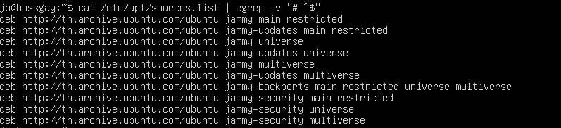

# Advanced Packaging Tool (APT)
## Table of Contaent
- [Advanced Packaging Tool (APT)](#advanced-packaging-tool-apt)
  - [Table of Contaent](#table-of-contaent)
  - [**Overview**](#overview)
  - [การใช้งาน](#การใช้งาน)
  - [Check all Repository that have](#check-all-repository-that-have)
  - [Adding Repository](#adding-repository)
    - [Installing `add-apt-repository`](#installing-add-apt-repository)
    - [Adding Repositories with `add-apt-repository`](#adding-repositories-with-add-apt-repository)
    - [Example using `add-apt-repository`](#example-using-add-apt-repository)
    - [Adding PPA Repositories](#adding-ppa-repositories)
    - [Manually Adding Repositories](#manually-adding-repositories)
  - [apt Syntax overview](#apt-syntax-overview)
    - [apt update](#apt-update)
    - [apt upgrade](#apt-upgrade)
    - [apt install](#apt-install)
    - [apt remove](#apt-remove)
    - [apt purge](#apt-purge)
    - [apt autoremove](#apt-autoremove)
    - [apt list](#apt-list)
    - [apt search](#apt-search)
    - [apt show](#apt-show)
    - [man apt](#man-apt)
  - [recommand package](#recommand-package)
  - [Reference](#reference)

## **Overview**
**Advanced Package Tool (APT)** เป็นอินเตอร์เฟซซอฟต์แวร์ฟรีที่ใช้กับ Debian และ Linux distributions  ที่มีพื้นฐานมาจาก Debian APT 
ทำให้กระบวนการการจัดการซอฟต์แวร์บนระบบคอมพิวเตอร์แบบ Unix-like กลายเป็นเรื่องง่ายขึ้นด้วยการทำงานโดยอัตโนมัติในการดึงข้อมูล กำหนดค่า 
และติดตั้งซอฟต์แวร์จากแพ็คเกจที่พร้อมคอมไพล์

มีเครื่องมือคำสั่งที่ใช้ใน การค้นหา การจัดการ และข้อมูลเกี่ยวกับแพคเกจ รวมถึงการเข้าถึง low-level ทุกฟีเจอร์ที่ libapt-pkg และ libapt-inst ให้ 
ซึ่งเป็นไลบรารีที่ higher-level ขึ้นมาจากพวกตัวจัดการแพคเกจ 

APT สามารถจัดการกับไฟล์ที่คอมไพล์ไว้ล่วงหน้าและการคอมไพล์รหัสต้นฉบับได้ ทำให้เป็นเครื่องมือที่มีประสิทธิภาพและ
สะดวกสบายสำหรับผู้ใช้ในการจัดการการติดตั้งและถอนการติดตั้งซอฟต์แวร์

## การใช้งาน
ชุดเครื่องมือที่ช่วยให้ผู้ใช้ติดตั้ง อัพเดทและจัดการซอฟต์แวร์บนระบบปฏิบัติการ Linux

**ลักษณะเด่น**

* เป็นชุดคำสั่งที่ใช้งานง่ายกว่าเครื่องมือจัดการแพ็คเกจดั้งเดิมอย่าง dpkg
* สามารถจัดการความสัมพันธ์ระหว่างแพ็คเกจต่างๆ ได้
* มีระบบติดตามการอัพเดทและเวอร์ชั่น
* เรียกใช้ dpkg ด้วยการเรียงลำดับแพ็คเกจอย่างเหมาะสมเพื่อให้การติดตั้งหรือลบ
* ในบางกรณีอาจใช้ตัวเลือก --force ของ dpkg เพื่อบังคับการดำเนินการ

## Check all Repository that have
`sudo cat /etc/apt/sources.list | egrep -v "#|^$"`

เป็นการแสดง repository ที่ทำการดึง package ทำให้สามารถ install package โดย apt ทั้งหมด
repository ที่ ใช้จะอยู่ใน `/etc/apt/sources.list`



โครงสร้างของ sources.list ( ที่เก็บ repository ต่างๆ )

`<package version> <mirror site url> <release code> <repository component, component, component..........>`

---
## Adding Repository

การเพิ่ม repository สามารถทำได้ด้วย command `add-apt-repository`

### Installing `add-apt-repository`

หากคุณได้รับ error ว่า "add-apt-repository command not found" คุณสามารถลง software-properties-common package ที่มี script ของ `add-apt-repository` อยู่ได้โดยการรัน command ดังนี้:
```
sudo apt update
sudo apt install software-properties-common
```

### Adding Repositories with `add-apt-repository`

`add-apt-repository [options] repository`<br>
repository สามารถใส่เป็น repository entry ปกติที่สามารถใส่เพิ่มเข้าไปในไฟล์ sources.list หรือเป็น PPA repository ในรูบแบบ `ppa:<user>/<ppa-name>`

`man add-apt-repository` เป็น command สำหรับแสดงรูปแบบคอมแมนด์ของ `add-apt-repository`

### Example using `add-apt-repository`

สมมุติว่าคุณต้องการติดตั้ง [MangoDB](https://www.mongodb.com/cloud/atlas/lp/try4?utm_source=google&utm_campaign=search_gs_pl_evergreen_atlas_core_prosp-brand_gic-null_apac-th_ps-all_desktop_eng_lead&utm_term=mongodb&utm_medium=cpc_paid_search&utm_ad=e&utm_ad_campaign_id=12212624374&adgroup=115749714863&cq_cmp=12212624374&gad_source=1&gclid=CjwKCAiA8YyuBhBSEiwA5R3-EyYTaCN9i1cdSHCcMKyDjCRtazKmepYdnfIeVY-WFNl5VzoqM0g-sBoCq_IQAvD_BwE) จาก official repositories

เริ่มจากการ import public key ของ repository:<br>
```
sudo apt-key adv --keyserver hkp://keyserver.ubuntu.com:80 --recv 9DA31620334BD75D9DCB49F368818C72E52529D4
```
จากนั้นก็เพิ่ม MangoDB repository เข้ามาด้วย:
```
sudo add-apt-repository 'deb [arch=amd64] https://repo.mongodb.org/apt/ubuntu bionic/mongodb-org/4.0 multiverse'
```
ซึ่งจะทำการเพิ่ม `source.list` เข้ามาในเครื่อง<br>
เพียงเท่านี้คุณก็สามารถลง package จาก repository นี้ได้แล้ว:
`sudo apt install mongodb-org`
หากคุณต้องการลบ repository ที่ลงไว้ออก ก็สามารถใช้ `--remove` ได้:
```
sudo add-apt-repository --remove 'deb [arch=amd64] https://repo.mongodb.org/apt/ubuntu bionic/mongodb-org/4.0 multiverse'
```

### Adding PPA Repositories
PPA หรือ Personal Package Archive เป็นเครื่องมือที่ช่วยให้ผู้ใช้สามารถ upload Ubuntu source packages ที่สร้างขึ้นได้ และ published พร้อมกับ Launchpad ในรูปแบบของ apt repository

การเพื่ม PPA จะสร้างไฟล์ใหม่ภายใต้โฟลเดอร์ /etc/apt/sources.list.d/ โดยใช้command:
```
add-apt-repository ppa:<ppa_name>
```
และกด`Enter`เมื่อโดนถาม

เมื่อ PPA repository ได้ถูกเพื่มเข้ามาแล้ว ก็สามารถใช้ [`sudo apt install`](#apt-install) เพื่อเพิ่ม Package ได้เลย

### Manually Adding Repositories
สามารถทำได้ด้วยการแก้ไขไฟล์ใน `/etc/apt/sources.list` และเพื่ม repository line ที่บรรทัดสุดท้าย เช่น สำหรับ CouchDB repository
```
deb https://apache.bintray.com/couchdb-deb bionic main
```
เวลาเพิ่ม repository แบบ manual จำเป็นต้อง import key เองด้วย โดยสามารถใช้ wget หรือ curl: สำหรับ CouchDB repository
```
curl -L https://couchdb.apache.org/repo/bintray-pubkey.asc | sudo apt-key add -
```
จากนั้นก็ทำการ update package index ด้วย `auso apt update` หลังจากนั้นก็ [`sudo apt install`](#apt-install) เพื่อเพิ่ม Package ได้เลย

---

## apt Syntax overview
การที่ apt install, remove,.. etc  package ต่างๆ ของ **apt** จะเป็นการ download package มาจาก repository ที่มีอยู่แล้ว

### apt update
`sudo apt update`

**อัพเดต** list แพ็คเกจที่ติดตั้งบนระบบ


### apt upgrade
`sudo apt upgrade`

**อัพเกรด** แพ็คเกจที่โหลดไว้เป็น version ล่าสุด

`sudo apt upgrade package_name`

สามารถ อัพเกรด แค่แพ็คเกจที่ต้องการ

`sudo apt full-upgrade`

ข้อแตกต่างระหว่าง upgrade full-upgrade คือ แพ็คเกจที่ติดตั้งในภายหลังจะถูกลบออก หากจำเป็นในการอัพเกรดทั้งระบบ

<span style='color: red;'>!! Be very careful when using this command. !!</span>


### apt install

`sudo apt install package_name`

ติดตั้งแพ็คเกจที่ต้องการ

`sudo apt install package_name1 package_name2`

สามารถติดตั้งแพ็คเกจหลายๆ อันพร้อมกันได้โดยการขั้นด้วย **space**

`sudo apt install /full/path/file.deb`

ถ้าต้องการติดตั้งไฟล์ `.deb` ให้ระบุเส้นทางแบบเต็มไปยังไฟล์


### apt remove

`sudo apt remove package_name`

ลบเเพ็คเกจที่ต้องการ

`sudo apt remove package_name1 package_name2`

สามารถลบแพ็คเกจหลายๆ อันพร้อมกันได้โดยการขั้นด้วย **space**


### apt purge

`sudo apt purge package_name`

คำสั้ง remove จะยังมีไฟล์กำหนดค่าที่ลบไม่หมด แต่ คำสั่ง purge เป็นคำสั่งที่ลบทุกไฟล์ที่อยู่ในแพ็คเกจ


### apt autoremove

`sudo apt autoremove`

เมื่อติดตั้งเเพ็คเกจที่มี dependency กับอีกแพ็คเกจ ถึงจะลบเพ็คเกจความเป็น dependency ยังอยู่มรระบบ

ใช้เอาไว้ลบ dependency ที่ไม่ต้องการ


### apt list

`sudo apt list`

คำสั่งที่ใช้แสดงรายการแพ็คเกจที่มีอยู่ทั้งหมด

`sudo apt list | package_name`

คำสั่งที่แสดง version, architecture ของแพ็คเกจที่ต้องการ

`sudo apt list --installed`

คำสั่งที่แสดงแค่แพ็คเก็จที่ติดตั้งอยู่

`sudo apt list --upgradeable`

คำสั่งที่แสดงแพ็คเกจที่สามารถอัพเกรดได้


### apt search

`sudo apt search package_name`

คำสั่งที่หา และแสดงแพ็คเกจที่สามารถใช้ได้


### apt show

`sudo apt show package_name`

คำสั่งที่แสดงรายละเอียดของแพ็คเกจ


### man apt

`man apt`

สามารถเรียนรู้คำสั่งอื่นๆ ที่ไม่ได้สอนในด้านบนได้

---

## recommand package
<span style='color: red;'>!! Internet required !!</span>

พา install แพ็คเกจที่ทาสเเมวชอบแน่นอน!!!

`sudo apt update`

`sudo apt upgrade`

`sudo apt show nyancat`

ดูข้อมูลของแพ็คเกจ nyancat

`nyancat`

เช็คว่าเคยติดตั้งแพ็คเกจ nyancat หรือไม่

`ถ้าเคยติดตั้งแล้วขอแสดงความเสียใจให้กับคุณ`

`sudo apt install nyancat`

ติดตั้ง nyancat

`nyancat`

run nyancat

---


## Reference
* APT - Debian Wiki: https://wiki.debian.org/Apt
* APT - Wiki: https://en.wikipedia.org/wiki/APT_(software)
- [https://jjeongil.tistory.com/1672](https://jjeongil.tistory.com/1672)
- [https://tttap.tistory.com/130](https://tttap.tistory.com/130)
