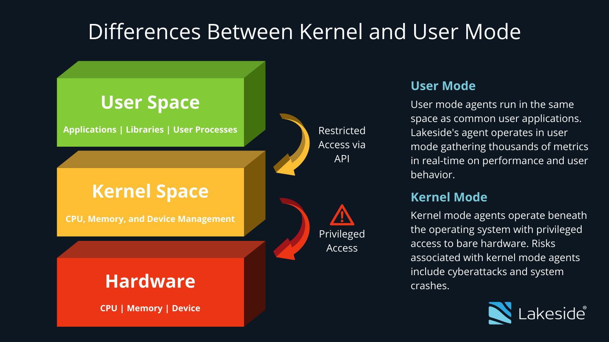

# Kernel Stage
### Kernel คืออะไร ?
**เคอร์เนล (Kernel)** คือโปรแกรมพื้นฐานภายใต้ระบบปฏิบัติการคอมพิวเตอร์ (OS) ที่คอยทำหน้าที่เป็นสื่อกลางระหว่างฮาร์ดแวร์ กับ ซอฟต์แวร์และช่วยจัดการทรัพยากรในคอมพิวเตอร์ต่าง ๆ 
นอกจากนี้ยังมีหน้าที่เป็นตัวควบคุมอุปกรณ์ Input / Output และอุปกรณ์ต่อพ่วงอื่น ๆ อย่าง เมาส์ (Mouse), จอมอนิเตอร์ (Monitor), แป้นพิมพ์ (Keyboard) ฯลฯ ที่เชื่อมต่อระบบผ่านไดร์เวอร์ อีกด้วย
### Kernel ทำงานอย่างไร ?
ตั้งแต่ที่เราเริ่มเปิดเครื่องคอมพิวเตอร์และบูทเครื่อง ระบบเคอร์เนล (Kernel) จะเป็นส่วนแรกจากระบบปฏิบัติการที่เริ่มทำงานก่อนเลย มันจะวิ่งเข้าไปจับจองพื้นที่ในแรม จากนั้นเมื่อเราเข้าสู่ระบบปฏิบัติการหรือบูทเครื่องสำเร็จแล้ว มันก็จะเปลี่ยนเป็นโหมดผู้ใช้ (User Mode) และรันโปรแกรมของระบบปฏิบัติการ หรือ แอปพลิเคชันอื่น ๆ บนพื้นที่ของผู้ใช้

ในขณะที่การดึงทรัพยากรพื้นฐานในเครื่องมาระหว่างนั้น ก็เป็นหน้าที่ของโหมดเคอร์เนลที่ติดต่อสื่อสารกับฮาร์ดแวร์ให้เรา ซึ่งเจ้า โหมดผู้ใช้ (User Mode) และ โหมดเคอร์เนล (Kernel Mode) นี้ก็จะมีการติดต่อกันด้วย API ที่เรียกว่า System Call ตามที่เราเห็นในภาพ
|  | 
|:--:| 
| *การสื่อสารระหว่าง User Space และ Kernel Space และ ฮาร์ดแวร์* |

> ระบบปฏิบัติการต่าง ๆ เกือบทุกชนิดมีการทำงานอยู่ 2 ส่วน คือโหมดผู้ใช้งาน (User Mode) และโหมดเคอร์เนล (Kernel Mode)
> - **Kernel Mode/Kernel Space**: คือพื้นที่ของหน่วยความจำระบบที่สงวนไว้สำหรับเคอร์เนล เป็นที่ที่เคอร์เนลรันและดำเนินการคำสั่ง Kernel Mode
> Kernel Mode คือโหมดการประมวลผล CPU ของเคอร์เนล ซึ่งทำงานโดยใช้สิทธ์การเข้าถึงแบบ Root
> เมื่อ User Space ต้องการบริการจากเคอร์เนล เคอร์เนลจะส่งสัญญาณให้ดำเนินการ syscall และสลับไปที่ Kernel Mode ตลอดระยะเวลาของการดำเนินการ syscall
> - **User Mode/User Space**: กระบวนการที่ถูกดำเนินการโดยผู้ใช้ในระบบปฏิบัติการ  มันอาจถูกดำเนินการโดยระบบ init (เช่น systemd) แต่ไม่ได้เป็นส่วนหนึ่งของเคอร์เนล
> User Space คือพื้นที่ของหน่วยความจำที่ไม่ใช่ ที่ของแอปพลิเคชันในเคอร์เนลทำงาน
> User Mode ผู้ใช้ทำงานในโหมดผู้ใช้(User-Mode) ซึ่งเป็นโหมดการดำเนินการที่ไม่มีสิทธิพิเศษ
> User Mode ต้องสลับไปยัง Kernel Mode เมื่อต้องการใช้บริการที่เคอร์เนลให้มา (เช่น ดิสก์ I/O การเข้าถึงเครือข่าย) การสลับไปใช้โหมดเคอร์เนลเกี่ยวข้องกับการทริกเกอร์ syscall ที่จะดำเนินการโดยเคอร์เนล 

### หน้าที่หลักของ Kernel
1.  **เป็นสะพานเชื่อมต่อระหว่างผู้ใช้งาน กับฮาร์ดแวร์** คือสะพานเชื่อมต่อให้ผู้ใช้งานสามารถเข้าถึงประสิทธิภาพของอุปกรณ์คอมพิวเตอร์ หรือฮาร์ดแวร์ เช่น  CPU, RAM หรือ อุปกรณ์ I/O
2. **จัดการทรัพยากรภายในเครื่อง** คือควบคุมกระบวนการสื่อสารระหว่างโปรแกรม และ CPU รับผิดชอบในการกำหนดทิศทางเชื่อมต่อระหว่าง โปรเซส (Process) หรือ เธรด (Threads) ที่กำลังรันโค้ดทำงานอยู่ภายในคอมพิวเตอร์ หรือเรียกว่า Inter-Process Communication (IPC)
3. **จัดการพื้นที่หน่วยความจำ (RAM)** มีหน้าที่ในการจัดการพื้นที่ใช้งานแรมอย่างเหมาะสม ช่วยตัดสินใจว่าหน่วยความจำเท่าไหร่ที่คำสั่งไหนสามารถใช้ได้ และ แก้ปัญหาเมื่อมีพื้นที่หน่วยความจำไม่เพียงพอ
### การกำหนดค่า Kernel (Configuring)
> การเข้าถึง Kernel configuration มีได้หลักๆ 2 ทาง
> 1. **/proc/_config.gz_**
>  2. **/boot**

- parameter บางส่วนใน Kernel configuration

|parameter|ความหมาย|
|  --------  |  -------  |
| init | รันไบนารีที่ระบุแทน /sbin/init เป็นกระบวนการเริ่มต้น |
| initrd | ระบุตำแหน่งของ ramdisk เริ่มต้น |
| cryptdevice | ระบุตำแหน่งของพาร์ติชันที่เข้ารหัส dm-crypt พร้อมชื่อผู้ทำ map อุปกรณ์ |
| debug |เปิดใช้งานการดีบักเคอร์เนล|
| lsm | ตั้งค่าลำดับการเริ่มต้นของโมดูลความปลอดภัย Linux|
| maxcpus |จำนวนโปรเซสเซอร์สูงสุดที่เคอร์เนล SMP จะแสดงในระหว่างการบูตเครื่อง|
| netdev |พารามิเตอร์อุปกรณ์เครือข่าย|
| nomodeset |ปิดใช้งานการตั้งค่า Kernel mode|
| panic |เวลาก่อนที่จะรีบูตอัตโนมัติเมื่อเกิด kernel panic|
| resume |ระบุอุปกรณ์ที่จะใช้เมื่อตื่นจากโหมดไฮเบอร์เนต(hibernation)|
| ro | Mount อุปกรณ์ root แบบอ่านอย่างเดียว(read-only)ขณะบู๊ต|
| root | ระบบไฟล์ของ Root |
| rootflags |ตัวเลือกการ Mount ระบบไฟล์Root|
| rw |Mount อุปกรณ์ Root แบบ อ่าน-เขียน(read-write)ขณะบูต|
| systemd.unit |บูตไปยังเป้าหมายที่ระบุ|

# แหล่งอ้างอิง
- https://tips.thaiware.com/1806.html#how-does-a-kernel-work
- https://www.form3.tech/blog/engineering/linux-fundamentals-user-kernel-space
- https://www.baeldung.com/linux/kernel-config
- https://wiki.archlinux.org/title/kernel_parameters
- https://www.kernel.org/doc/html/v4.14/admin-guide/kernel-parameters.html
