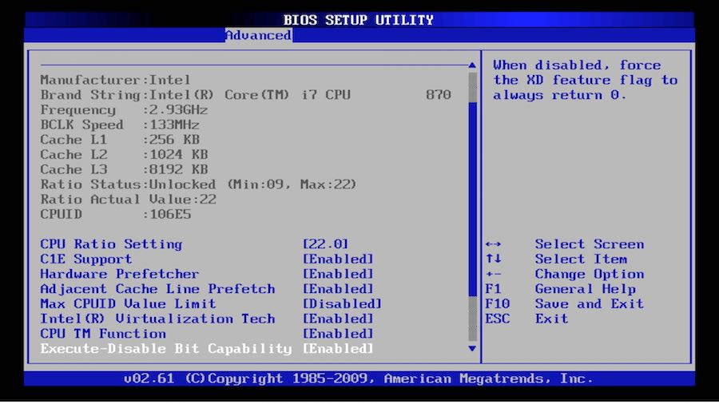
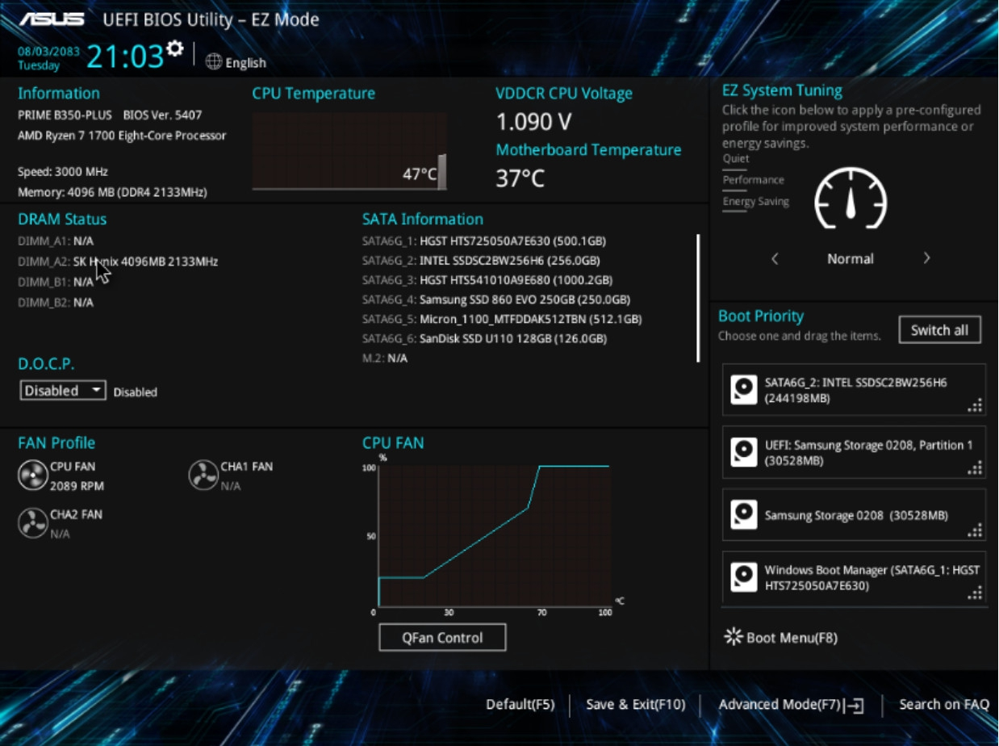

# System startup (Firmware Stage)
เป็นขั้นตอนแรกที่เกิดขึ้นเมื่อทำการเปิดเครื่อง มันจ่ายไฟฟ้าให้กับส่วนประกอบหลักทำงาน และจะทำการเรียกใช้ firmware โดย firmware ที่ใช้จะขึ้นอยู่กับ Hardware ของเครื่องนั้นๆ โดยหลักๆ จะมีการใช้ firmware อยู่ 2 ตัวหลักๆ  ดังนี้
## 1. BIOS (Basic Input/Output System)
### BIOS คืออะไร?
 Firmware ที่ไมโครโปรเซสเซอร์ของคอมพิวเตอร์ใช้ในการสตาร์ทระบบคอมพิวเตอร์หลังจากเปิดเครื่อง นอกจากนี้ยังจัดการการไหลของข้อมูลระหว่างระบบปฏิบัติการ (OS) ของคอมพิวเตอร์และอุปกรณ์ที่เชื่อมต่อ เช่น ฮาร์ดดิสก์ อะแดปเตอร์วิดีโอ แป้นพิมพ์ เมาส์ และเครื่องพิมพ์
### หลักการทำงาน
BIOS นั้นจะถูกติดตั้งมาพร้อมกับเครื่องคอมพิวเตอร์ โดยเป็น Firmware on chip ในเมนบอร์ด โดยเมื่อผู้ใช้เปิดเครื่อง
1. ฺ Power On Self Test (POST) BIOS จะทำการตรวจสอบไฟล์ต่างๆที่จำเป็นทั้งหมดว่ามีครบและใช้งานได้หรือไม่ โดยในทุกๆ Hardware ของเครื่องคอมพิวเตอร์ จะมีไฟล์ที่เรียกว่า "Boot devices" อยู่
2. หลังจากการตรวจสอบไฟล์ทั้งหมดและมั่นใจว่าทุกๆ "Boot devices" สามารถทำงานได้ปกติ BIOS จะทำการค้นหาตัว Master Boot Record (MRB) ซึ่งเป็นโปรแกรมขนาดเล็กที่ถูกจัดเก็บอยู่ในอุปกรณ์จัดเก็บข้อมูล(storage) นำมาดำเนินการ(executes)โปรแกรม ซึ่งจะทำการระบุถึงตำแหน่งของ "bootloader" และทำการโหลดเข้าสู่ memory และเริ่มทำการ run "bootloader"
3. นอกจาาการทำงานข้างต้น BIOS ยังทำหน้าที่ช่วยให้ผู้ใช้สามารถปรับเปลี่ยนการตั้งค่าฮาร์ดแวร์และระบบที่ถูกเก็บอยู่ใน CMOS ได้ด้วย
> CMOS(Complementary Metal-Oxide-Semiconductor) เป็นส่วนที่เก็บการตั้งค่าบางอย่าง เช่น วันที่ เวลา ลำดับการบูตซึ่งจะเป็นอุปกรณ์ที่ต้องใช้ไฟเลี้ยงอยู่ตลอดเพื่อให้ค่าการตั้งค่าคงอยู่ตลอดโดยจะใช้ CMOS Battery เป็นแหล่งจ่ายไฟ

|  | 
|:--:| 
| *หน้าต่างการตั้งค่าของ BIOS* |

## 2. UEFI (Unified Extensible Firmware Interface)
### UEFI คืออะไร?
Firmware ที่ทำหน้าที่เหมือน BIOS ทุกประการ เพียงแต่ว่าพื้นฐานจะมีความแตกต่างกันอยู่เล็กน้อย ตรงที่ UEFI จะบันทึกข้อมูลเอาไว้ในไฟล์ .EFI แทนที่จะเก็บไว้ในเฟิร์มแวร์เหมือนกับ BIOS 
ไฟล์ .EFI จะถูกบันทึกเอาไว้ในพาร์ทิชันที่เรียกว่า EFI System Partition (ESP) บนฮาร์ดไดร์ฟ ซึ่งภายในพาร์ทิชันนี้ก็จะใช้เป็นพื้นที่เก็บข้อมูล Boot-loader ด้วยเช่นกัน
### หลักการทำงาน
UEFI นั้นถูกเก็บอยู่ใน memory แบบพิเศษที่เรียกว่า NVRAM(Non-Volatile RAM) โดยเมื่อทำการเปิดเครื่อง
1. จะทำงานเหมือนกับขั้นตอน POST (Power On Self Test) ใน BIOS แต่จะมีขอบเขตการตรวจสอบส่วนประกอบของ Hardware ที่ครอบครุมมากกว่า
2. UEFI นั้นมี boot manager อยู่ในตัวมันเอง ซึ่งจะทำการโหลด UEFI applications ที่ถูกจัดเก็บอยู่ใน ESP(EFI System Partition) ซึ่งใน ESP จะมี "bootloader" อยู่ด้วย ก็จะทำการ โหลด "bootloader"  เข้าสู่ memory และทำการเตรียมการโหลด OS และ Kernel โดยในขั้นตอนนี้จะมีความยืดหยุ่นมากกว่าแบบ BIOS เนื่องจาก UEFI นั้นสามารถเข้าใจระบบไฟล์ได้โดยตรง
3. เช่นเดียวกับ BIOS UEFI ก็จะมีหน้าที่ช่วยให้ผู้ใช้สามารถปรับเปลี่ยนการตั้งค่าฮาร์ดแวร์และระบบ ได้ด้วยแต่ UEFI นั้นจะมีออกแบบหน้าต่างการปรับเปลี่ยนค่าที่ดูสวยงามกว่าของ BIOS

|  | 
|:--:| 
| *หน้าต่างการตั้งค่าของ UEFI* |

## ข้อแตกต่างระหว่าง BIOS และ UEFI
|BIOS|UEFI|
|  --------  |  -------  |
| หน้าจอเป็นสีน้ำเงิน| UI ที่เป็นมิตรและใช้งานง่ายกับผู้ใช้  |
| ไม่มี animation| มีสีที่หลากหลายร่วมกับ animation |
| ไม่รองรับ Ethernet, Wi-Fi และ Bluetooth | รองรับ Ethernet, Wi-Fi และ Bluetooth |
| ไม่รองรับ การตรวจสอบหาต้นเหตุและการซ่อมแซม หาก Boot ไม่ติด| รองรับ การตรวจสอบหาต้นเหตุและการซ่อมแซม หาก Boot ไม่ติด |
| ไม่รองรับการใช้เมาส์ รองรับเพียง คีย์บอร์ด| รองรับการใช้เมาส์ และ คีย์บอร์ด|
| ไม่มีการบูตแบบ Secure Boot| สามารถ Secure Boot ได้ โดยไม่โหลดซอฟต์แวร์ที่เป็นอันตราย|
| Program ถูกเขียนโดย assembly 16-bit| Program ถูกเขียนโดยภาษา C 64-bit|
| รองรับข้อมูล 2.2 terabytes| รองรับข้อมูลสูงสุดถึง 9 zettabytes|
	

# แหล่งอ้างอิง
- https://en.wikipedia.org/wiki/Booting_process_of_Linux
- https://www.techtarget.com/whatis/definition/BIOS-basic-input-output-system
- https://en.wikipedia.org/wiki/Bootloader
- https://www.baeldung.com/cs/bios-vs-cmos-vs-uefi
- https://tips.thaiware.com/1788.html
- https://medium.com/@adilrk/booting-with-uefi-unified-extensible-firmware-interface-c719929b253c
