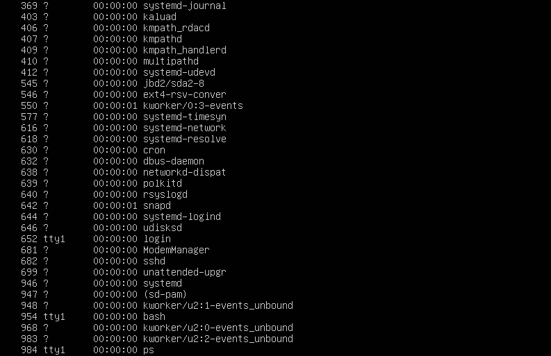
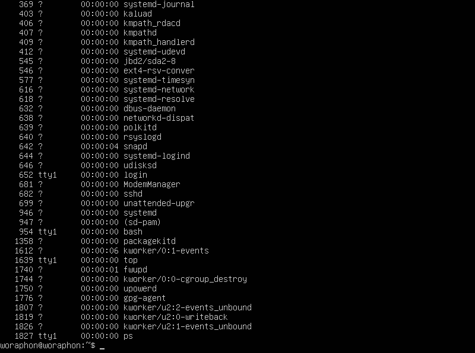

# คำสั่ง`kill`
เป็นคำสั่งที่ใช้เพื่อส่งสัณณาณไปยัง process เพื่อทำลายการทำงาน โดยเฉพาะอย่างยิ่งตอนที่ process ไม่มีการตอบสนองหรือใช้ทรัพยากรระบบมากเกินไป
|อาร์กิวเมนต์|คำอธิบาย|ตัวอย่าง|
|---|-----------|-----|
|`-SIGTERM`|ร้องขอให้ทำลาย process แต่สามารถให้ล้างข้อมูลก่อนได้|`kill -SIGTERM 1234`|
|`-SIGKILL`|บังคับทำลาย process ทันที|`kill -SIGKILL 1234`|
|`-SIGSTOP`|หยุดการดำเนินการของ process ชั่วคราว|`kill -SIGSTOP 1234`|
|`-SIGCONT`|ดำเนินการ process ที่หยุดไว้|`kill -SIGCONT 1234`|
|`-SIGHUP`|ส่งสัญญาณไปยัง process เมื่อมีการปิดการควบคุม terminal|`kill -SIGHUP 1234`|
|`-SIGINT`|ส่งสัญญาณ interrupt ไปส่วนใหญ่จะเป็นผู้ใช้|`kill -SIGINT 1234`|
|`-SIGQUIT`|ส่งสัญญาณ quit ไปมักเป็นผลมาจาก core dump|`kill -SIGQUIT 1234`|
|`-SIGABRT`|ส่งสัญญาณ abort ไปมักเป็นผลมาจาก core dump|`kill -SIGABRT 1234`|
|`-SIGALRM`|ใช้ในการตั้งเตือนหรือนับเวลา|`kill -SIGALRM 1234`|
|`-SIGUSR1` และ `-SIGUSR2`|ผู้ใช้เป็นคนกำหนดการส่งสัญญาณ|`kill -SIGUSR1 1234`|
## คำสั่ง`kill`ในรูปแบบต่างๆ
|วิธีการ|คำอธิบาย|ใช้ในกรณี|
|---|-----------|-----|
|`kill`|ทำลาย processes ด้วย PID|เมื่อรู้ PID ของ process|
|`pkill`|ทำลาย processes ด้วย ชื่อ|เมื่อรู้ ชื่อ ของ process|
|`killall`|ทำลาย instances ของ processes ทั้งหมด|เมื่อต้องการทำลายinstances ของ process ทั้งหมด|
|`xkill`|ทำลาย processes ในส่วนของ graphically |เมื่อต้องจัดการกับ graphical application ที่ไม่ตอบสนอง|
## ตัวอย่างการนำไปใช้
- ในการนำไปใช้งานเราสามารถใช้คำสั่ง`ps` หรือ`ps -A`เพื่อดู process ที่ต้องกการจะทำลายการทำงานของมันได้และใช้คำสั่ง`kill`ต่างๆเพื่อจบการทำงาน
> ps -A

> kill 630

- ในกรณีที่ไม่สามารถดำเนินการทำลาย processes ได้เนื่องจาก Operation not permitted

> สามารถแก้ได้โดยการใช้ `sudo kill` เพื่อเเป็นขอสิทธิ์ในการแก้ไข

- ในกรณีที่ไม่สามารถดำเนินการทำลาย processes ได้เนื่องจาก No such process

> แสดงว่า process PID นี้ไม่มีอยู่ สามารถแก้ได้โดยการใช้`ps` หรือ`ps -A`เพื่อดู PID ของ process ที่ต้องการแก้ไขให้ถูกต้อง  
ทั้งนี้ทั้งนั้นเมื่อใช้คำสั่ง`kill`แล้วไม่มี outputอะไรออกมา ไม่ต้องตกใจนั้นแสดงว่าคำสั่ง`kill`ได้ดำเนินเสร็จสิ้นเรียบร้อยแล้ว

***
# แหล่งอ้างอิง
- https://ioflood.com/blog/kill-linux-command/
