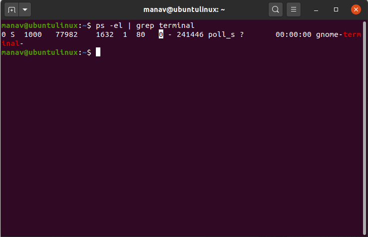
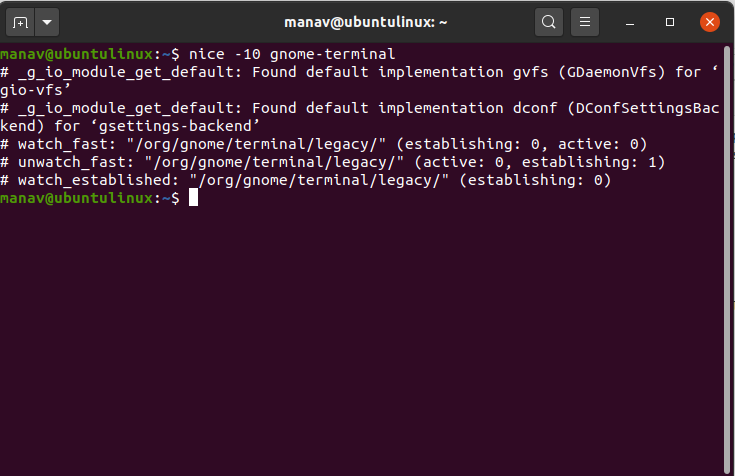
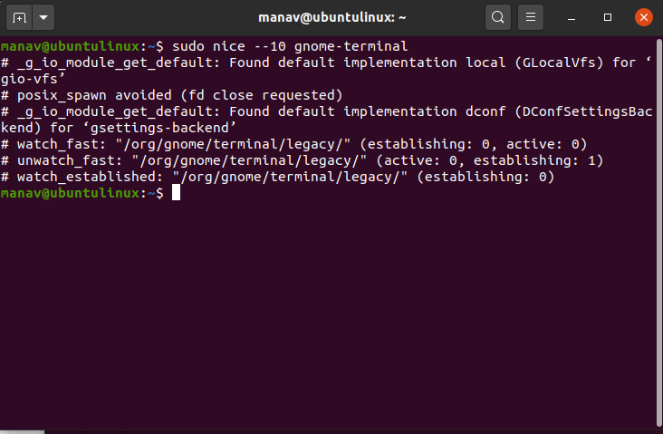

# คำสั่ง`nice`
เป็นคำสั่งที่ช่วยปรับเปลี่ยนในการจัดลำดับความสำคัญของ program/process โดยผู้ใช้ได้ หากเรากำหนดให้ process นั้นมีลำดับความสำคัญที่สูง kernel จะจัดสรรเวลา CPU ให้ process นั้นมากขึ้น มีค่าตั้งแต่ -20(ค่าความสำคัญสูงสุด) ถึง 19 (ค่าความสำคัญต่ำสุด) และ 0 คือค่าเริ่มต้น
|อาร์กิวเมนต์|คำอธิบาย|ตัวอย่าง|
|---|-----------|-----|
|`-n` หรือ `--adjustment`|ตั้งค่าลำดับความสำคัญของ process|`nice -7 gnome-terminal`|
## ตัวอย่างการนำไปใช้
- แสดง process ที่ทำงานอยู่ในปัจจุบันและเอาเฉพาะบรรทัดที่มีคำว่า terminal
> ps -el | grep terminal

> การตั้งค่า nice ให้เป็นค่าบวก

> การตั้งค่า nice ให้เป็นค่าลบ

***
# แหล่งอ้างอิง
- https://www.geeksforgeeks.org/nice-and-renice-command-in-linux-with-examples/
- https://linuxopsys.com/topics/nice-command-in-linux-with-example
