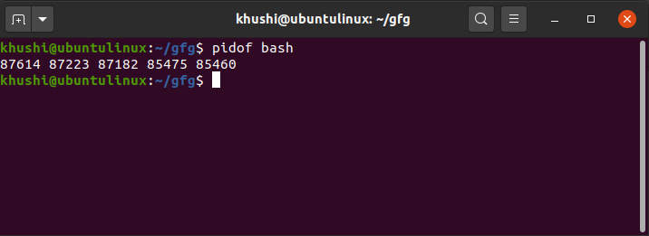

# คำสั่ง`pidof`
เป็นคำสั่งที่ใช้ในการค้นหา process ID ที่กำลังทำงานอยู่
|อาร์กิวเมนต์|คำอธิบาย|ตัวอย่าง|
|---|-----------|-----|
|`-s`|แสดงเพียงหนึ่ง PID|`pidof -s bash`|
|`-x`|แสดง ID ของ script ที่เหมือนกัน|`pidof -x bash`|
|`-c`|แสดงเพียง ID ของ process ที่ทำงานภายใต้ root directory เดียวกัน|`pidof -c bash`|
|`-o`|ละเว้นการแสดง ID ของ process ที่ระบุ|`pidof -o 87223 bash`|
## ตัวอย่างการนำไปใช้
- แสดง PID ของ process ในตัวอย่างนี้คิอ bash
> pidof bash

- แสดงเพียงหนึ่ง PID ของ process
> pidof -s bash

- หากเราไม่ต้องการแสดง PID ของ process ไหนก็ให้ใช้คำสั่งต่อไปนี้
> pidof -o 87223 bash

***
# แหล่งอ้างอิง
- https://www.geeksforgeeks.org/pidof-command-in-linux-with-examples/
