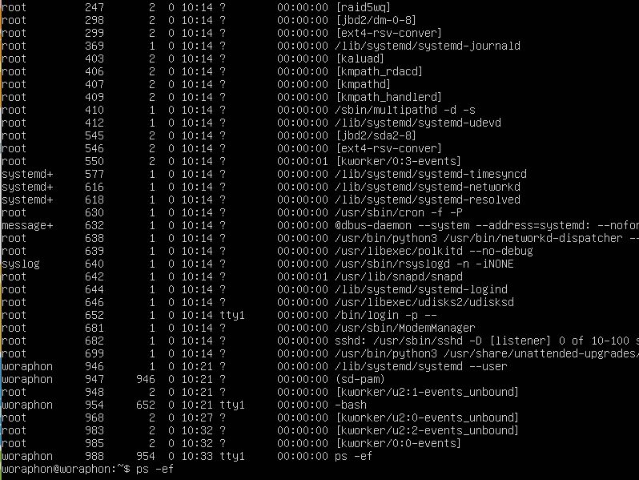
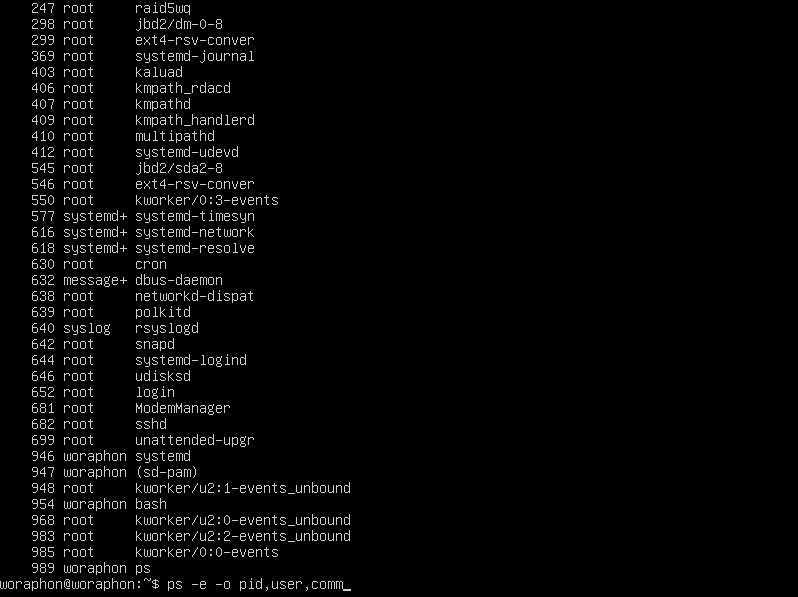
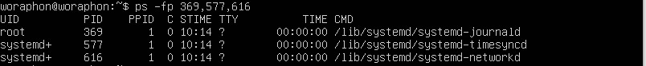
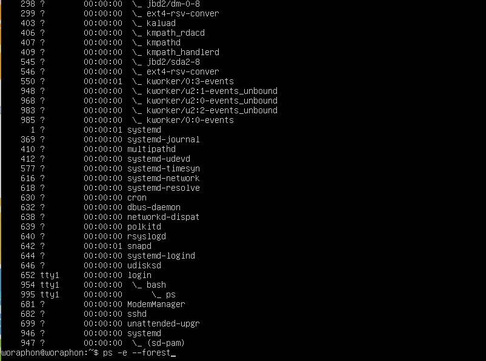
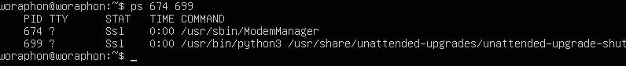

# คำสั่ง`ps`
เป็นคำสั่งที่แสดงข้อมูลเกี่ยวกับ processes ที่กำลังทำงานอยู่ในระบบ
|อาร์กิวเมนต์|คำอธิบาย|ตัวอย่าง|
|---|-----------|-----|
|`-A` หรือ `-e`|แสดงข้อมูลเกี่ยวกับ processes ทั้งหมด|`ps -A` หรือ `ps -e`|
|`-f`|แสดงข้อมูลแบบ full-format|`ps -f`|
|`-l`|แสดงข้อมูลแบบ long format|`ps -l`|
|`-j`|แสดงข้อมูลแบบ jobs format.|`ps -j`|
|`-o`|แสดงข้อมูลแบบ User-defined format|`ps -o pid,comm`|
|`-p`|แสดงข้อมูลที่เลือกโดย PID|`ps -p 1234`|
|`-t`|แสดงข้อมูลที่เลือกโดย TTY|`ps -t pts/1`|
|`-u`|แสดงข้อมูลที่เลือกโดย effective user ID (EUID).|`ps -u root`|
|`-x`|แสดงข้อมูลโดยไม่ต้องควบคุม terminal (เหมือน daemons)|`ps -x`|
|`-C`|แสดงข้อมูลที่เลือกโดย command name|`ps -C bash`|
|`-L`|แสดงข้อมูล threads โดยอาจมีคอลัมท์ LWP and NLWP|`ps -L`|
## คำสั่ง`ps`ในรูปแบบอื่นๆ
|วิธีการ|คำอธิบาย|ใช้ในกรณี|
|---|-----------|-----|
|`ps PID`|แสดงข้อมูลเกี่ยวกับ process แบบเฉพาะ|เมื่อต้องการรู้ PID ของ process แบบเฉพาะเจาะจง|

ก็จะแสดงข้อมูลออกมาแบบนี้  

  

โดย  
- **PID** คือ ID ของ process
- **TTY** คือ ชื่อที่ใช้ในการควบคุม terminal ของ process
- **TIME** คือ เวลาที่ process ใช้เวลาทำงานทั้งหมด
- **CMD** คือ ชื่อของคำสั่งที่ใช้ในการเริ่มทำ process
## ตัวอย่างการนำไปใช้
- แสดง process ที่ทำงานอยู่ในปัจจุบัน
> ps

- แสดงทุก process ที่ทำงานอยู่ในระบบ
> ps -A หรือ ps -e

- แสดงทุก process ที่ทำงานอยู่ในระบบและแสดงแบบ full-format
> ps -ef หรือ ps -eF

- แสดงข้อมูลแบบที่ผู้ใช้เป็นคนกำหนด output format เอง เช่นอยากเห็น PID, user, และคำสั่งในแต่ละ process
> ps -e -o pid,user,comm

- แสดงข้อมูลที่เลือก processes จาก PID เช่นอยากเห็นรายละเอียดของ process ที่มี PID 410 หรือแสดงแบบหลายๆ PID ได้
> ps -fp 410

> ps -fp 369,577,616

- แสดง process แบบ tree จะเห็นการเชื่อมโยงของ process ที่ทำงานร่วมกัน
> ps -e --forest

- ถ้าหากเราอยากรู้ข้อมูลของ process แบบเฉพาะเจาะจง สามารถใช้คำสั่ง`ps PID`ได้เช่น
> อยากรู้ข้อมูลของ process ที่มี PID 674 ก็ใช้คำสั่ง`ps 674`

> หรือถ้าหากอยากรู้แบบเฉพาะหลายๆตัวก็ทำได้เช่นกัน เช่น`ps 674 699`

***
# แหล่งอ้างอิง
- https://ioflood.com/blog/ps-linux-command/
- https://www.hostpacific.com/ps-command-for-linux-process-monitoring-1/
- https://linuxize.com/post/ps-command-in-linux/
