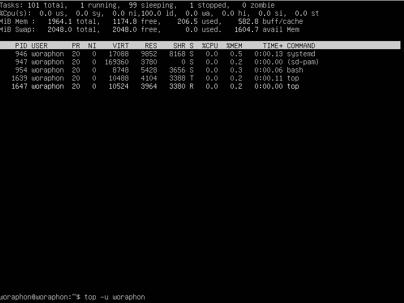
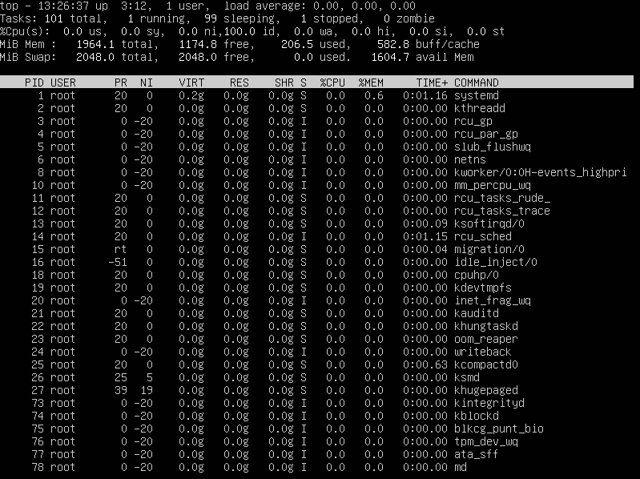
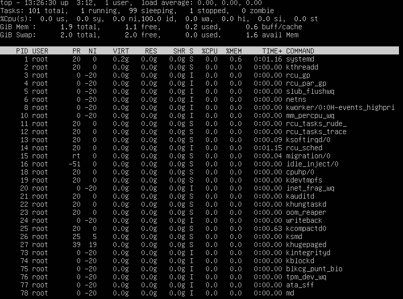
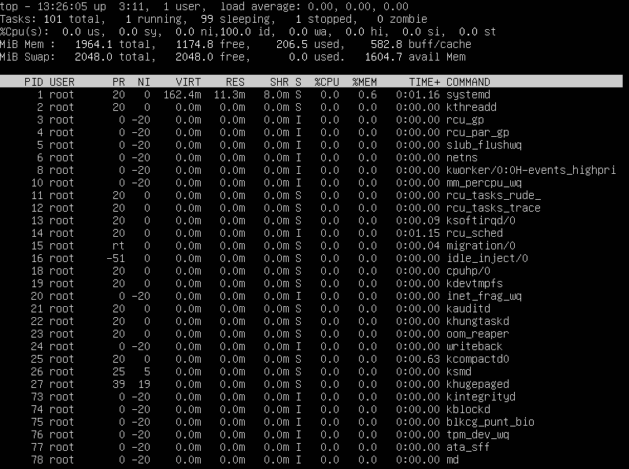
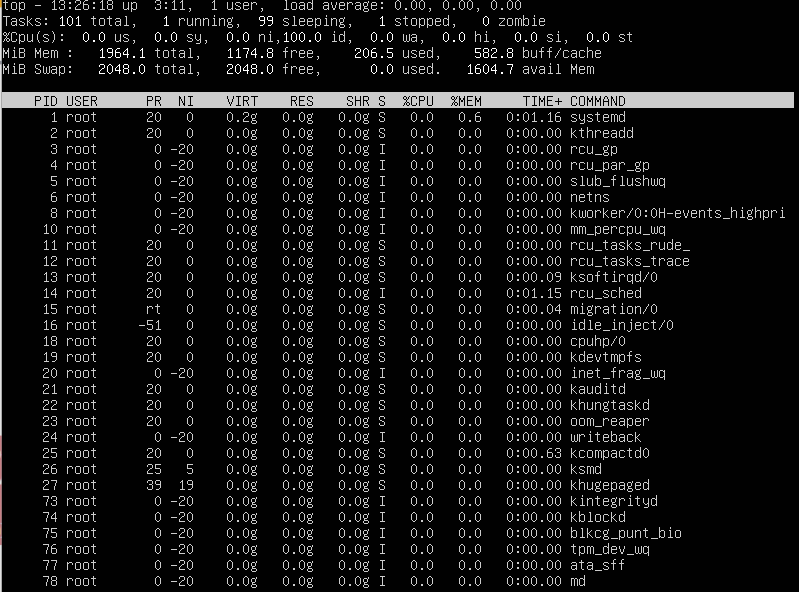
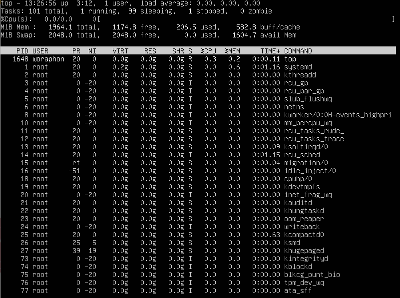
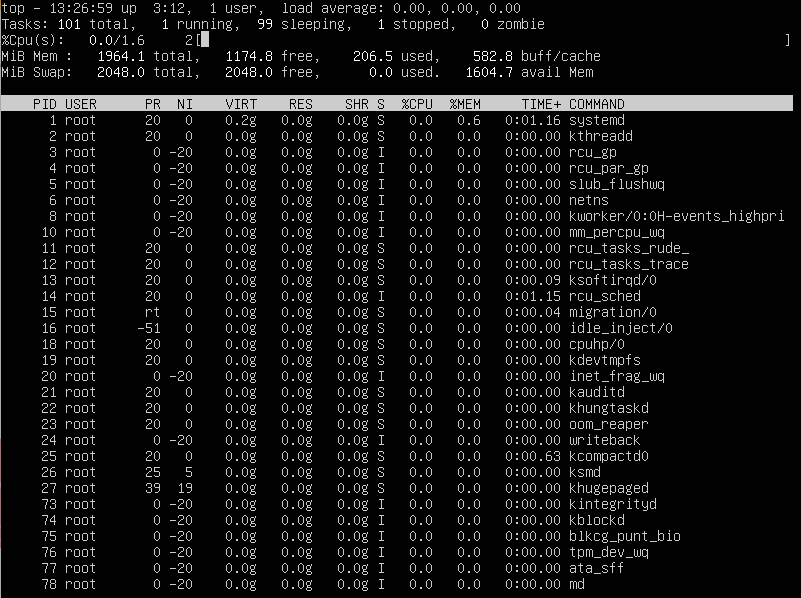
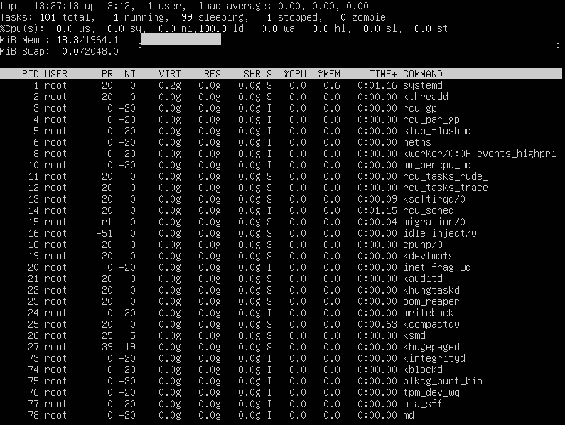
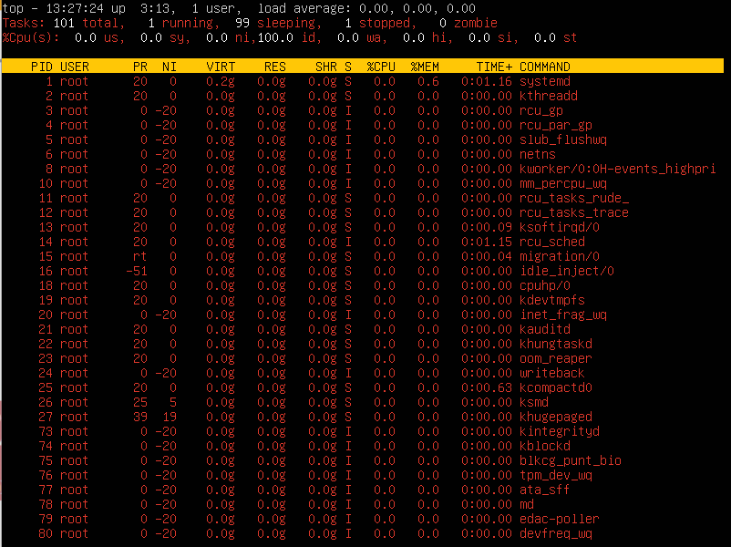

# คำสั่ง`top`
เป็นคำสั่งที่แสดงข้อมูลเกี่ยวกับ processes ที่กำลังทำงานอยู่ในระบบแบบ real-time นอกจากนี้ยังสามารถให้ข้อมูลในระบบโดยสรุปของการใช้ทรัพยากร, CPU, และการใช้หน่วยความจำ
|อาร์กิวเมนต์|คำอธิบาย|ตัวอย่าง|
|---|-----------|-----|
|`-h`|แสดงคำสั่งไฟล์ help|`top -h`|
|`-v`|แสดงเวอร์ชั่นของ library และ prompt การใช้งานจากนั้นออกจากโปรแกรม|`top -v`|
|`-b`|เริ่มคำสั่ง top ในโหมด betch|`top -b`|
|`-c`|สลับ command line/ชื่อโปรแกรม|`top -c`|
|`-d`|ใช้เพื่อหน่วงเวลา|`top -d 5`|
|`-H`|การดำเนินการในโหมด Threads|`top -H`|
|`-i`|สลับไปที่ process ที่ไม่ได้ใช้งาน|`top -i`|
|`-n`|ระบุจำนวนรอบที่ top จะทำงาน|`top -n 5`|
|`-o`|เรียงลำดับการแสดงผลจากมากไปน้อย|`top -o %CPU`|
|`-O`|เรียงลำดับการแสดงผลจากน้อยไปมาก|`top -O res`|
|`-p`|แสดงข้อมูลของ process ตามที่ระบุ PID|`top -p 1234`|
|`-s`|เริ่ม top ด้วยโหมด secure|`top -s`|
|`-S`|เรียงลำดับ process ตามคอลัมน์ที่เลือกจากน้อยไปมาก|`top -S`|
|`-u` หรือ `-U`|แสดงข้อมูลเฉพาะผู้ใช้ที่ระบุ user ID หรือ user name|`top -u username`|
|`-w`|เป็นการจัดรูปแบบ output โดยใช้ตัวแปรสภาพแวดล้อม COLUMNS= และ LINES=|`top -w`|
|`-1`|สลับสถานะ single/seperate CPU|`top -1`|
## ตัวอย่างการนำไปใช้
- แสดง process ที่ทำงานอยู่แบบ real-time
> top

- แสดง process ที่ทำงานอยู่แบบ real-time ของผู้ใช้ที่ระบุ
> top -u woraphon

- เมื่อเข้าสู่ top แล้วสามารถ E เพื่อเปลี่ยนการแสดงหน่วยของ memory ได้หรือกด e เพื่อเปลี่ยนการแสเงหน่วยของ memory ในรายการ process
> กด E

> กด e

- เมื่อเข้าสู่ top แล้วสามารถกด t เพื่อสลับการดูกราฟการใช้งานของ CPU core ได้
> กด t

- เมื่อเข้าสู่ top แล้วสามารถกด m เพื่อสลับการดูกราฟการใช้งาน memory ได้
> กด m

- เมื่อเข้าสู่ top แล้วสามารถกด z เพื่อเปลี่ยนสีการแสดงผลของ top ได้
> กด z

***
# แหล่งอ้างอิง
- https://phoenixnap.com/kb/top-command-in-linux
